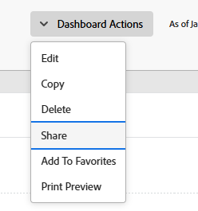

# Share a dashboard

<!-- Audited: 1/2025 -->

Your Adobe Workfront administrator grants users access to view or edit dashboards when they assign access levels. For more information about granting access to issues, see [Grant access to reports, dashboards, and calendars](../../../administration-and-setup/add-users/configure-and-grant-access/grant-access-reports-dashboards-calendars.md).

Along with the access level that users are granted, you can also grant them permissions to View or Manage specific dashboards that you have access to share. For more information about access levels and permissions, see [How access levels and permissions work together](../../../administration-and-setup/add-users/access-levels-and-object-permissions/how-access-levels-permissions-work-together.md).

Permissions are specific to one item in Workfront and define what actions one can take on that item.

>[!NOTE]
>
>A Workfront administrator can add or remove permissions to any items in the system, for all users, without being the owner of those items.

## Access requirements

+++ Expand to view access requirements for the functionality in this article.

You must have the following to share objects:

<table style="table-layout:auto"> 
 <col> 
 <col> 
 <tbody> 
  <tr> 
   <td role="rowheader"><strong>Adobe Workfront plan</strong></td> 
   <td> 
Any 
 </td> 
  </tr> 
  <tr> 
   <td role="rowheader"><strong>Adobe Workfront license</strong></td> 
    <td> 
      
New:

         <ul>
         <li>
Light or higher
</li>
         </ul>
      
Current:

         <ul>
         <li>
Review or higher
</li>
         </ul>
   </td> 
  </tr> 
  <tr> 
   <td role="rowheader"><strong>Access level configurations</strong></td> 
   <td> 
View access or higher to Reports, Dashboards, Calendars
 </td> 
  </tr> 
  <tr> 
   <td role="rowheader"><strong>Object permissions</strong></td> 
   <td> 
View permissions or higher the dashboard
 </td> 
  </tr> 
 </tbody> 
</table>

For information, see [Access requirements in Workfront documentation](/help/quicksilver/administration-and-setup/add-users/access-levels-and-object-permissions/access-level-requirements-in-documentation.md). 

+++

## Prerequisites

The dashboard must be created before you can share it.

For information on creating dashboards, see [Create a dashboard](../../../reports-and-dashboards/dashboards/creating-and-managing-dashboards/create-dashboard.md).

## Considerations about sharing dashboards

In addition to the considerations below, also see [Share reports, dashboards, and calendars](../../../workfront-basics/grant-and-request-access-to-objects/permissions-reports-dashboards-calendars.md).

* The creator of a dashboard has Manage permissions to it, by default.

* You can share dashboards that you create with other individuals, teams, groups, job roles, or companies. You can also share dashboards others created and which were shared with you. 
* You can also share them with your entire organization by making it visible system-wide. 
* You can share an individual dashboard, or you can share multiple dashboards from a list. 
* When you share a dashboard, users inherit View permissions to all the reports objects on the dashboard, by default.

  For more information about the hierarchy of objects in Workfront, see [Understand objects in Adobe Workfront](../../../workfront-basics/navigate-workfront/workfront-navigation/understand-objects.md).

  For information about viewing inherited permissions, see [View inherited permissions on objects](../../../workfront-basics/grant-and-request-access-to-objects/view-inherited-permissions-on-objects.md).

## Share a dashboard

Sharing one dashboard or several dashboards from a list is identical.

1. Go to a list of dashboards and select one or multiple dashboards, then click **Share** .

   Or

   Click the name of one dashboard, then click **Dashboard Actions** > **Sharing**.

   

1. In the **Add people, teams, roles, groups, or companies** field, start typing the name of the user, team, role, group, or company that you want to share the dashboard with, then click the name when it appears in the drop-down list.
1. (Optional) To make the dashboard accessible to all users in the system, click the **Only invited people can access** dropdown menu in the sharing dialog box, then select **Everyone in the system can view**.

1. Click **Save**.
