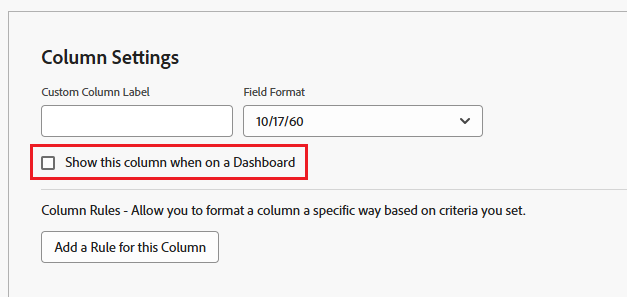
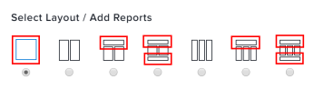
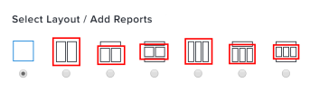

# Understand how reports display on a dashboard

<!-- Audited: 1/2025 -->

You can manage how reports added to dashboards are displayed. While creating or editing a dashboard, you can select one of seven layout options that specifies areas where reports can be placed on the dashboard. Please carefully consider your dashboard layout choice, as too many columns or certain panels like the AI Assistant can impact available display space and make your dashboard difficult to view.

For information about editing the layout of reports on a dashboard, see [Create a dashboard](../../../reports-and-dashboards/dashboards/creating-and-managing-dashboards/create-dashboard.md).

## Default report columns in dashboard layout areas

Certain layout options have report placement areas that limit the number of report columns displayed by default. You can manually select which report columns should display in these areas of a dashboard when you are creating or editing a report by clicking on [!UICONTROL **Advanced Options**] in [!UICONTROL **Column Settings**]. If you want to show all columns of the report on a dashboard, ensure that you specify that for each column of the report or place the report in an area that displays all report columns by default.

For more information about selecting which columns of a report should display on a dashboard, see [Create a custom report](../../../reports-and-dashboards/reports/creating-and-managing-reports/create-custom-report.md).

### Areas that show all columns of a report by default

When the report is selected for an area of the dashboard that takes up the full width of the dashboard, then by default all columns of the report display on the dashboard.  

### Areas that show only the first column of a report by default

When the report is selected for an area of the dashboard that takes up less than the full width of the dashboard, then by default only the first column of the report displays on the dashboard.  

