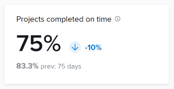

# KPI queries

You can use the queries in this article to create data visualizations similar to those in Enhanced Analytics.

>[!IMPORTANT]
>
>Queries will produce similar results to those shown in Enhanced Analytics, but they may not match exactly.


## Prerequisites

Before you begin, you must

1. Establish a connection with your Business Intelligence (BI) tool:
    1. [Create a reader account or connection for Snowflake](/help/quicksilver/reports-and-dashboards/data-lake/create-a-reader-account.md)
    1. [Establish a connection to Workfront Data Connect](/help/quicksilver/reports-and-dashboards/data-lake/share-data-externally.md)

Once you establish a connection, you can use the queries in this article to extract and visualize data.

## Projects completed

The Projects completed KPI shows how many projects within the filtered time period have been completed, as well as how the percentage increased or decreased since the previous time period.

You can also see the number of projects completed in the previous time period, as well as the number of days in the previous time period.


### Query

```
WITH completedProjectsInRange as ( 
SELECT COUNT(t0.PROJECTID) as PROJECT_COUNT FROM PROJECTS_CURRENT t0 
WHERE t0.ACTUALCOMPLETIONDATE >= '2025-01-01' 
AND t0.ACTUALCOMPLETIONDATE <= '2025-01-31' 
), completedProjectsPreviousRange as ( 
SELECT COUNT(t0.PROJECTID) as PROJECT_COUNT FROM PROJECTS_CURRENT t0 
WHERE t0.ACTUALCOMPLETIONDATE >= '2024-12-01' 
AND t0.ACTUALCOMPLETIONDATE <= '2024-12-31' 
), rawChange as ( 
SELECT (a.PROJECT_COUNT - b.PROJECT_COUNT) as CHANGE_FROM_PREVIOUS_PERIOD FROM completedProjectsInRange a, completedProjectsPreviousRange b 
), percentChange as ( 
SELECT  
CASE 
WHEN a.PROJECT_COUNT = b.PROJECT_COUNT THEN 0.00 
WHEN b.PROJECT_COUNT > 0 THEN ((a.PROJECT_COUNT - b.PROJECT_COUNT) / b.PROJECT_COUNT * 100) 
END AS PERCENT_CHANGE_FROM_PREVIOUS_PERIOD 
FROM completedProjectsInRange a, completedProjectsPreviousRange b 
) 
SELECT 
a.PROJECT_COUNT, 
b.PROJECT_COUNT as PREVIOUS_PROJECT_COUNT, 
c.CHANGE_FROM_PREVIOUS_PERIOD, 
d.PERCENT_CHANGE_FROM_PREVIOUS_PERIOD 
FROM completedProjectsInRange a, completedProjectsPreviousRange b, rawChange c, 
percentChange d

```

## Projects completed on time

The Projects completed on time KPI shows the percentage of projects within the filtered time period that were completed on time, as well as how the percentage increased or decreased since the previous time period. 

You can also see the percentage of projects completed on time in the previous time period, as well as the number of days in the previous time period.



```
WITH completedProjectsInRange as ( 
    SELECT 
        COUNT(t0.PROJECTID) as PROJECT_COUNT 
    FROM PROJECTS_CURRENT t0 
    WHERE t0.ACTUALCOMPLETIONDATE >= '2025-01-01' 
        AND t0.ACTUALCOMPLETIONDATE <= '2025-01-31' 
), completedOntimeProjectsInRange as ( 
    SELECT 
        COUNT(t0.PROJECTID) as PROJECT_COUNT 
    FROM PROJECTS_CURRENT t0 
    WHERE t0.ACTUALCOMPLETIONDATE >= '2025-01-01' 
        AND t0.ACTUALCOMPLETIONDATE <= '2025-01-31' 
        AND t0.PROGRESSSTATUS = 'ON' 
), percentOntimeProjects as ( 
    SELECT 
        CASE 
            WHEN a.PROJECT_COUNT = 0 THEN 0 
            ELSE ROUND(b.PROJECT_COUNT/a.PROJECT_COUNT) * 100 
        END as ONTIMEPROJECTPERCENT 
    FROM completedProjectsInRange a, completedOntimeProjectsInRange b 
), completedProjectsPreviousRange as ( 
    SELECT 
        COUNT(t0.PROJECTID) as PROJECT_COUNT 
    FROM PROJECTS_CURRENT t0 
    WHERE t0.ACTUALCOMPLETIONDATE >= '2024-12-01' 
        AND t0.ACTUALCOMPLETIONDATE <= '2024-12-31' 
), completedOntimeProjectsPreviousRange as ( 
    SELECT 
        COUNT(t0.PROJECTID) as PROJECT_COUNT 
    FROM PROJECTS_CURRENT t0 
    WHERE t0.ACTUALCOMPLETIONDATE >= '2024-12-01' 
        AND t0.ACTUALCOMPLETIONDATE <= '2024-12-31' 
        AND t0.PROGRESSSTATUS = 'ON' 
), percentOntimeProjectsPreviousRange as ( 
    SELECT 
        CASE 
            WHEN a.PROJECT_COUNT = 0 THEN 0 
            ELSE ROUND(b.PROJECT_COUNT/a.PROJECT_COUNT) * 100 
        END as ONTIMEPROJECTPERCENT 
    FROM completedProjectsPreviousRange a, completedOntimeProjectsPreviousRange b 
), rawChange as ( 
    SELECT 
        (a.ONTIMEPROJECTPERCENT - b.ONTIMEPROJECTPERCENT) as CHANGE_FROM_PREVIOUS_PERIOD 
    FROM percentOntimeProjects a, percentOntimeProjectsPreviousRange b 
), percentChange as ( 
    SELECT  
        CASE 
            WHEN a.ONTIMEPROJECTPERCENT = b.ONTIMEPROJECTPERCENT THEN 0 
            WHEN b.ONTIMEPROJECTPERCENT > 0 THEN ((a.ONTIMEPROJECTPERCENT - b.ONTIMEPROJECTPERCENT) / b.ONTIMEPROJECTPERCENT * 100) 
        END AS PERCENT_CHANGE_FROM_PREVIOUS_PERIOD 
    FROM percentOntimeProjects a, percentOntimeProjectsPreviousRange b 
) 

SELECT 
    a.ONTIMEPROJECTPERCENT, 
    b.ONTIMEPROJECTPERCENT as PREVIOUS_ONTIMEPROJECTPERCENT, 
    c.CHANGE_FROM_PREVIOUS_PERIOD, 
    d.PERCENT_CHANGE_FROM_PREVIOUS_PERIOD 
FROM percentOntimeProjects a, percentOntimeProjectsPreviousRange b, rawChange c, 
percentChange d

```

## Avg. project duration

The Avg. project duration KPI shows the average amount of completion time—in days, weeks, or years—for projects with actual end dates within the filtered time period, as well as how the percentage increased or decreased since the previous time period.

You can also see the average amount of completion time for projects with actual end dates in the previous time period, as well as the number of days in the previous time period.

>[!NOTE]
>
>This only accounts for the duration of completed projects. 


```
WITH averageProjectDurationInRange as ( 
    SELECT 
        AVG(t0.ACTUALDURATIONMINUTES) as AVERAGE_PROJECT_DURATION 
    FROM PROJECTS_CURRENT t0 
    WHERE t0.ACTUALCOMPLETIONDATE >= '2025-01-01' 
        AND t0.ACTUALCOMPLETIONDATE <= '2025-01-31' 
), averageProjectPreviousRange as ( 
    SELECT AVG (t0. ACTUALDURATIONMINUTES) as AVERAGE_PROJECT_DURATION FROM PROJECTS_CURRENT t0 
    WHERE t0.ACTUALCOMPLETIONDATE >= '2024-12-01' 
        AND t0.ACTUALCOMPLETIONDATE <= '2024-12-31' 
), rawChange as ( 
    SELECT ((a.AVERAGE_PROJECT_DURATION - b.AVERAGE_PROJECT_DURATION) / 480) as CHANGE_FROM_PREVIOUS_PERIOD FROM averageProjectDurationInRange a, averageProjectPreviousRange b 
), percentChange as ( 
    SELECT  
        CASE 
            WHEN a.AVERAGE_PROJECT_DURATION = b.AVERAGE_PROJECT_DURATION THEN 0 
            WHEN b.AVERAGE_PROJECT_DURATION > 0 THEN ((a.AVERAGE_PROJECT_DURATION - b.AVERAGE_PROJECT_DURATION)  / b.AVERAGE_PROJECT_DURATION) * 100 
        END AS PERCENT_CHANGE_FROM_PREVIOUS_PERIOD 
        FROM averageProjectDurationInRange a, averageProjectPreviousRange b 
) 
 
SELECT 
    a.AVERAGE_PROJECT_DURATION, 
    b.AVERAGE_PROJECT_DURATION as PREVIOUS_AVERAGE_PROJECT_DURATION, 
    c.CHANGE_FROM_PREVIOUS_PERIOD, 
    d.PERCENT_CHANGE_FROM_PREVIOUS_PERIOD 
FROM averageProjectDurationInRange a, averageProjectPreviousRange b, rawChange c, 
percentChange d

```

## Average tasks per project

The Avg, tasks per project KPI shows the average number of tasks assigned to projects within the filtered time period, as well as how the percentage increased or decreased since the previous time period. 

You can also see the average number of tasks assigned to projects in the previous time period, as well as the number of days in the previous time period.


```
WITH tasksPerProjectInRange as ( 
    SELECT 
        COUNT(t0.TASKID) as TASK_COUNT 
    FROM TASKS_CURRENT t0 
        LEFT JOIN PROJECTS_CURRENT t1 ON t1.PROJECTID = t0.PROJECTID 
    WHERE 
        ( 
            t1.PLANNEDSTARTDATE >= '2025-01-01' 
            AND t1.PLANNEDSTARTDATE <= '2025-01-31' 
        ) 
        OR ( 
            t1.PLANNEDCOMPLETIONDATE >= '2025-01-01' 
            AND t1. PLANNEDCOMPLETIONDATE <= '2025-01-31' 
        ) 
        OR ( 
            t1.PLANNEDSTARTDATE <= '2025-01-01' 
            AND t1. PLANNEDCOMPLETIONDATE >= '2025-01-31' 
        ) 
    GROUP BY t0.PROJECTID 
), averageTasksPerProjectInRange as ( 
    SELECT AVG(TASK_COUNT) AS AVERAGE_TASK_COUNT FROM tasksPerProjectInRange 
), tasksPerProjectInPreviousRange as ( 
    SELECT 
        COUNT(t0.TASKID) as TASK_COUNT 
    FROM TASKS_CURRENT t0 
        LEFT JOIN PROJECTS_CURRENT t1 ON t1.PROJECTID = t0.PROJECTID 
    WHERE 
        ( 
            t1.PLANNEDSTARTDATE >= '2024-12-01' 
            AND t1.PLANNEDSTARTDATE <= '2024-12-31' 
        ) 
        OR ( 
            t1.PLANNEDCOMPLETIONDATE >= '2024-12-01' 
            AND t1. PLANNEDCOMPLETIONDATE <= '2024-12-31' 
        ) 
        OR ( 
            t1.PLANNEDSTARTDATE <= '2024-12-01' 
            AND t1. PLANNEDCOMPLETIONDATE >= '2024-12-31' 
        ) 
    GROUP BY t0.PROJECTID 
), averageTasksPerProjectInPreviousRange as ( 
    SELECT 
        AVG(TASK_COUNT) AS AVERAGE_TASK_COUNT 
        FROM tasksPerProjectInPreviousRange 
), rawChange as ( 
    SELECT 
        (a.AVERAGE_TASK_COUNT - b.AVERAGE_TASK_COUNT) as CHANGE_FROM_PREVIOUS_PERIOD 
    FROM averageTasksPerProjectInRange a, averageTasksPerProjectInPreviousRange b 
), percentChange as ( 
    SELECT 
        CASE 
            WHEN a.AVERAGE_TASK_COUNT = b.AVERAGE_TASK_COUNT THEN 0 
            WHEN b.AVERAGE_TASK_COUNT > 0 THEN ((a.AVERAGE_TASK_COUNT - b.AVERAGE_TASK_COUNT) / b.AVERAGE_TASK_COUNT) * 100  
        END as PERCENT_CHANGE_FROM_PREVIOUS_PERIOD 
    FROM averageTasksPerProjectInRange a, averageTasksPerProjectInPreviousRange b 
) 
 
SELECT 
    a.AVERAGE_TASK_COUNT, 
    b.AVERAGE_TASK_COUNT as PREVIOUS_AVERAGE_TASK_COUNT, 
    c.CHANGE_FROM_PREVIOUS_PERIOD, 
    d.PERCENT_CHANGE_FROM_PREVIOUS_PERIOD 
FROM averageTasksPerProjectInRange a, averageTasksPerProjectInPreviousRange b, rawChange c, percentChange d

```

## Troubleshooting

* **No results**: If your query does not return any results, check to make sure double and single quotations copied correctly.