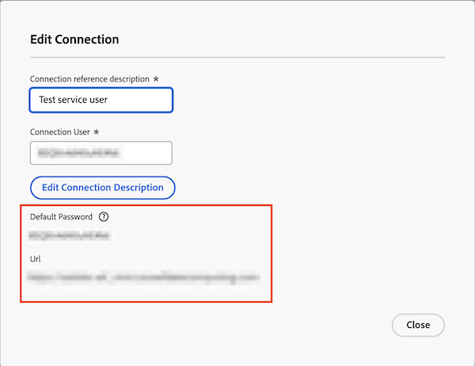

# Power BI tool cannot connect with the provided password 

## Problem

When you try to sign into Data Connect from your Power BI tool, you see the following error:

`Cannot connect from BI tool with provided password`

## Cause

When creating the JDBC connection, Workfront provides a temporary password for Data Connect. 

Before accessing Data Connect through Power BI, you must first log in using the connection details provided, update the temporary password, and then proceed with your login.

## Solution

Reset the connection password in Workfront, then create a new password with the link provided in the Edit Connection dialog box.

### Reset connection password in Workfront

1. Go to Workfront > Setup > System > Data Connect.
1. Find and open the connection from the list.
1. Under **Reset Connection Password**, check the box to confirm that you want to reset the password.
1. Click **Reset Connection Password**. 
    
1. Continue to the section below. 

### Create a new password for the connection

1. Copy the URL, and paste it into a new browser tab.
1. In Workfront, copy and paste the Connection User name and the Default Password into the new browser tab.
    
1. Click **Sign in**.
1. Enter a new password, then click **Submit**.
1. Go to your Power BI tool and log in with the new password.
