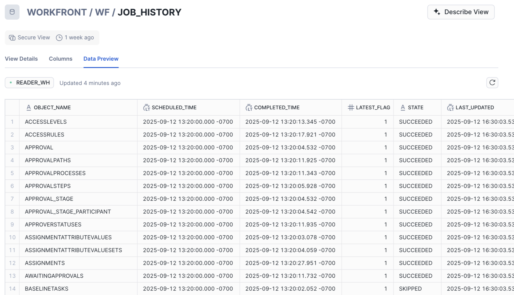

# Use the Job History view in Data Connect 

In the Job History view, Workfront administrators can access detailed records of each data refresh job. These records provide valuable insight into the jobs that keep your data up to date and help you establish ideal timeframes on when to execute processes and refresh your business visualizations.

The Job History view columns contain the following information: 

* **OBJECT_NAME**: Displays the name of the object associated with the job. 
* **SCHEDULED_TIME**: Displays the job's start time. 
* **COMPLETED_TIME**: Displays the job's completion time. 
* **LATEST_FLAG**: Indicates if the job was part of the most recent refresh. 
* **STATE**: Displays the job's status. For more, see the following section in this article: [Available job statuses](#available-job-statuses). 
* **LAST_UPDATED**: The job's last updated timestamp.

>[!NOTE]
>
>The Job History view includes details for the previous 72 hours of scheduled jobs. 

## Available job statuses 

Each Data Connect job is assigned a status that indicates if it was successful, skipped, or failed.

<table>
    <tr>
        <td><b>Job Status</b></td>
        <td><b>Definition</b></td>
    </tr>
    <tr>
        <td>Succeeded</td>
        <td>The job successfully processed each available update, and all updates for that record type are now reflected in the data lake.</td>
    </tr>
    <tr>
        <td>Skipped</td>
        <td>The job was skipped because there were no updates in queue to be processed for the record type.</td>
    </tr>
    <tr>
        <td>Failed</td>
        <td>The job failed to execute. In these cases, it is likely that no data in queue was committed to the data lake. Records that remain in queue will be processed in the next scheduled job for that record type. </td>
    </tr>
   </table> 

## Considerations on job execution and logging behavior

Snowflake uses a job scheduler optimization tool that can affect how job execution is processed and logged in the Job History view. This logging behavior can vary depending on whether or not there's data to process.

For example, when there aren't any new rows to process for a given object, one of the following outcomes may occur:

* **Job executes and is marked as Skipped**: Snowflake detects that there are no rows to process, executes the job, and records it with a Skipped status in the table.

* **Job doesn't execute**: Snowflake determines there are no rows to process, doesn't execute the job, and records it with a Skipped status in the table. 
    
    >[!NOTE]
    >
    >In the second scenario where the job doesn't execute, the most recent record for that object may reflect a timestamp that doesn't align with the expected schedule.

In other words, a job may be considered executed even if no rows were processed, and it may or may not be logged depending on the job scheduler's behavior for that particular job.