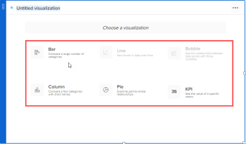

# Add or edit a visualization in a report in Reporting Canvas

A visualization can help you quickly tell a story about your data by enhancing the narrative and highlighting important information.

You can add the following types of visualizations to a report:

* Bar
* Column

  <!--
  <li data-mc-conditions="QuicksilverOrClassic.Draft mode"> 
Line
 </li>
  -->

* Pie

  <!--
  <li data-mc-conditions="QuicksilverOrClassic.Draft mode"> 
Bubble
 </li>
  -->

* KPI

##  

## Access requirements

You must have the following access to perform the steps in this article:

<table cellspacing="0"> 
 <col> 
 <col> 
 <tbody> 
  <tr> 
   <td role="rowheader">Adobe Workfront plan*</td> 
   <td> 
Any
 </td> 
  </tr> 
  <tr> 
   <td role="rowheader">Workfront license*</td> 
   <td> 
Plan
 </td> 
  </tr> 
  <tr> 
   <td role="rowheader">Access level configurations*</td> 
   <td> 
Edit access to create reports, calendars, and dashboards
 
Note: If you still don't have access, ask your Workfront administrator if they set additional restrictions in your access level. For information on how a Workfront administrator can modify your access level, see <a href="../../administration-and-setup/add-users/configure-and-grant-access/create-modify-access-levels.md" class="MCXref xref">Create or modify custom access levels</a>.
 </td> 
  </tr> 
  <tr data-mc-conditions=""> 
   <td role="rowheader">Object permissions</td> 
   <td> 
Manage access to the report
 
For information on requesting additional access, see <a href="../../workfront-basics/grant-and-request-access-to-objects/request-access.md" class="MCXref xref">Request access to objects in Adobe Workfront</a>.
 </td> 
  </tr> 
 </tbody> 
</table>

&#42;To find out what plan, license type, or access you have, contact your Workfront administrator.

## Prerequisites

Before you begin, you must enroll in the Reporting Canvas beta program.

<!--
<MadCap:conditionalText data-mc-conditions="QuicksilverOrClassic.Draft mode">
For more information, see [link to Beta enrollment info].
</MadCap:conditionalText>
-->

## Add or edit a visualization in a report

1. Click the **Main Menu** icon  in the upper-right corner of Adobe Workfront, then click **Reports**.
1. Click **New report**.

   Or

   Go to an existing report, click the **More Menu** icon  in the report header, then select **Edit**.

1. (Conditional) In the report building that displays, if there isn't already a table on the canvas, add and configure one as explained in [Add or edit a report table in Reporting Canvas](../../reports-and-dashboards/new-reporting-experience/add-or-edit-report-table.md).
1. From the right panel, double-click the **Visualization** icon  or drag it onto the canvas where you want it.

   If you double-click the icon, the visualization displays at the top of the canvas in its default size, which you can change by dragging its corner handles.

1. Select the table (listed on the visualization block) that you want the visualization to depict.

   

1. Select the type of visualization you want to add.

   

   Your visualization displays, representing the data in the table you selected.

   The dot next to the title of the visualization is the same color as the dot next to the title of the table. In a report with multiple tables, this helps you easily match visualizations to their associated tables.

   >[!TIP]
   >
   >If you created the table after you added the visualization, the bar chart is selected by default. To change the type, click the **Settings** icon.

1. Continue on to configure your visualization:

   * **Bar** visualization: For instructions, see [Configure a bar visualization in the Reporting Canvas](../../reports-and-dashboards/new-reporting-experience/configure-bar-visualization.md#bar).
   * **Column** visualization: For instructions, see [Configure a column visualization in Reporting Canvas](../../reports-and-dashboards/new-reporting-experience/configure-column-visualization.md).
   * **Line** visualization: For instructions, see [Configure a line visualization in Reporting Canvas](../../reports-and-dashboards/new-reporting-experience/configure-line-visualization.md).
   * **Pie** visualization: For instructions, see [Configure pie visualization in Reporting Canvas](../../reports-and-dashboards/new-reporting-experience/configure-pie-visualization.md).
   * **Bubble** visualization: For instructions, see [Configure a bubble visualization in the Reporting Canvas](../../reports-and-dashboards/new-reporting-experience/configure-bubble-visualization.md) .
   * **KPI** visualization: For instructions, see [Configure a KPI visualization in Reporting Canvas](../../reports-and-dashboards/new-reporting-experience/configure-kpi-visualization.md).

###  

