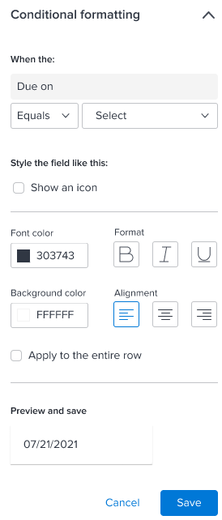

# Modify table columns in Reporting Canvas

You can create column in a report table by dragging fields to the table. Once added, you can modify the following aspects of the column:

* Column name
* Sorting
* Aggregation method
* Formulas (IF statements, CONCAT, and so on)
* Conditional formatting

## Access requirements

You must have the following access to perform the steps in this article:

<table cellspacing="0"> 
 <col> 
 <col> 
 <tbody> 
  <tr> 
   <td role="rowheader">Adobe Workfront plan*</td> 
   <td> 
Any
 </td> 
  </tr> 
  <tr> 
   <td role="rowheader">Workfront license*</td> 
   <td> 
Plan
 </td> 
  </tr> 
  <tr> 
   <td role="rowheader">Access level configurations*</td> 
   <td> 
Edit access to create reports, calendars, and dashboards
 
Note: If you still don't have access, ask your Workfront administrator if they set additional restrictions in your access level. For information on how a Workfront administrator can modify your access level, see <a href="../../administration-and-setup/add-users/configure-and-grant-access/create-modify-access-levels.md" class="MCXref xref">Create or modify custom access levels</a>.
 </td> 
  </tr> 
  <tr data-mc-conditions=""> 
   <td role="rowheader">Object permissions</td> 
   <td> 
Manage access to the report
 
For information on requesting additional access, see <a href="../../workfront-basics/grant-and-request-access-to-objects/request-access.md" class="MCXref xref">Request access to objects in Adobe Workfront</a>.
 </td> 
  </tr> 
 </tbody> 
</table>

&#42;To find out what plan, license type, or access you have, contact your Workfront administrator.

## Prerequisites

Before you begin, you must enroll in the Reporting Canvas beta program.

<!--
<MadCap:conditionalText data-mc-conditions="QuicksilverOrClassic.Draft mode">
For more information, see [link to Beta enrollment info].
</MadCap:conditionalText>
-->

## Modify columns in a table

1. Go to an existing report, click the **More Menu** icon  in the report header, then select **Edit**.
1. On the table header in the report, click the **Edit** icon .

   

   >[!NOTE]
   >
   >If you just created the table and haven't configured it yet, click the Edit button displayed on the table instead.

1. (Optional) To rearrange the order of columns in a table, drag a column to a new location.
1. In the header row of the table, select the name of a column you want to modify, then do any of the following to configure the data and style of the column:

  * Open the **Data** tab in the right panel, then change any of the following:

    <table cellspacing="0">
      class="TableStyle-TableStyle-List-options-in-steps-Column-Column1" /&gt;
     <col>
     <tbody>
      <tr data-mc-conditions="">
       <td role="rowheader">Aggregate based on</td>
       <td>
 If you want to aggregate (summarize) the information in a column, select the type of aggregation you want. 

If you are not using groupings in the table, the aggregated value displays in the main header above the column:
<!--
         
SHOW THIS (not working yet)

        -->
If you are using groupings in the table, the aggregated value displays in the grouping headers in the column:
<!--
         
SHOW THIS - Like under step 7 in Reports and Dashboards/Reports/Creating and Managing Reports/create-custom-report.htm

        --></td>
      </tr>
      <tr data-mc-conditions="">
       <td role="rowheader">Field format</td>
       <td>
(Available only when the column contains date, percent, currency, or time data, not text data.) Select the format you want for the data. For example, you can select Percent to display percent signs after the numbers in the Percent Complete column. Or display the dates in a Planned Completion Date column in the date format you prefer.
</td>
      </tr>
      <tr data-mc-conditions="">
       <td role="rowheader">Field is editable</td>
       <td>Enable this if you want allow people who access the table to edit the name of the column.</td>
      </tr>
      <tr>
       <td role="rowheader"><strong>Sort</strong></td>
       <td>
By default, the table sorts by the first column. Instead, you can click <b>Sort by this column</b> to sort the table by the selected column. Select a <strong>Sorting</strong> direction and a <strong>Sort Order</strong> for the column.

When you select sorting options for a column, a small box displays next to the column name with a number to indicate when the column is sorted (1st, 2nd, and so on) and an arrow to indicate whether the sorting direction is ascending or descending. 

You can repeat this process to sort the table by as many as 5 different columns. Make sure the sort for each column has the correct Sort Order. For example, if the table lists users and some of them have the same last name, you might want to display it sorted first by last name, and second, within each last name, sorted by first name.

Note: If you delete a column that you were using to sort the table and another column is also selected for sorting, that column is used to sort the table instead. If there is no other column selected for sorting, the table returns to the default state, which is to sort by the first column.
</td>
      </tr>
     </tbody>
    </table>

  * Open the **Style** tab in the right panel, then change any of the following:

    <table cellspacing="0">
     <col>
     <col>
     <tbody>
      <tr>
       <td role="rowheader"><strong>Custom column label</strong></td>
       <td>Rename the selected column using up to 100 characters.</td>
      </tr>
      <tr>
       <td role="rowheader">Show hover text</td>
       <td>
Determine whether you want explanatory text to display when someone hovers over a column name.

This option is disabled by default.
</td>
      </tr>
      <tr>
       <td role="rowheader">Hover text</td>
       <td>(Available only when <strong>Show hover text</strong> is enabled.) Customize the explanatory text that displays when someone hovers over a column name.</td>
      </tr>
      <tr>
       <td role="rowheader"><strong>Conditional formatting</strong></td>
       <td>
        <ol>
         <li value="1">
Add , edit , or delete  a rule that formats the column you selected.

For example, you can create a rule that changes the font in the "Project Status" field to bold purple when that field's value equals "Building."

Or you can use <b>Show an icon</b> to add a green flag icon to every item in the column that has the Current status.

 

If you use <strong>Show an icon</strong>, the other formatting options are unavailable.

You can use <strong>Apply to the entire row</strong> if you want the formatting to affect the entire row wherever it displays. For example, you could highlight projects that are due after a certain date by applying a yellow background color not only to those dates in the Due on column, but to the rows where the dates occur.
<!--
           
As you add an icon or formatting to a rule, the results display under <strong>Preview and save</strong> at the bottom of the panel.

          --></li>
         <li value="2">When you are finished adding a rule, click <strong>Save</strong>.</li>
         <li value="3">
(Optional) Click <b>+ Add Rule</b> to add additional rules to the same column, or add rules to other columns.

Rules are applied in the order that you create them in. If you drag  saved rules into a different order, they are applied in that new order.

For example, you can first create a rule stating that when the field "Project Status" equals "Building," the font color is purple and bold.

You can then create a second rule stating that when the field "TaskName" is not blank, the font color is red and italicized, and the background color is yellow.

In this example, tasks whose Project Status is Building are displayed in purple and bold text. If the task name is not blank, tasks also have a yellow background. Tasks whose Project Status is anything other than Building (and the Task Name is not blank) are displayed in a red italicized text with a yellow background.
</li>
        </ol></td>
      </tr>
     </tbody>
    </table>

   <!--
   <li value="5" data-mc-conditions="QuicksilverOrClassic.Draft mode">(Optional) Hover over a column to display its Data and Style configurations.<!--
   <MadCap:conditionalText data-mc-conditions="QuicksilverOrClassic.Draft mode">
   NOT FINISHED
   </MadCap:conditionalText>
   --></li>
   -->

1. (Optional) To delete a column, click its name, then click the x that displays to the right of the name.
1. Click the Go Back arrow  in the top-left corner of the screen to see your report.

