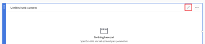

# Add or edit a web content block in Reporting Canvas

Web content blocks allow you to display information from external websites directly within your report.

## Prerequisites

Before you begin, you must enroll in the Reporting Canvas beta. For more information, see [Reporting Canvas beta: overview](/help/quicksilver/product-announcements/betas/canvas-dashboards-beta/reporting-canvas-beta-overview.md).

## Add or edit a web content block

1. Click the **Main Menu** icon  in the upper-right corner of Adobe Workfront, then click**Reporting**.
1. Click **New report**.

   Or

   Go to an existing report, click the **More** icon  in the report header, then click **Edit**.

1. On the right side of the screen, under **Add a Block**, either:

   Drag the **Web content** icon onto the canvas directly to your desired location.

   Or

   Double-click the **Web content** icon to add a block to the top of the canvas.

   >[!TIP]
   >
   >You can change the size of the block after it is placed by dragging its corner handles.

1. Click **Untitled web content** in the block header, then type a title for the block.
1. Click the **Edit** icon  in the block header.

   

1. In the **Settings** panel that opens, enter the complete URL for the page that you would like to display (including "https://") in the **URL** field.

   >[!NOTE]
   >
   >Currently, only sites from select domains are able to be displayed. The domains that can currently be used are:
   >   
   >   * workfront.com
   >   * google.com
   >   * sharepoint.com
   >   * attask-ondemand.om
   >   * powerbi.com
   >   * domo.com
   >   * looker.com

   A warning displays below your entered URL if it is unable to be embedded. These warnings include:

   | Warning name |Reason |
   |---|---|
   | Invalid URL |The entered URL does not return a valid site. |
   | Provider site restrictions |The site that you are trying to embed is not allowed. |

   {style="table-layout:auto"}

1. (Optional) Click the **Pass Parameters** toggle to open a list of available pass parameters.

   >[!WARNING]
   >
   >Pass parameters are currently disabled.

1. Click **Embed URL** to save your selections and return to your report.
