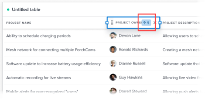

# Configure a table column in Reporting Canvas

The columns in a table can be configured for display. You can modify the following aspects of a column:

* Name
* Sorting
* Edit permission
* Hover text
* Aggregation
* Conditional formatting

## Prerequisites

Before you begin, you must enroll in the Reporting Canvas beta. For more information, see [Reporting Canvas beta: overview](/help/quicksilver/product-announcements/betas/canvas-dashboards-beta/reporting-canvas-beta-overview.md).

## Modify columns in a table

1. Go to an existing report, click the **More Menu** icon  in the report header, then select **Edit**.
1. On the table header in the report, click the **Edit** icon .

   

   >[!NOTE]
   >
   >If you just created the table and haven't yet added any fields, click the Edit button in the center of the table instead.

1. (Optional) Add, reposition, or delete columns in the table. For more information on editing the fields in a table, see [Add or edit a table block in Reporting Canvas](../../../reports-and-dashboards/reporting-canvas/table-blocks/add-or-edit-report-table.md)

   | Add a new column |To add a column to a table, either click and drag a field from the **Fields** panel on the right of the page onto the table where you would like to place it, or double-click a field to add it as the right-most column. |
   |---|---|
   | Move a column |To rearrange the order of columns in a table, click on a column name and drag it to a new location. |
   | Delete a column |To delete a column from a table, click on the column you want to delete then click the x at the right side of the column name. |

   {style="table-layout:auto"}

1. To configure a column, click the name of the column you want to modify in the header row of the table, then one of the following tabs on the right panel:

   <table style="table-layout:auto"> 
    <col> class="TableStyle-TableStyle-List-options-in-steps-Column-Column1" /&gt;
    <tbody>
     <tr data-mc-conditions="">
      <th role="rowheader" colspan="2">Data tab</th>
     </tr>
     <tr data-mc-conditions="">
      <td role="rowheader">Aggregate based on</td>
      <td>
 To aggregate (summarize in the header) the information in a column, select the type of aggregation you want from the <strong>Aggregate based on</strong> drop-down menu. The options available are dependent on the type of data contained in the column.

If you are using groups in the table, the aggregated value displays in the group row above the column name rather than next to the column name.
</td>
     </tr>
     <tr data-mc-conditions="">
      <td role="rowheader">Field format</td>
      <td>
(Available only when the column contains date, percent, currency, or time data, not text.) Select the format you want for the data in the <b>Field Format</b> drop-down. For example, you can display percent signs after the numbers in a column or change the way dates are displayed.
</td>
     </tr>
     <tr data-mc-conditions="">
      <td role="rowheader">Field is editable</td>
      <td>Enable the <strong>Field is editable</strong> if you want to allow users who view the table to edit the name of the column.</td>
     </tr>
     <tr>
      <td role="rowheader"><strong>Sort</strong></td>
      <td>
By default, the table sorts according to the data in its left-most column, in ascending order. To sort by the selected column instead, click the down arrow next to <strong>Sort</strong>, then click the checkbox <b>Sort by this column</b>. You may then select a <strong>Sorting</strong> direction (ascending or descending values) and a <strong>Sort Order</strong> (the relative sorting priority of this column compared to other sorting columns in the table).

You can repeat this process to sort the table by as many as 5 different columns. Make sure that each column has the correct <strong>Sort Order</strong> relative to any new columns you select for sorting.

Note: If you delete a column that is selected to sort a table and another column is also selected for sorting, that column is used to sort the table instead in descending order. If there are no other columns selected for sorting, the table returns to the default: sorting by its first column.

When you designate a column to sort the table, a small box displays next to the column name with a number that indicates the relative priority of that the column in sorting the table (the table is sorted first by 1, then 2, and so on) and an arrow to indicate whether the sorting direction is ascending or descending. 

</td>
     </tr>
    </tbody>
   </table>

   <table style="table-layout:auto"> 
    <col> 
    <col> 
    <tbody> 
     <tr> 
      <th role="rowheader" colspan="2">Style tab</th> 
     </tr> 
     <tr> 
      <td role="rowheader"><strong>Custom column label</strong> </td> 
      <td>Enter a new display name for the column (limit 100 characters).</td> 
     </tr> 
     <tr> 
      <td role="rowheader">Show hover text</td> 
      <td> 
Determine whether you want explanatory text to display when someone hovers over a column name.
 
This option is disabled by default.
 </td> 
     </tr> 
     <tr> 
      <td role="rowheader">Hover text</td> 
      <td>(Available only when <strong>Show hover text</strong> is enabled.) Customize the explanatory text that displays when someone hovers over a column name.</td> 
     </tr> 
     <tr> 
      <td role="rowheader"><strong>Conditional formatting</strong> </td> 
      <td> 
       <ol data-mc-continue="false"> 
        <li value="1"> 
Add , edit , or delete  a rule that formats cells in the column when their values meet criteria you specify.
 
For example, you can create a rule that changes the font in the "Project Status" field to bold purple when that field's value equals "Building."
 
Or you can use <b>Show an icon</b> to add a green flag icon to every item in the column that has the "Current" status.
 
  
 
Note: If you use <strong>Show an icon</strong>, the other formatting options are unavailable.
 
You can select <strong>Apply to the entire row</strong> if you want the formatting to affect the entire row of a cell that meets your rule's condition. For example, you could highlight projects that are due after a certain date by applying a yellow background color to not only the date cells in the "Due on" column, but to the entire row where those dates occur.
 
Tip: As you add formatting options to a rule, the resulting cell format is displayed under <strong>Preview</strong> at the bottom of the panel.
 </li> 
        <li value="2">When you are finished adding a rule, click <strong>Save</strong>.</li> 
        <li value="3"> 
(Optional) Click <b>+ Add Rule</b> to add additional rules to the same column.
 
Multiple conditional formatting rules in a table are applied in the following order:
 
         <ul> 
          <li> 
Rules that apply to entire rows are evaluated first, from left to right for each column and then from top to bottom within a column.
 
Note: Row formatting will override other conditional formatting for cells in that row, even if they would otherwise meet the condition of another column's rule.
 </li> 
          <li> 
Other rules are evaluated next, from top to bottom as they are listed in the right panel for a column. You can drag  saved rules in that panel to alter their order.
 
Note: Cells are formatted based on the first condition they meet, and will not be formatted further even if they meet other conditions.
 </li> 
         </ul> </li> 
       </ol> </td> 
     </tr> 
    </tbody> 
   </table>

1. Click the **Go back** arrow in the top-left corner of the screen to return to your report.
