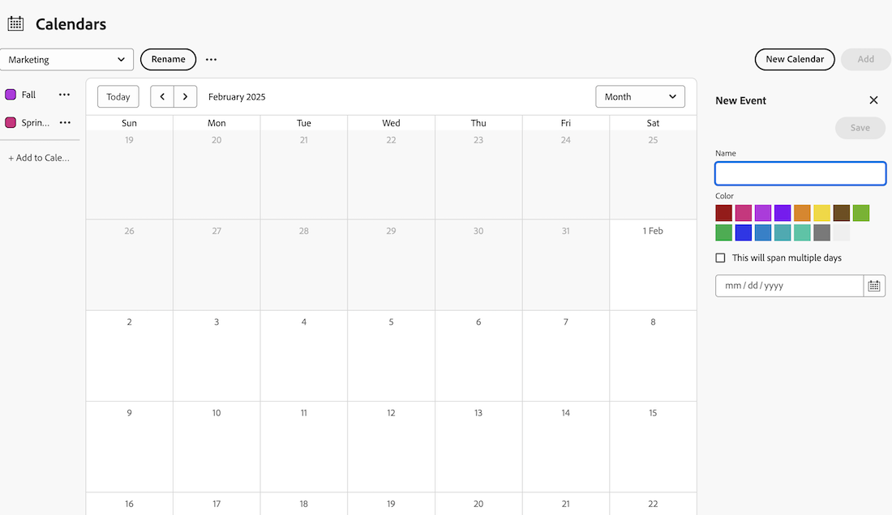

# Add ad hoc events to a calendar report

You can add ad hoc events to a calendar. An ad hoc event simply serves as a reminder in your calendar and is not associated with a project, task, or issue.

## Access requirements

+++ Expand to view access requirements for the functionality in this article.

You must have the following access to perform the steps in this article:

<table style="table-layout:auto"> 
 <col> 
 </col> 
 <col> 
 </col> 
 <tbody> 
  <tr> 
   <td role="rowheader">[!DNL Adobe Workfront plan]</td> 
   <td> 
Any
 </td> 
  </tr> 
  <tr> 
   <td role="rowheader">[!DNL Adobe Workfront] license</td> 
   <td>
New: Standard

       
or

       
Current: Plan
</td> 
  </tr> 
  <tr> 
   <td role="rowheader">Access level configurations</td> 
   <td> 
[!UICONTROL Edit] access to [!UICONTROL Reports], [!UICONTROL Dashboards], and [!UICONTROL Calendars]
</td> 
  </tr> 
  <tr> 
   <td role="rowheader">Object permissions</td> 
   <td>[!UICONTROL Manage] access to the calendar report</td> 
  </tr> 
 </tbody> 
</table>

For more detail about the information in this table, see [Access requirements in Workfront documentation](/help/quicksilver/administration-and-setup/add-users/access-levels-and-object-permissions/access-level-requirements-in-documentation.md).

+++

## Add ad hoc events to a calendar report

1. Go to the Calendar you want to add an ad-hoc event to. 
1. Click **Add** at the top of the calendar. 
1. In the side panel on the right, **Name** the event.
1. Choose a color for the event.
1. Choose if the event should span multiple days.
1. Enter or choose a date using the Calendar icon. 
   