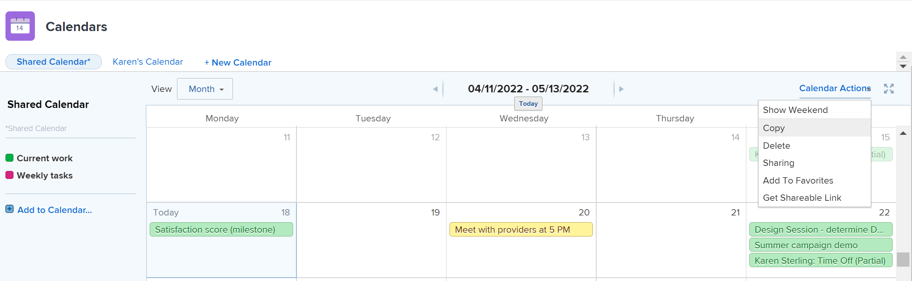
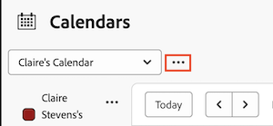

# Copy a calendar report

If you created a calendar, you can copy the calendar and use it as a starting point for a new calendar.

Additionally, if you have [!UICONTROL Manage] access to a calendar to which you are not the owner, you can copy the calendar and become the owner of the copied calendar.

## Access requirements

+++ Expand to view access requirements for the functionality in this article.

You must have the following access to perform the steps in this article:

<table style="table-layout:auto"> 
 <col> 
 </col> 
 <col> 
 </col> 
 <tbody> 
  <tr> 
   <td role="rowheader">[!DNL Adobe Workfront plan]</td> 
   <td> 
Any
 </td> 
  </tr> 
  <tr> 
   <td role="rowheader">[!DNL Adobe Workfront] license</td> 
   <td>
New: Standard

       
or

       
Current: Plan
</td> 
  </tr> 
  <tr> 
   <td role="rowheader">Access level configurations</td> 
   <td> 
[!UICONTROL Edit] access to [!UICONTROL Reports], [!UICONTROL Dashboards], and [!UICONTROL Calendars]
</td> 
  </tr> 
  <tr> 
   <td role="rowheader">Object permissions</td> 
   <td>[!UICONTROL Manage] access to the calendar report</td> 
  </tr> 
 </tbody> 
</table>

For more detail about the information in this table, see [Access requirements in Workfront documentation](/help/quicksilver/administration-and-setup/add-users/access-levels-and-object-permissions/access-level-requirements-in-documentation.md).

+++

## Copy a calendar report in Production

1. Go to the calendar you want to copy.
1. On the **[!UICONTROL Calendar]** toolbar, click **[!UICONTROL Calendar Actions]**, then select **[!UICONTROL Copy]** from the drop-down list.
   A copy of the calendar opens.

   

   All the projects and calendar groupings in the original calendar display in the copy of the calendar. Only objects placed by calendar filters export to the newly copied calendar. Any events manually added to the original calendar must be manually added to the copied calendar.

   Only you have access to the copied calendar. Users with access to the original calendar do not have access to the copied calendar. You can grant access to the newly-created calendar by sharing it with other users. To learn about sharing calendars, see [[!UICONTROL Share a calendar] report](../../../reports-and-dashboards/reports/calendars/share-a-calendar-report.md).

1. (Optional) Rename the calendar.

## Copy a calendar report in Preview

1. Go to the calendar you want to copy.
1. Click the **More** menu next to the Calendar drop-down menu. 

1. Select **[!UICONTROL Copy]** from the drop-down list. The calendar is copied and you are taken to the new copy.

>[!NOTE]
>
>All the projects and calendar groupings in the original calendar display in the copy of the calendar. Only objects placed by calendar filters export to the newly copied calendar. Any events manually added to the original calendar must be manually added to the copied calendar.
>&nbsp;
>
>Only you have access to the copied calendar. Users with access to the original calendar do not have access to the copied calendar. You can grant access to the newly-created calendar by sharing it with other users. To learn about sharing calendars, see [[!UICONTROL Share a calendar] report](../../../reports-and-dashboards/reports/calendars/share-a-calendar-report.md).

1. (Optional) Click the **More** menu, then click **Edit** to rename the calendar.

