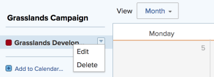

# Edit an existing calendar report

You can modify an existing calendar by adding or deleting a link to a project. You can also modify calendar groupings associated with a calendar report.

>[!NOTE]
>
>You are limited to 15 groupings in a calendar report.

## Access requirements

+++ Expand to view access requirements for the functionality in this article.

You must have the following access to perform the steps in this article:

<table style="table-layout:auto"> 
 <col> 
 </col> 
 <col> 
 </col> 
 <tbody> 
  <tr> 
   <td role="rowheader">[!DNL Adobe Workfront plan]</td> 
   <td> 
Any
 </td> 
  </tr> 
  <tr> 
   <td role="rowheader">[!DNL Adobe Workfront] license</td> 
   <td>
New: Standard

       
or

       
Current: Plan
</td> 
  </tr> 
  <tr> 
   <td role="rowheader">Access level configurations</td> 
   <td> 
[!UICONTROL Edit] access to [!UICONTROL Reports], [!UICONTROL Dashboards], and [!UICONTROL Calendars]
</td> 
  </tr> 
  <tr> 
   <td role="rowheader">Object permissions</td> 
   <td>[!UICONTROL Manage] access to the calendar report</td> 
  </tr> 
 </tbody> 
</table>

For more detail about the information in this table, see [Access requirements in Workfront documentation](/help/quicksilver/administration-and-setup/add-users/access-levels-and-object-permissions/access-level-requirements-in-documentation.md).

+++

## Edit an existing calendar report

{{step1-to-calendars}}

1. (Optional) To change the name of the calendar report, click the [!UICONTROL calendar name] field, then make the desired changes.
   
   If you have shared the calendar report with other users or teams, the modified calendar name is automatically updated in their calendar view.

1. (Optional) To add a project to the calendar report:

   1. Click **[!UICONTROL Add to Calendar].**
   1. In the **[!UICONTROL Project name]** field, begin typing the name of a project from which you want to add calendar events, then click the name when it displays in the drop-down list.

      
Items from the project and its associated tasks and issues are added to the calendar report.

1. (Optional) To add a calendar grouping or to modify an existing calendar grouping:

   1. Hover over the project name, click the drop-down arrow next to the project name, then click **[!UICONTROL Edit]**.

      

   1. Choose how you want to group your items:

      * [Use [!UICONTROL Planned Dates] in a calendar report](../../../reports-and-dashboards/reports/calendars/use-planned-dates.md)
      * [Use [!UICONTROL Projected Dates] in a calendar report](../../../reports-and-dashboards/reports/calendars/use-projected-dates.md)
      * [Use custom date fields in a calendar report](../../../reports-and-dashboards/reports/calendars/use-custom-dates.md)
