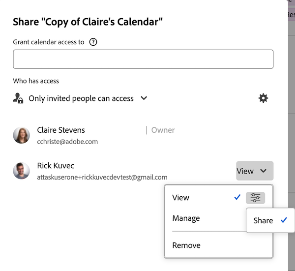
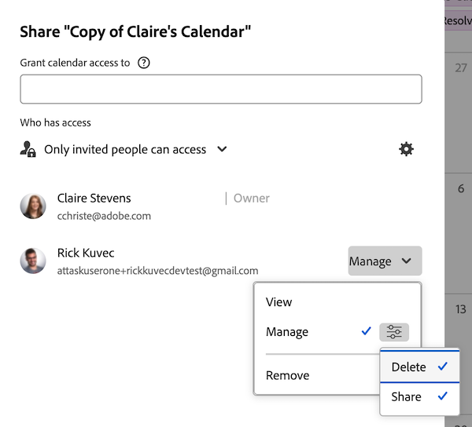

# Share a calendar report

You can share a calendar with other users and you can make it available publicly, allowing someone without an [!DNL Adobe Workfront] license to view it.

## Access requirements

+++ Expand to view access requirements for the functionality in this article.

<table style="table-layout:auto"> 
 <col> 
 </col> 
 <col> 
 </col> 
 <tbody> 
  <tr> 
   <td role="rowheader">Adobe Workfront package</td> 
   <td> 
Any
 </td> 
  </tr> 
  <tr> 
   <td role="rowheader">Adobe Workfront license</td> 
   <td>
Light

       
Review
</td> 
  </tr> 
  <tr> 
   <td role="rowheader">Access level configurations</td> 
   <td> 
 View or higher access to Reports, Dashboards, and Calendars
</td> 
  </tr> 
  <tr> 
   <td role="rowheader">Object permissions</td> 
   <td>View or higher permissions to the calendar report, with access to share</td> 
  </tr> 
 </tbody> 
</table>

For more detail about the information in this table, see [Access requirements in Workfront documentation](/help/quicksilver/administration-and-setup/add-users/access-levels-and-object-permissions/access-level-requirements-in-documentation.md).

+++

## Share a calendar with [!DNL Workfront] users {#share-a-calendar-with-workfront-users}

Sharing a calendar is similar to sharing other objects. For more information about sharing objects in [!DNL Adobe Workfront], see [Overview of sharing permissions on objects](../../../workfront-basics/grant-and-request-access-to-objects/sharing-permissions-on-objects-overview.md).

Calendars that have been shared with you display with an asterisk (&#42;) next to the calendar name.

To share a calendar inside of [!DNL Workfront]:

1. Go to the calendar you want to share.
1. Click the **More** menu next to the calendar name, then click **Sharing**.

1. In the **[!UICONTROL Give Calendar access to]** field, begin typing the name of the user, team, role, group, or company that you want to share the calendar, then click the name when it displays in the drop-down list.\
   To learn about setting permissions, see [Overview of sharing permissions on objects](../../../workfront-basics/grant-and-request-access-to-objects/sharing-permissions-on-objects-overview.md).

1. (Optional) Repeat step 3 for each user, team, role, or group that you want to grant access to the calendar.
1. Specify the permissions for each user, team, role, group, or company that you added in Step 3 by clicking the drop-down menu, then select the permission level that you want to grant:

   * **[!UICONTROL View]:** Users can review and share the calendar.
   
      

   * **[!UICONTROL Manage]:** Users have full access to the calendar, minus administrative rights, which are granted at the access level, plus all View permissions.

      

      >[!NOTE]
      >
      >The [!DNL Workfront] administrator and the creator of the calendar have the ability to remove permissions from these entities.

1. (Optional) Depending on a user's role, you may be able to click **[!UICONTROL Advanced Options]**, then click **[!UICONTROL Share]**&#x200B; to allow the user to share the calendar with other users.

   For more information about the permissions levels, see [Overview of sharing permissions on objects](../../../workfront-basics/grant-and-request-access-to-objects/sharing-permissions-on-objects-overview.md).

1. (Optional) To make the calendar available to all [!DNL Workfront] users, click the gear icon, then in the drop-down menu click **[!UICONTROL Make this visible system-wide]** to make the object available to all [!DNL Workfront] users.\
   All users can see the object based on the permissions that you set.

1. Click **[!UICONTROL Save]**.

## Share a calendar with a public link

You can make a calendar public and share a link with people who do not have a [!DNL Workfront] license.

1. Go to the calendar you want to share.
1. Click **[!UICONTROL Calendar Actions]**, then click **[!UICONTROL Sharing]**.
1. Click the **More** menu next to the calendar name.

lick **Copy public link**.
1. Click **[!UICONTROL Save]**.

## Share a calendar with a private link

You can share a private calendar link with [!DNL Workfront] users. Users are required to log in to view the calendar when they use the link.

1. Go to the calendar you want to share.
1. Click the **More** menu next to the calendar name, then click **[!UICONTROL Get Sharable Link]**.

   >[!NOTE]
   >
   >[!DNL Workfront] users must have access to the calendar in order to access it with the link. To grant access, see [Share a calendar with [!DNL Workfront] users](#share-a-calendar-with-workfront-users).\
   >If users don't have access, they can request it after pasting the link into their browser.
