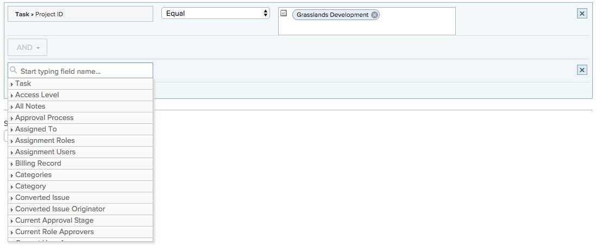
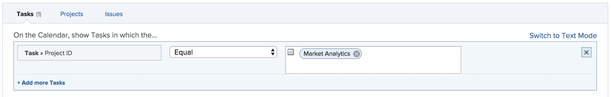

# Use custom date fields in a calendar report

A [!UICONTROL calendar] report is a dynamic report that provides a visual representation of your work. You can use custom date fields in a calendar report for the following objects:

* Tasks
* Issues
* Projects

## Access requirements

You must have the following access to perform the steps in this article:

<table style="table-layout:auto"> 
 <col> 
 </col> 
 <col> 
 </col> 
 <tbody> 
  <tr> 
   <td role="rowheader"><strong>[!DNL Adobe Workfront plan*]</strong></td> 
   <td> 
Any
 </td> 
  </tr> 
  <tr> 
   <td role="rowheader"><strong>[!DNL Adobe Workfront] license*</strong></td> 
   <td> 
[!UICONTROL Plan] 
 </td> 
  </tr> 
  <tr> 
   <td role="rowheader"><strong>Access level configurations*</strong></td> 
   <td> 
[!UICONTROL Edit] access to [!UICONTROL Reports], [!UICONTROL Dashboards], and [!UICONTROL Calendars]
 
Note: If you still don't have access, ask your [!DNL Workfront] administrator if they set additional restrictions in your access level. For information on how a [!DNL Workfront] administrator can modify your access level, see <a href="../../../administration-and-setup/add-users/configure-and-grant-access/create-modify-access-levels.md" class="MCXref xref">Create or modify custom access levels</a>.
 </td> 
  </tr> 
  <tr> 
   <td role="rowheader"><strong>Object permissions</strong></td> 
   <td> 
[!UICONTROL Manage] access to the calendar report
 
For information on requesting additional access, see <a href="../../../workfront-basics/grant-and-request-access-to-objects/request-access.md" class="MCXref xref">Request access to objects </a>.
 </td> 
  </tr> 
 </tbody> 
</table>

&#42;To find out what plan, license type, or access you have, contact your [!DNL Workfront] administrator.

## Prerequisites

1. You must have custom date fields and a value within the field available in your [!DNL Workfront] instance. If you don't have a custom form set up with custom dates, follow the instructions in the first two sections in [Create or edit a custom form](../../../administration-and-setup/customize-workfront/create-manage-custom-forms/create-or-edit-a-custom-form.md).
1. Attach the custom form to a project, task, or issue you plan to add to the calendar, and specify a date. For more information, see [Add a custom form to an object](../../../workfront-basics/work-with-custom-forms/add-a-custom-form-to-an-object.md).

## Set up the group of items

You can choose how you want the group of items to display on your calendar.

1. Click the **[!UICONTROL Main Menu]** icon  in the upper-right corner of [!DNL Adobe Workfront], then click **[!UICONTROL Calendars]**.

1. Select the calendar you want to add a new group of items to.\
   Or\
   Click **[!UICONTROL + New Calendar]** and enter the calendar name.

   >[!NOTE]
   >
   >You must have [!UICONTROL Edit] access to [!UICONTROL Reports], [!UICONTROL Dashboards], and [!UICONTROL Calendars] in your access level to create a calendar report.

1. On the left, click **[!UICONTROL Add to Calendar]**, then click **[!UICONTROL Add advanced items]**.

1. Specify the following:

   <table style="table-layout:auto">
    <col>
    <col>
    <tbody>
     <tr>
      <td role="rowheader"><strong>[!UICONTROL Name this group of items]</strong></td>
      <td>Type a name for the group of items.</td>
     </tr>
     <tr>
      <td role="rowheader"><strong>[!UICONTROL Color]</strong></td>
      <td>Select a color for the group of items. All items display in the selected color on the calendar report.</td>
     </tr>
     <tr>
      <td role="rowheader"><strong>[!UICONTROL Date Field]</strong></td>
      <td>Choose <strong>[!UICONTROL Custom dates]</strong>. </td>
     </tr>
     <tr>
      <td role="rowheader"><strong>[!UICONTROL On the calendar, show]</strong></td>
      <td>
Choose how you want the dates to show:

       <ul>
        <li><strong>[!UICONTROL Single Date]</strong>: The calendar displays the object on a single date.</li>
        <li><strong>[!UICONTROL Duration] (Start to End)</strong>: The calendar displays the object over a span of days. 
Note: If you choose <strong>[!UICONTROL Duration]</strong>, the end date specified must be after the start date or the item won't show on the calendar.
</li>
       </ul></td>
     </tr>
     <tr data-mc-conditions="">
      <td role="rowheader"><strong>[!UICONTROL Custom Dates]</strong></td>
      <td>
Enter the custom date name attached to the object you want to track.

<strong>NOTE:</strong> The search for the custom date name is limited to 50 results to avoid performance issues.</td>
     </tr>
    </tbody>
   </table>

1. Continue to the following section.

## Add objects to the group of items

After you set up how you want items to display, you need to add the objects you want to see on the calendar to the grouping.

1. In the **[!UICONTROL What would you like to add to the calendar?]** section, select

   * **[!UICONTROL Tasks]**
   * **[!UICONTROL Projects]**
   * **[!UICONTROL Issues]**

1. Click **[!UICONTROL Add Tasks]**, **[!UICONTROL Add Projects]**, or **[!UICONTROL Add Issues]**, depending on the object type you are adding to the calendar.\
   

1. In the drop-down menu, begin typing the field name, then select the field source of the object you want to display on the calendar (for example, **[!UICONTROL Late Tasks]**).
1. Set a condition statement for the calendar grouping.

   

   To learn about setting conditions, see [Filter and condition modifiers](../../../reports-and-dashboards/reports/reporting-elements/filter-condition-modifiers.md).

1. (Optional) Specify additional objects for the calendar grouping by repeating Steps 1-4.
1. In the **[!UICONTROL Set the Tasks/Projects/Issues labels to be the...]** field, select how the objects in this calendar grouping are labeled in the calendar.

   >[!NOTE]
   >
   >If the default label options are not available for a certain object, the object name is shown instead. For example, when the [!UICONTROL Parent Task] label is selected and there is no parent task associated with the object, [!DNL Adobe Workfront] displays the object name you are viewing in the calendar.

1. Click **[!UICONTROL Save]**.
