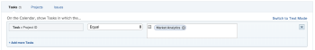

# Use Planned Dates in a calendar report

A calendar report is a dynamic report that provides a visual representation of your work.&nbsp;You can use Planned Date fields in a calendar report for the following objects:

* Tasks
* Issues
* Projects

## Access requirements

You must have the following access to perform the steps in this article:

<table style="table-layout:auto"> 
 <col> 
 </col> 
 <col> 
 </col> 
 <tbody> 
  <tr> 
   <td role="rowheader">Adobe Workfront plan*</td> 
   <td> 
Any
 </td> 
  </tr> 
  <tr> 
   <td role="rowheader">Adobe Workfront license*</td> 
   <td> 
Plan 
 </td> 
  </tr> 
  <tr> 
   <td role="rowheader">Access level configurations*</td> 
   <td> 
Edit access to&nbsp;Reports, Dashboards, and Calendars
 
Note: If you still don't have access, ask your Workfront administrator if they set additional restrictions in your access level. For information on how a Workfront administrator can modify your access level, see <a href="../../../administration-and-setup/add-users/configure-and-grant-access/create-modify-access-levels.md" class="MCXref xref">Create or modify custom access levels</a>.
 </td> 
  </tr> 
  <tr> 
   <td role="rowheader">Object permissions</td> 
   <td> 
Manage access to the calendar report
 
For information on requesting additional access, see <a href="../../../workfront-basics/grant-and-request-access-to-objects/request-access.md" class="MCXref xref">Request access to objects </a>.
 </td> 
  </tr> 
 </tbody> 
</table>

&#42;To find out what plan, license type, or access you have, contact your Workfront administrator.

## Set up the group of items

You can choose how you want the group of items to display on your calendar.

1. Click the **Main Menu** icon  in the upper-right corner of Adobe Workfront, then click **Calendars**.

1. Select the calendar you want to add a new group of items to.   
   Or  
   Click **+ New Calendar** and enter the calendar name.

   >[!NOTE]
   >
   >You must have Edit access to Reports, Dashboards, and Calendars in your access level to create a calendar report.

1. On the left, click **Add to Calendar**, then click **Add advanced items**.

1. Specify the following:  

   <table style="table-layout:auto">
    <col>
    <col>
    <tbody>
     <tr>
      <td role="rowheader">Name this group of items</td>
      <td>Type a name for the group of items.</td>
     </tr>
     <tr>
      <td role="rowheader">Color</td>
      <td>Select a color for the group of items. All items display in the selected color on the calendar report.</td>
     </tr>
     <tr>
      <td role="rowheader">Date Field</td>
      <td>
Choose <strong>Planned dates</strong>. For more information on planned dates, see 

       <ul>
        <li><a href="../../../manage-work/projects/planning-a-project/project-planned-start-date.md" class="MCXref xref">Overview of the project Planned Start Date</a></li>
        <li><a href="../../../manage-work/tasks/task-information/task-planned-start-date.md" class="MCXref xref">Overview of the task Planned Start Date</a></li>
        <li><a href="../../../manage-work/tasks/task-information/task-planned-completion-date.md" class="MCXref xref">Overview of the task Planned Completion Date</a></li>
        <li><a href="../../../manage-work/projects/planning-a-project/project-planned-completion-date.md" class="MCXref xref">Set the project Planned Completion Date</a> </li>
       </ul></td>
     </tr>
     <tr>
      <td role="rowheader">On the calendar, show</td>
      <td>
Choose how you want the dates to show:

       <ul>
        <li><strong>Start Date Only</strong>: The calendar displays the object on a single date.</li>
        <li><strong>End Date Only</strong>: The calendar displays the object on a single date.</li>
        <li><strong>Duration (Start to End)</strong>: The calendar displays the object over a span of days.</li>
       </ul></td>
     </tr>
     <tr data-mc-conditions="">
      <td role="rowheader">Switch to actual dates when available</td>
      <td>
The calendar automatically switches to actual dates when they are available.  Choose <strong>Yes</strong> or <strong>No</strong> to switch to actual dates when available. For more information on Actual Dates, see

       <ul>
        <li><a href="../../../manage-work/projects/planning-a-project/project-actual-start-date.md" class="MCXref xref">Overview of the project Actual Start Date </a></li>
        <li><a href="../../../manage-work/projects/planning-a-project/project-actual-completion-date.md" class="MCXref xref">Overview of the project Actual Completion Date </a></li>
       </ul></td>
     </tr>
    </tbody>
   </table>

1. Continue to the following section.

## Add objects to the group of items

After you set up how you want items to display, you need to add the objects you want to see on the calendar to the grouping.

1. In the **What would you like to add to the calendar?** section, select

   * **Tasks**
   * **Projects**
   * **Issues**

1. Click **Add Tasks**, **Add Projects**, or **Add Issues**, depending on the object type you are adding to the calendar.  
   

1. In the drop-down menu, begin typing the field name, then select the&nbsp;field source of the object you want to display on the calendar (for example,&nbsp;**Late Tasks**).
1. Set a condition statement for the calendar grouping.

   

   To learn about setting conditions, see [Filter and condition modifiers](../../../reports-and-dashboards/reports/reporting-elements/filter-condition-modifiers.md).

1. (Optional) Specify additional objects for the calendar grouping by repeating Steps 1-4.
1. In the **Set the Tasks/Projects/Issues labels to be the...**&nbsp;field, select how the objects in this calendar grouping are labeled in the calendar.

   >[!NOTE]
   >
   >If the default label&nbsp;options are not available for a certain object, the object name is&nbsp;shown instead. For example, when the Parent Task label is selected and&nbsp;there is no parent task associated with the object,&nbsp;Adobe Workfront displays the object name you are viewing in the calendar.

1. Click **Save**.

