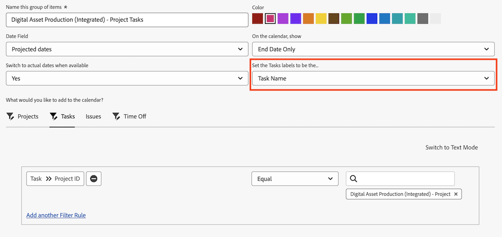

# Use [!UICONTROL Projected Dates] in a calendar report

A calendar report is a dynamic report that provides a visual representation of your work. You can use Projected Date fields in a calendar report for the following objects:

* Tasks
* Issues
* Projects

## Access requirements

+++ Expand to view access requirements for the functionality in this article.

You must have the following access to perform the steps in this article:

<table style="table-layout:auto"> 
 <col> 
 </col> 
 <col> 
 </col> 
 <tbody> 
  <tr> 
   <td role="rowheader">[!DNL Adobe Workfront plan]</td> 
   <td> 
Any
 </td> 
  </tr> 
  <tr> 
   <td role="rowheader">[!DNL Adobe Workfront] license</td> 
   <td>
New: Standard

       
or

       
Current: Plan
</td> 
  </tr> 
  <tr> 
   <td role="rowheader">Access level configurations</td> 
   <td> 
[!UICONTROL Edit] access to [!UICONTROL Reports], [!UICONTROL Dashboards], and [!UICONTROL Calendars]
</td> 
  </tr> 
  <tr> 
   <td role="rowheader">Object permissions</td> 
   <td>[!UICONTROL Manage] access to the calendar report</td> 
  </tr> 
 </tbody> 
</table>

For more detail about the information in this table, see [Access requirements in Workfront documentation](/help/quicksilver/administration-and-setup/add-users/access-levels-and-object-permissions/access-level-requirements-in-documentation.md).

+++

## Set up the group of items in Production

You can choose how you want the group of items to display on your calendar.

{{step1-to-calendars}}

1. Select the calendar you want to add a new group of items to.
   Or
   Click **[!UICONTROL + New Calendar]** and enter the calendar name.

   >[!NOTE]
   >
   >You must have [!UICONTROL Edit] access to [!UICONTROL Reports], [!UICONTROL Dashboards], and [!UICONTROL Calendars] in your access level to create a calendar report.

1. On the left, click **[!UICONTROL Add to Calendar]**, then click **[!UICONTROL Add advanced items]**.

1. Specify the following:

   <table style="table-layout:auto">
    <col>
    <col>
    <tbody>
     <tr>
      <td role="rowheader"><strong>[!UICONTROL Name this group of items]</strong></td>
      <td>Type a name for the group of items.</td>
     </tr>
     <tr>
      <td role="rowheader"><strong>[!UICONTROL Color]</strong></td>
      <td>Select a color for the group of items. All items display in the selected color on the calendar report.</td>
     </tr>
     <tr>
      <td role="rowheader"><strong>[!UICONTROL Date Field]</strong></td>
      <td>
Choose <strong>[!UICONTROL Projected dates]</strong>. For more information on Projected Dates, see 

       <ul>
        <li><a href="../../../manage-work/projects/planning-a-project/project-projected-start-date.md" class="MCXref xref">Overview of the project Projected Start Date</a></li>
        <li><a href="../../../manage-work/projects/planning-a-project/project-projected-completion-date.md" class="MCXref xref">Overview of the Projected Completion Date for projects, tasks, and issues</a> </li>
       </ul></td>
     </tr>
     <tr>
      <td role="rowheader"><strong>[!UICONTROL On the calendar, show]</strong></td>
      <td>
Choose how you want the dates to show:

       <ul>
        <li><strong>[!UICONTROL Start Date Only]</strong>: The calendar displays the object on a single date.</li>
        <li><strong>[!UICONTROL End Date Only]</strong>: The calendar displays the object on a single date.</li>
        <li><strong>[!UICONTROL Duration] (Start to End)</strong>: The calendar displays the object over a span of days.</li>
       </ul></td>
     </tr>
     <tr data-mc-conditions="">
      <td role="rowheader"><strong>[!UICONTROL Switch to Actual Dates when available]</strong></td>
      <td>
The calendar automatically switches to actual dates when they are available.  Choose <strong>[!UICONTROL Yes]</strong> or <strong>[!UICONTROL No]</strong> to switch to actual dates when available. For more information on Actual Dates, see

       <ul>
        <li><a href="../../../manage-work/projects/planning-a-project/project-actual-start-date.md" class="MCXref xref">Overview of the project Actual Start Date </a></li>
        <li><a href="../../../manage-work/projects/planning-a-project/project-actual-completion-date.md" class="MCXref xref">Overview of the project Actual Completion Date </a></li>
       </ul></td>
     </tr>
    </tbody>
   </table>

1. Continue to the following section.

## Add objects to the group of items in Production

After you set up how you want items to display, you need to add the objects you want to see on the calendar to the grouping.

1. In the **[!UICONTROL What would you like to add to the calendar?]** section, select

   * **[!UICONTROL Tasks]**
   * **[!UICONTROL Projects]**
   * **[!UICONTROL Issues]**

1. Click **[!UICONTROL Add Tasks]**, **[!UICONTROL Add Projects]**, or **[!UICONTROL Add Issues]**, depending on the object type you are adding to the calendar.
   

1. In the drop-down menu, begin typing the field name, then select the field source of the object you want to display on the calendar (for example,&nbsp;**[!UICONTROL Late Tasks]**).
1. Set a condition statement for the calendar grouping.

   

   To learn about setting conditions, see [Filter and condition modifiers](../../../reports-and-dashboards/reports/reporting-elements/filter-condition-modifiers.md).

1. (Optional) Specify additional objects for the calendar grouping by repeating Steps 1-4.
1. In the **[!UICONTROL Set the Tasks/Projects/Issues labels to be the...]** field, select how the objects in this calendar grouping are labeled in the calendar.

   >[!NOTE]
   >
   >If the default label options are not available for a certain object, the object name is shown instead. For example, when the Parent Task label is selected and there is no parent task associated with the object, [!DNL Adobe Workfront] displays the object name you are viewing in the calendar.

1. Click **[!UICONTROL Save]**.

## Set up the group of items in Preview

You can choose how you want the group of items to display on your calendar.

{{step1-to-calendars}}

1. Select the calendar you want to add a new group of items, click the More menu, then **Edit**.
   Or
   Click **[!UICONTROL + New Calendar]**, enter the project name, then click **[!UICONTROL Add advanced items]**.

   >[!NOTE]
   >
   >You must have [!UICONTROL Edit] access to [!UICONTROL Reports], [!UICONTROL Dashboards], and [!UICONTROL Calendars] in your access level to create a calendar report.

1. On the left, click **[!UICONTROL Add to Calendar]**, then click **[!UICONTROL Add advanced items]**.

1. Specify the following:

   <table style="table-layout:auto">
    <col>
    <col>
    <tbody>
     <tr>
      <td role="rowheader"><strong>[!UICONTROL Name this group of items]</strong></td>
      <td>Type a name for the group of items.</td>
     </tr>
     <tr>
      <td role="rowheader"><strong>[!UICONTROL Color]</strong></td>
      <td>Select a color for the group of items. All items display in the selected color on the calendar report.</td>
     </tr>
     <tr>
      <td role="rowheader"><strong>[!UICONTROL Date Field]</strong></td>
      <td>
Choose <strong>[!UICONTROL Projected dates]</strong>. For more information on Projected Dates, see 

       <ul>
        <li><a href="../../../manage-work/projects/planning-a-project/project-projected-start-date.md" class="MCXref xref">Overview of the project Projected Start Date</a></li>
        <li><a href="../../../manage-work/projects/planning-a-project/project-projected-completion-date.md" class="MCXref xref">Overview of the Projected Completion Date for projects, tasks, and issues</a> </li>
       </ul></td>
     </tr>
     <tr>
      <td role="rowheader"><strong>[!UICONTROL On the calendar, show]</strong></td>
      <td>
Choose how you want the dates to show:

       <ul>
        <li><strong>[!UICONTROL Start Date Only]</strong>: The calendar displays the object on a single date.</li>
        <li><strong>[!UICONTROL End Date Only]</strong>: The calendar displays the object on a single date.</li>
        <li><strong>[!UICONTROL Duration] (Start to End)</strong>: The calendar displays the object over a span of days.</li>
       </ul></td>
     </tr>
     <tr data-mc-conditions="">
      <td role="rowheader"><strong>[!UICONTROL Switch to Actual Dates when available]</strong></td>
      <td>
The calendar automatically switches to actual dates when they are available.  Choose <strong>[!UICONTROL Yes]</strong> or <strong>[!UICONTROL No]</strong> to switch to actual dates when available. For more information on Actual Dates, see

       <ul>
        <li><a href="../../../manage-work/projects/planning-a-project/project-actual-start-date.md" class="MCXref xref">Overview of the project Actual Start Date </a></li>
        <li><a href="../../../manage-work/projects/planning-a-project/project-actual-completion-date.md" class="MCXref xref">Overview of the project Actual Completion Date </a></li>
       </ul></td>
     </tr>
    </tbody>
   </table>

1. Continue to the following section.

## Add objects to the group of items in Preview

After you set up how you want items to display, you need to add the objects you want to see on the calendar to the grouping.

1. In the **[!UICONTROL What would you like to add to the calendar?]** section, select

   * **[!UICONTROL Tasks]**
   * **[!UICONTROL Projects]**
   * **[!UICONTROL Issues]**
   * **[!UICONTROL Time Off]**
1. Click **[!UICONTROL Add Tasks]**, **[!UICONTROL Add Projects]**, or **[!UICONTROL Add Issues]**, depending on the object type you are adding to the calendar.

1. In the drop-down menu, begin typing the field name, then select the field source of the object you want to display on the calendar (for example,&nbsp;**[!UICONTROL Late Tasks]**).
1. Set a condition statement for the calendar grouping.

    
       To learn about setting conditions, see [Filter and condition modifiers](../../../reports-and-dashboards/reports/reporting-elements/filter-condition-modifiers.md).

1. (Optional) Specify additional objects for the calendar grouping by repeating Steps 1-4.
1. In the **[!UICONTROL Set the Tasks/Projects/Issues labels to be the...]** field, select how the objects in this calendar grouping are labeled in the calendar.

   >[!NOTE]
   >
   >If the default label options are not available for a certain object, the object name is shown instead. For example, when the [!UICONTROL Parent Task] label is selected and there is no parent task associated with the object, [!DNL Adobe Workfront] displays the object name you are viewing in the calendar.

   

1. Click **[!UICONTROL Save]**.

