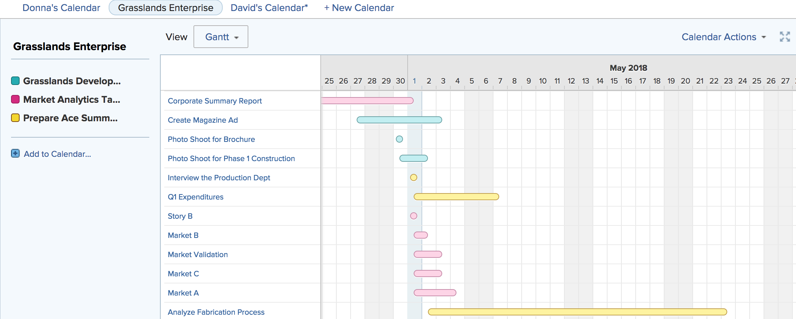

# View calendar reports and event details

You can view calendar reports and event details that you created or were shared with you in Adobe Workfront.

## Access requirements

You must have the following access to perform the steps in this article:

<table style="table-layout:auto"> 
 <col> 
 </col> 
 <col> 
 </col> 
 <tbody> 
  <tr> 
   <td role="rowheader"><strong>Adobe Workfront plan*</strong></td> 
   <td> 
Any
 </td> 
  </tr> 
  <tr> 
   <td role="rowheader"><strong>Adobe Workfront license*</strong></td> 
   <td> 
Request or higher
 </td> 
  </tr> 
  <tr> 
   <td role="rowheader"><strong>Access level configurations*</strong></td> 
   <td> 
View or higher access to Reports, Dashboards, and Calendars
 
Note: If you still don't have access, ask your Workfront administrator if they set additional restrictions in your access level. For information on how a Workfront administrator can modify your access level, see <a href="../../../administration-and-setup/add-users/configure-and-grant-access/create-modify-access-levels.md" class="MCXref xref">Create or modify custom access levels</a>.
 </td> 
  </tr> 
  <tr> 
   <td role="rowheader"><strong>Object permissions</strong></td> 
   <td> 
View or higher permissions to the calendar report
 
For information on requesting additional access, see <a href="../../../workfront-basics/grant-and-request-access-to-objects/request-access.md" class="MCXref xref">Request access to objects </a>.
 </td> 
  </tr> 
 </tbody> 
</table>

&#42;To find out what plan, license type, or access you have, contact your Workfront administrator.

## View a calendar report

1. Click the **Main Menu** icon  in the upper-right corner of Adobe Workfront, then click **Calendars**.

   Depending on your access level, you might see the following calendars listed:

   * Your default Adobe Workfront calendar  
     Workfront creates a calendar for you based on the projects, tasks, and issues that are assigned to you or that are assigned to teams, groups, or roles to which you are assigned.
   * Calendars that you have created  
     To learn about creating calendars, see [Calendar reports overview](../../../reports-and-dashboards/reports/calendars/calendar-reports-overview.md).
   
   * Calendars that other users have shared with you  
     To learn about sharing calendars, see [Share a calendar report](../../../reports-and-dashboards/reports/calendars/share-a-calendar-report.md).

1. (Conditional) Click the **View** drop-down, then select the calendar duration you want to view.  
     
   You can choose from the following calendar report views:

   * **Month**: Displays four weeks of the calendar
   * **Week**: Displays one week of the calendar
   * **Gantt**: Displays a continuous view of the calendar  
     
     You can see more events in a Gantt view by scrolling down or sideways. A loading symbol appears as data is populated for the view.

1. (Optional) If you are viewing the calendar in the Month or Week views, you can change your calendar view with the following options:

   * To include or exclude weekends:

      1. On the **Calendar** toolbar, click **Calendar Actions**, then from the drop-down list select either **Show Weekend** or **Hide Weekend**.

   * To quickly change the displayed dates:

      1. On the **Calendar** toolbar, click the left arrow of the date indicator to move back in the calendar or the right arrow to move forward.  
           
         The displayed dates are adjusted by an interval based your current calendar view. For example, if you are viewing the calendar in the Week view, the calendar displays either one week forward or one week back, depending on the arrow you select.
      
      1. (Optional) To return to the current day, click **Today**.

1. (Optional) To view a calendar in full-screen, click the full-screen arrows on the right-hand side of the **Calendar** toolbar. 
     
   Press Esc to return to the normal view of the calendar.

1. (Optional) To hide the events for a project or calendar grouping linked to the calendar, clear the project or calendar grouping in the project list.
     
   You can make the events visible again by selecting the project or calendar grouping in the project list.

## View calendar report event details

You can see the details of an event in a calendar.

1. Go to the event that you want to know the details for, then click the event.  
   A details page for the event opens.  
   

1. (Optional) To view additional details on the object:

   1. Hover over the project, task, or issue name.  
      A details page opens for the object.  
      

   1. (Optional) To open the associated project, task, or issue, click the title of the object.
   1. (Optional) To close all the opened details pages, click anywhere outside the event details pages.
