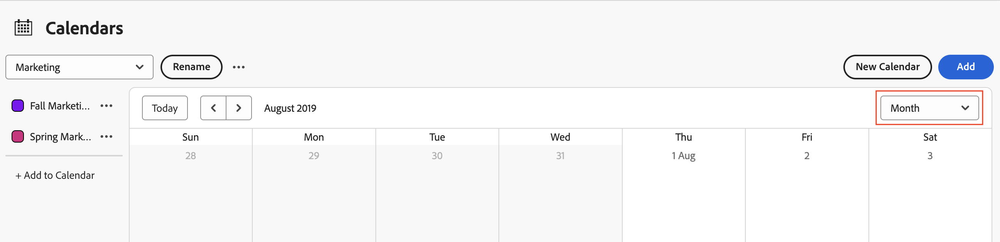
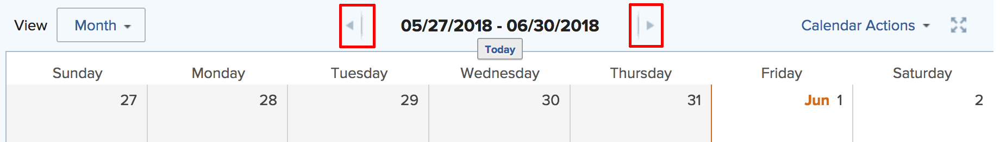
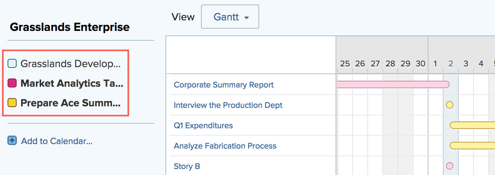

# View calendar reports and event details

You can view calendar reports and event details that you created or were shared with you in Adobe Workfront.

## Access requirements

+++ Expand to view access requirements for the functionality in this article.

You must have the following access to perform the steps in this article:

<table style="table-layout:auto"> 
 <col> 
 </col> 
 <col> 
 </col> 
 <tbody> 
  <tr> 
   <td role="rowheader">[!DNL Adobe Workfront plan]</td> 
   <td> 
Any
 </td> 
  </tr> 
  <tr> 
   <td role="rowheader">[!DNL Adobe Workfront] license</td> 
   <td>
New: Contributor

       
or

       
Current: Request
</td> 
  </tr> 
  <tr> 
   <td role="rowheader">Access level configurations</td> 
   <td> 
[!UICONTROL View] or higher access to [!UICONTROL Reports], [!UICONTROL Dashboards], and [!UICONTROL Calendars]
</td> 
  </tr> 
  <tr> 
   <td role="rowheader">Object permissions</td> 
   <td>[!UICONTROL View] or higher permissions to the calendar report</td> 
  </tr> 
 </tbody> 
</table>

For more detail about the information in this table, see [Access requirements in Workfront documentation](/help/quicksilver/administration-and-setup/add-users/access-levels-and-object-permissions/access-level-requirements-in-documentation.md).

+++

## View a calendar report

<!--{{step1-to-calendars}}-->

1. Click the **[!UICONTROL Main Menu]** icon  in the upper-right corner of Adobe Workfront, or (if available), click the **[!UICONTROL Main Menu]** icon  in the upper-left corner, then click **[!UICONTROL Calendars]**.

   Depending on your access level, you might see the following calendars listed:
   
   * Your default [!DNL Adobe Workfront] calendar
   
     Workfront creates a calendar for you based on the projects, tasks, and issues that are assigned to you or that are assigned to teams, groups, or roles to which you are assigned.
      
   * Calendars that you have created

     To learn about creating calendars, see [Calendar reports overview](../../../reports-and-dashboards/reports/calendars/calendar-reports-overview.md).

   * Calendars that other users have shared with you

     To learn about sharing calendars, see [[!UICONTROL Share a calendar] report](../../../reports-and-dashboards/reports/calendars/share-a-calendar-report.md).

1. (Conditional) Click the **[!UICONTROL View]** drop-down, then select the calendar duration you want to view.
   
   You can choose from the following calendar report views:

   * **[!UICONTROL Month]**: Displays four weeks of the calendar
   * **[!UICONTROL Week]**: Displays one week of the calendar
   * **[!UICONTROL Gantt]**: Displays a continuous view of the calendar
      
      You can see more events in a **Gantt** view by scrolling down or sideways. A loading symbol appears as data is populated for the view.

   >[!NOTE]
   >
   >In the **Month** and **Week** views, events that are current or future (including events that span multiple days, as long as they contain today or a future day) have shading that corresponds to the color in the project or calendar grouping. Past events have lighter shading to indicate that they are no longer current, but you can still select and view those events.

1. (Optional) If you are viewing the calendar in the **Month** or **Week** views, you can change your calendar view with the following options:

      <!--   * To include or exclude weekends:
      1. On the **[!UICONTROL Calendar]** toolbar, click **[!UICONTROL Calendar Actions]**, then from the drop-down list select either **[!UICONTROL Show Weekend]** or **[!UICONTROL Hide Weekend]**.-->

      * To quickly change the displayed dates:

         1. On the **[!UICONTROL Calendar]** toolbar, click the left arrow of the date indicator to move back in the calendar or the right arrow to move forward.

            
            
            The displayed dates are adjusted by an interval based your current calendar view. For example, if you are viewing the calendar in the **Week** view, the calendar displays either one week forward or one week back, depending on the arrow you select.

         1. (Optional) To return to the current day, click [!UICONTROL **Today**].

1. (Optional) To hide the events for a project or calendar grouping linked to the calendar, clear the project or calendar grouping in the project list.
   
   You can make the events visible again by selecting the [!UICONTROL project] or calendar grouping in the project list.

## View calendar report event details

You can see the details of an event in a calendar, for both current and past events.

1. Go to the event that you want to know the details for, then click the event. The details open in a panel on the right side.
1. (Optional) To open the associated project, task, or issue, click the title of the object.
