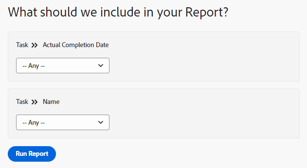

# Add a prompt to a report

<!-- Audited: 11/2024 -->

## The difference between prompts and filters

Filters and prompts are similar in the sense that they both restrict the amount of information which you display in a report.

You build a filter when you want the information displayed in the report to be filtered by the same criteria every time you run the report. Filters are built one time and they are hard coded in the report. For more information about building filters, see the article [Filters overview](../../../reports-and-dashboards/reports/reporting-elements/filters-overview.md).

Prompts are open filters that can be customized and applied differently every time you run a report.

When you add prompts to your report, you can customize the filtering information by editing the prompt criteria every time you run the report. The report runs with a different filter every time, depending on what modifiers you choose, instead of hard coding the modifiers once in the filter of the report.

Prompts act as a customizable filter on reports which can be updated right before you run the report. You can create generic reports and then narrow the results based on information you want to see for that day or on the information that is relevant for a set of criteria individual to you. For example, if you have an Hours report and you want to change the information of the report based on the following criteria:

* The dates when the hours were logged
* The users who entered the hours
* The amount of hours entered

You would build three prompts where the conditions are the criteria required and the report would look different every time you run it, according to which information you choose for your prompts.

A filter can tell Adobe Workfront to show only those hours entered between June and August of this year. However, with a prompt, you can use a different time frame each time you run the report (for example, between January and February or October and December).

## Access requirements

+++ Expand to view access requirements for the functionality in this article. 

You must have the following access to perform the steps in this article:

<table style="table-layout:auto"> 
 <col> 
 <col> 
 <tbody> 
  <tr> 
   <td role="rowheader">Adobe Workfront plan*</td> 
   <td> <p>Any</p> </td> 
  </tr> 
  <tr> 
   <td role="rowheader">Adobe Workfront license*</td> 
    <td> 
      <p>New:</p>
         <ul>
         <li><p>Standard</p></li>
         </ul>
      <p>Current:</p>
         <ul>
         <li><p>Plan</p></li>
         </ul>
   </td>
  </tr> 
  <tr> 
   <td role="rowheader">Access level configurations*</td> 
   <td> <p>Edit access to&nbsp;Reports,&nbsp;Dashboards,&nbsp;Calendars</p> <p>Edit access to Filters,&nbsp;Views, Groupings</p></td> 
  </tr> 
  <tr> 
   <td role="rowheader">Object permissions*</td> 
   <td> <p>Manage permissions to a report</p></td> 
  </tr> 
 </tbody> 
</table>

*For information, see [Access requirements in Workfront documentation](/help/quicksilver/administration-and-setup/add-users/access-levels-and-object-permissions/access-level-requirements-in-documentation.md). 

+++

## Prerequisites

You must create a report before you can add a prompt to it.

For instructions on creating a report, see [Create a report](../../../reports-and-dashboards/reports/creating-and-managing-reports/create-report.md)

## Create a prompt

1. Go to the report where you want to add a prompt.
1. Expand **Report Actions**, and then click **Edit**.

1. Click the **Report Settings** button.
1. Click the **Report Prompts** tab, then click **Add a Prompt**.  
   

1. (Conditional) Select the field that you want the prompt to be based on. Start typing the name of the field, then click to select it when it appears in the list.  
   The options available to users running the report will differ depending on the field you select.  
   For example, if you select a date field such as Actual Completion Date on a task report, "Actual Completion Date" is the name of the prompt. When editing this prompt as you are running this report, you can choose from a set of modifiers to build your filtering statement. This process is identical to building a filter. For more information about modifiers, see [Filter and condition modifiers](../../../reports-and-dashboards/reports/reporting-elements/filter-condition-modifiers.md).

1. (Conditional) Click **Custom Prompt** to create a custom prompt.

   A custom prompt is a predefined prompt where you hard code the filtering criteria before you run the report. In this sense, a custom prompt is closer to a filter than a prompt.

   However, the prompt remains as flexible as a regular prompt because you can choose from several predefined statements, as opposed to having just one hard coded filter in the report.

   Specify the following information for the custom prompt: The condition of a custom prompt can only be edited using text mode. This allows for multiple conditions to be applied in a single field.

   * **Field name:** This is the name of the prompt, as you see it before you run the report.
   * **Dropdown Item Label:** This is the name of one of the options inside the prompt as you see it before you run the report.
   * **Condition:** Enter a condition that defines the prompt.
   * **Default:** You can select one item to to be the default option for this prompt.

   Use the same syntax that you would use when entering a text mode filter, and join your statements by "&". For more information about editing a filter in text mode, see [Edit a filter using text mode](../../../reports-and-dashboards/reports/text-mode/edit-text-mode-in-filter.md).

   For example, the **Condition** field of the custom prompt for the following scenarios could look like this:

   * all tasks on future projects where the project status is Idea, Requested, Planned and Current:

     ```   
     project:plannedStartDate=$$TODAY&project:plannedStartDate_Mod=gte&project:status=IDA,REQ,PLN,CUR&project:status_Mod=in
     ```

   * all tasks in completed (past) projects where the project status is Completed or Dead:

     ```   
     project:actualCompletionDate=$$TODAY&project:actualCompletionDate_Mod=lte&project:status=CPL,DED&project:status_Mod=in
     ```

   For more information about text mode modifiers, see [Filter and condition modifiers](../../../reports-and-dashboards/reports/reporting-elements/filter-condition-modifiers.md).

   >[!NOTE]
   >
   >You cannot change the conditions of a custom prompt when you run the report, like you would a standard prompt. You can have as many predefined conditions for a custom prompt as you need.

1. (Optional) Repeat Step 4 or Step 5 to create as many prompts as needed.
1. Click **Done**, then click **Save+Close** to save the report.

## Apply a prompt to a report

When you have a prompt added to a report, the default tab of the report is always the Prompts tab.

To run a report with a prompt:

1. Go to the report with the prompt.

   

1. Choose a condition for one or all the prompts displayed on the **Prompts** tab.  
   (Optional) You can leave the prompts blank and not filter the report by the prompt conditions.

1. Click **Run Report**.  
   (Conditional) If you populated the prompts, the report is filtered by the conditions you have chosen for your prompts.  
   (Conditional) If you left the prompts blank, the report is not filtered by the prompt conditions. The report displays as if it were not filtered.

   >[!NOTE]
   >
   >A report that contains a filter in addition to a prompt filters the results according to both the criteria defined in the filter and the prompt combined.

## Limitations of sharing prompted reports

>[!CAUTION]
>
>When you share a prompted report, both logged in and not logged in users viewing the report using the public share link cannot run the report using its prompts. In this case, the results of the report display without applying any prompts, and the information displayed will instead be based on the user's access level and permissions or the report's Run As User access level and permissions, if one is set.

The following are limitations in sharing prompted reports from Workfront:

* When you share a report publicly, users cannot run the report with applied prompts, unless they: have Workfront credentials, log in first, and navigate to the report directly in Workfront (not through the public share link).

  For more information about sharing reports, see the article [Share a report in Adobe Workfront](../../../reports-and-dashboards/reports/creating-and-managing-reports/share-report.md).

* When you schedule a prompted report for delivery the report in the email attachment includes the data of the report unprompted. When the user clicks the link in the email to access the report, they must log in first to view the report and run the prompt themselves.

  For information about scheduling a delivered report, see [Schedule an automatic report delivery](../../../reports-and-dashboards/reports/creating-and-managing-reports/set-up-automatic-report-delivery.md).

* When running a report with a date-based prompt, the report results will be filtered based on your browser's time zone settings. This can cause slight discrepancies in the date ranges displayed in a prompted report for dates that are at the beginning or end of a month. If your browser's time zone settings are tied to a specific location, variations in the that location's local time (such as adherence to daylight saving time) will also be factored into the dates displayed for a prompted report. This can lead to slight date range discrepancies between users in the same time zone but with different location settings.
