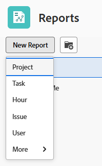
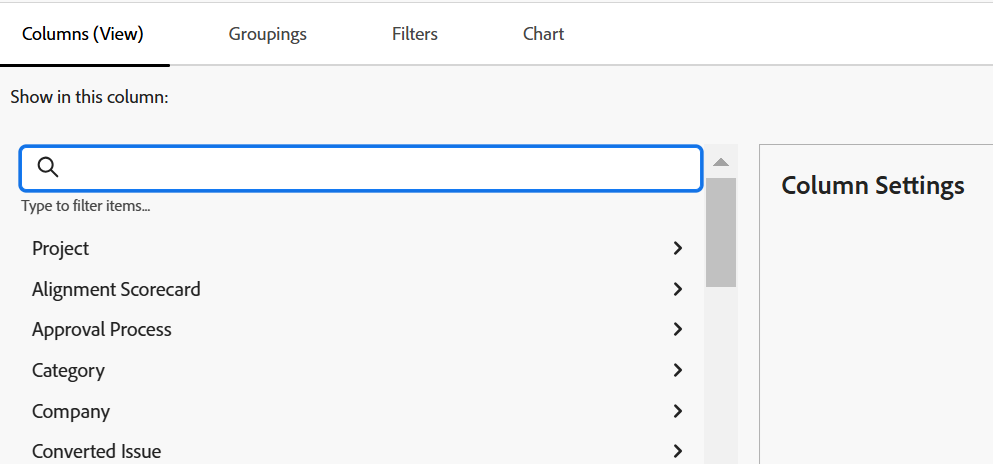
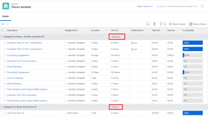
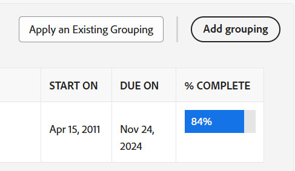
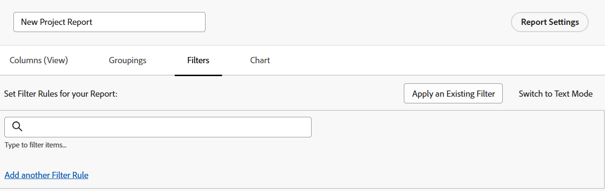
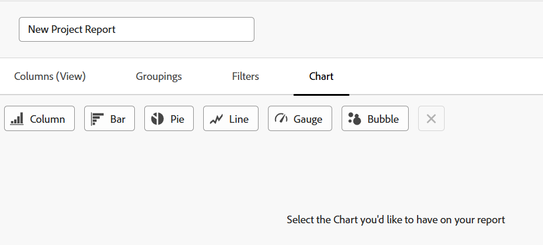

# Create a custom report

You can provide access to the information your organization needs in Adobe Workfront by creating reports. You can use any of the built-in reports available in Workfront, or you can build your custom reports from scratch.

For more information about built-in reports, see [Use Adobe Workfront built-in reports](../../../reports-and-dashboards/reports/using-built-in-reports/use-workfront-built-in-reports.md). 

For information about creating a report by copying it, see [Create a copy of a report](../../../reports-and-dashboards/reports/creating-and-managing-reports/create-copy-report.md).

For more information about creating and managing reports, including classes, videos, and tutorials, see the Learn section on the Adobe Experience League site. 

## Access requirements

You must have the following access to perform the steps in this article:

<table style="table-layout:auto"> 
 <col> 
 <col> 
 <tbody> 
  <tr> 
   <td role="rowheader">Adobe Workfront plan*</td> 
   <td> 
Any
 </td> 
  </tr> 
  <tr> 
   <td role="rowheader">Adobe Workfront license*</td> 
   <td> 
New: Standard 

   or
   
Current: Plan 
 </td> 
  </tr> 
  <tr> 
   <td role="rowheader">Access level configurations*</td> 
   <td> 
Edit access to Reports, Dashboards, Calendars
 
Edit access to Filters, Views, Groupings
 
<b>NOTE</b>

   
 If you still don't have access, ask your Workfront administrator if they set additional restrictions in your access level. For information on how a Workfront administrator can modify your access level, see <a href="../../../administration-and-setup/add-users/configure-and-grant-access/create-modify-access-levels.md" class="MCXref xref">Create or modify custom access levels</a>.
 </td> 
  </tr> 
  <tr> 
   <td role="rowheader">Object permissions</td> 
   <td> 
You obtain Manage permissions to the reports you create.
 
For information on requesting additional access, see <a href="../../../workfront-basics/grant-and-request-access-to-objects/request-access.md" class="MCXref xref">Request access to objects </a>.
 </td> 
  </tr> 
 </tbody> 
</table>

&#42;To find out what plan, license type, or access you have, contact your Workfront administrator.

## Create a report {#create-a-report}

{{step1-to-reports}}

1. Click **New Report**, then select the object type that you want for the report.

   The report builder loads.

   For specific information about available object reports, see the section [Report on objects](../../../workfront-basics/navigate-workfront/workfront-navigation/understand-objects.md#reporting-on-objects) in the article [Understand objects in Adobe Workfront](../../../workfront-basics/navigate-workfront/workfront-navigation/understand-objects.md).

   

   >[!TIP]
   >
   >You can also create a report by making a copy of an existing report. For more information, see [Create a copy of a report](../../../reports-and-dashboards/reports/creating-and-managing-reports/create-copy-report.md).

1. In the report builder, add the following to your report:

   <table style="table-layout:auto"> 
    <col> 
    <col> 
    <thead> 
     <tr> 
      <th>Feature</th> 
      <th>Description</th> 
     </tr> 
    </thead> 
    <tbody> 
     <tr> 
      <td>Columns (View)</td> 
      <td> 
Adding columns to your report determines what information your report contains.
 
To learn how to add a column, see <a href="#add-columns-view-to-a-report" class="MCXref xref">Add columns (view) to a report</a>. 
 </td> 
     </tr> 
     <tr> 
      <td>Groupings</td> 
      <td> 
Adding groupings to your report determines how your report is organized.
 
To learn how to add a grouping, see <a href="#add-groupings-to-a-report" class="MCXref xref">Add groupings to a report</a>.
 </td> 
     </tr> 
     <tr> 
      <td>Filters</td> 
      <td> 
Adding filter rules to your report determines information you see in your report.
 
To learn how to add a filter, see <a href="#add-filters-to-a-report" class="MCXref xref">Add filters to a report</a>.
 </td> 
     </tr> 
     <tr> 
      <td>Chart</td> 
      <td> 
Adding a chart to your report determines how the information in your report is presented visually.
 
To learn how to add a chart, see <a href="#add-a-chart-to-a-report" class="MCXref xref">Add a chart to a report</a>.
 </td> 
     </tr> 
    </tbody> 
   </table>

1. At any point during the report creation process, click **Apply** to save your changes.
1. After you are finished, click **Save + Close**.

### Add columns (view) to a report {#add-columns-view-to-a-report}

1. Start creating a report as described in the [Create a report](#create-a-report) section in this article.
1. In the report builder, select the **Columns (View)** tab to identify the columns to appear in the report.
1. (Optional) Click **Apply an Existing View** and click the name of a view in the drop-down menu to use an existing view.

   For more information about creating a view, see [Views overview in Adobe Workfront](../../../reports-and-dashboards/reports/reporting-elements/views-overview.md).

1. (Optional) To remove an existing column, click the column that you want to remove, then click the **x** next to the current name in the column header.

1. To add a new column, click **Add Column**.

   Or

   To change an existing column, click the column, click the **Remove** icon  to the left of the current field in the **Show in this column field** box in the upper-left corner of the report builder, and start typing a new field, then click it when it displays in the list.

   For more information about the fields you see in the columns, see [Glossary of Adobe Workfront terminology](../../../workfront-basics/navigate-workfront/workfront-navigation/workfront-terminology-glossary.md).

   

1. (Optional) In the **Column Settings** area, select **Sort by this column** to sort the values in the column either in ascending on descending alphabetical order, then indicate whether the list should use this column as its first sort.

   You can have multiple levels of sorts in a report view if you want to sort by the value in one column first, the value in a second column secondly, etc.

   If multiple results are identical according to the first sorting criteria, they sort in the order of the second sorting criteria. If multiple results are identical according to the first and second sorting criteria, they sort according to the third sorting, etc.

   >[!NOTE]
   >
   >If you add a field that references an object that is too far removed from the object that you're reporting on, you may not be able to sort by this field.  
   >For example, an issue report cannot sort by the Project Owner field because it references 3 additional objects: Project, Owner, and Name. However, you can still add this field to an issue report and see the information for it.  
   
   <!--outdated: To learn more about cross-object references in reports, see the section "Advanced Reporting Part 1 of 3" in the [Reports and Dashboards Learning Path](https://one.workfront.com/s/learningpath2/workfront-reporting-MC7MZT2BOL2ZC2LMJ4MA3EMHOCNY?tabset-dc70e=2).-->

1. (Optional) If you are using groupings and you want to summarize (aggregate) the information in a column, click the **Summarize this column by** drop-down list in the **Column Settings** area, then select the option you want to use to aggregate the information in the column.

   The aggregated information displays in the column in the grouping rows.

   

   For more information about summarizing data in a column, see [Views overview in Adobe Workfront](../../../reports-and-dashboards/reports/reporting-elements/views-overview.md).

   >[!NOTE]
   >
   >The following exceptions apply for parent objects (for example, parent tasks) when you are aggregating values for the following fields in groupings:
   >
   >* All the number and currency fields except Actual Hours (for example, Planned or Actual Labor Cost, Planned or Actual Expense Cost, Planned or Actual Cost, Planned Hours) aggregate only the values for the children tasks, and standalone tasks. They do not aggregate the values for the parent tasks or parents of parents. 
   >* Actual Hours aggregate the values for the main parent and the standalone tasks; they do not aggregate the numbers for the parents of parent tasks or the children tasks. 
   >* Custom data fields for number and currency values aggregate all tasks: parents, children, parents of parents, and standalone tasks. 

   For more information about using groupings in a report, see [Groupings overview in Adobe Workfront](../../../reports-and-dashboards/reports/reporting-elements/groupings-overview.md).

1. (Optional) Click **Advanced Options** to specify the following information for the column:

   <table style="table-layout:auto"> 
    <col> 
    <col> 
    <tbody> 
     <tr> 
      <td role="rowheader">Custom Column Label</td> 
      <td> 
Specify a custom label for the column. This label replaces the default label.
 </td> 
     </tr> 
     <tr> 
      <td role="rowheader">Field Format</td> 
      <td> 
Select the format in which you want the values to be displayed for fields in the column.
 </td> 
     </tr> 
     <tr> 
      <td role="rowheader">Show this column when on a Dashboard</td> 
      <td> 
Select this option to show this column on a dashboard, when the report is displayed side by side with another report. When this option is unselected, this column is not displayed when viewing the report on a dashboard where reports are displayed side by side.
 </td> 
     </tr> 
     <tr> 
      <td role="rowheader">Column Rules</td> 
      <td> 
Click <strong>Add a Rule for this Column</strong> to add conditional formatting to the column. After you add a rule, you can define field and text styles for how fields that match that rule are displayed. Click <strong>Add Rule</strong> after you have finished defining the rule. For more information about conditional formatting in a view, see <a href="../../../reports-and-dashboards/reports/reporting-elements/use-conditional-formatting-views.md" class="MCXref xref">Use conditional formatting in views</a>.
 </td> 
     </tr> 
    </tbody> 
   </table>

1. Click **Apply** to apply your changes so far and continue editing the report with the following options.

   Click **Save + Close** if you are finished editing the columns in the report and you want to save the report.

### Add groupings to a report {#add-groupings-to-a-report}

1. Start creating a report as described in the [Create a report](#create-a-report) section in this article.
1. In the report builder, select the **Groupings** tab to identify how you want to group items in the report.
1. Click **Add Grouping** to add a new grouping.

   Or

   Choose **Apply an Existing Grouping** to select an existing grouping when it displays in the list. 

   

1. Start typing the field that you want to add as a grouping. If the field is available, it populates for each object where it can be associated. Click the name of the field to add it to that grouping.
1. (Optional) You can choose to build a grouping in text mode, by clicking **Switch to Text Mode**. For more information about using text mode, see [Text Mode overview](../../../reports-and-dashboards/reports/text-mode/understand-text-mode.md).

   For more information about creating new groupings, see [Groupings overview in Adobe Workfront](../../../reports-and-dashboards/reports/reporting-elements/groupings-overview.md).

1. (Optional) Select **Collapse this grouping by default** if you want the results in this grouping to display collapsed rather than expanded.

   This setting is disabled by default and the results of the grouping always display in an expanded list.

   >[!TIP]
   >
   >* When you manually adjust groupings when viewing a list, Workfront remembers your manual preference until you log out. When you log back in, the list displays according to this setting.
   >* The results of a grouping always display expanded after accessing them from a chart element.

1. (Optional) Click **Switch to Matrix Grouping**, to build a matrix grouping and display your results in a grid format.

   For more information about building a matrix report, see [Create a matrix report](../../../reports-and-dashboards/reports/creating-and-managing-reports/create-matrix-report.md).

1. Click **Apply** to apply your changes so far and continue editing the report with the following options.

   Click **Save + Close** if you are finished editing the groupings in the report and you want to save the report.

### Add filters to a report {#add-filters-to-a-report}

1. Start creating a report as described in the [Create a report](#create-a-report) section in this article.
1. In the report builder, select the **Filters** tab to identify the amount of information that you want the report to include.
1. Click **Add a Filter Rule** to add a custom filter.  
   Or  
   Choose **Apply an Existing Filter** to use an existing filter.

   

1. If you clicked **Add a Filter Rule**, start typing the field that you want to add as a filter. If the field is available, it populates for each object where it can be associated. Click the name of the field to add it to that filter.  
   Use filter modifiers to build your filter. For more information about filter modifiers, see [Filter and condition modifiers](../../../reports-and-dashboards/reports/reporting-elements/filter-condition-modifiers.md).

   For more information about creating new filters, see [Filters overview in Adobe Workfront](../../../reports-and-dashboards/reports/reporting-elements/filters-overview.md).

1. (Optional) You can choose to build a filter in text mode by clicking **Switch to Text Mode**.

   For more information about using text mode, see [Text Mode overview](../../../reports-and-dashboards/reports/text-mode/understand-text-mode.md).

1. Click **Apply** when you are finished editing the filters in the report to apply your changes so far and continue editing the report with the following options.

   Click **Save + Close** if the report and you want to save the report.

### Add a chart to a report {#add-a-chart-to-a-report}

1. Start creating a report as described in the [Create a report](#create-a-report) section in this article.
1. In the report builder, select the **Chart** tab, then select the type of chart you want to add.

   

   For more information about building a chart in a report, see [Add a chart to a report](../../../reports-and-dashboards/reports/creating-and-managing-reports/add-chart-report.md).

1. Click **Apply** to apply your changes so far and continue editing the report with the following options.

   Click **Save + Close** if you are finished editing the report and you want to save the report.
