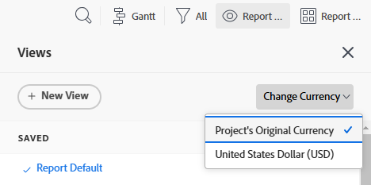
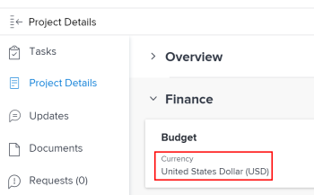
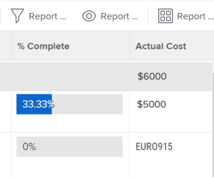
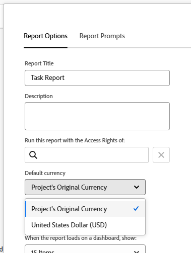

# Create financial data reports with unique exchange rates

If multiple exchange rates have been configured in Adobe Workfront, you can set financial values in reports and lists to display in a currency other than the default currency.

>[!IMPORTANT]
>
>If you select a currency other than the default currency in a View, you no longer see the links **Add More Tasks** and **Add More Issues** at the bottom of a project list.

For information about how to change the default currency for a given project, see [Change the project currency](../../../manage-work/projects/project-finances/change-project-currency.md).

If there are projects with a single currency in the report, the sums in groupings are also displayed in the system default currency.

## Access requirements

You must have the following access to perform the steps in this article:

<table style="table-layout:auto"> 
 <col> 
 <col> 
 <tbody> 
  <tr> 
   <td role="rowheader">Adobe Workfront plan*</td> 
   <td> 
Any
 </td> 
  </tr> 
  <tr> 
   <td role="rowheader">Adobe Workfront license*</td> 
   <td> 
Plan 
 </td> 
  </tr> 
  <tr> 
   <td role="rowheader">Access level configurations*</td> 
   <td> 
Edit access to&nbsp;Reports,&nbsp;Dashboards,&nbsp;Calendars
 
Edit access to Filters,&nbsp;Views, Groupings
 
Note: If you still don't have access, ask your Workfront administrator if they set additional restrictions in your access level. For information on how a Workfront administrator can modify your access level, see <a href="../../../administration-and-setup/add-users/configure-and-grant-access/create-modify-access-levels.md" class="MCXref xref">Create or modify custom access levels</a>.
 </td> 
  </tr> 
  <tr> 
   <td role="rowheader">Object permissions</td> 
   <td> 
Manage permissions to a report
 
For information on requesting additional access, see <a href="../../../workfront-basics/grant-and-request-access-to-objects/request-access.md" class="MCXref xref">Request access to objects </a>.
 </td> 
  </tr> 
 </tbody> 
</table>

&#42;To find out what plan, license type, or access you have, contact your Workfront administrator.

## Prerequisites

Before you can view alternate currencies as described in this section, the Workfront administrator must first enable and configure multiple currencies in the Setup area of Workfront. For information, see [Set up exchange rates](../../../administration-and-setup/manage-workfront/exchange-rates/set-up-exchange-rates.md).

## Apply financial values to a report {#apply-financial-values-to-a-report}

To convert financial values between currencies when working with reports:

1. Go to the report where you want to convert financial values to a different currency.
1. Click the **View** drop-down list, click **Change Currency**, then select one of the following currencies that you want to display financial values in:

   * Project's Original&nbsp;Currency
   * Any of the other currencies

     >[!TIP]
     >
     >You can choose only currencies previously selected in Setup.

   Using this option allows you to quickly convert financial values in a report between rate values.

   

   <!--
   
(NOTE: drafted this tip because I think this is confusing; this is in the step above.)

   -->

   <!--
   <note type="tip">
   You can also select the Change Currency option to convert financial values in other lists.
    
   
    
    
   </note>
   -->

## Display the Default Currency across multiple projects with different currencies

When you customize the currency at the project level and you want to display information from all the projects in the same report, the following scenarios exist:

* If you create a report that brings financial information from two or more projects that have different currencies applied, by default the grouping summary reflects the system's default currency as selected by the Workfront administrator.
* If you create a report for two or more projects that have the same currency, but they differ from that of the system's default currency, then the sums in the groupings are displayed using the system default currency.
* If you create a report for two or more projects that have job role assignments associated with an currency override, Workfront converts the financial information from the job role's overridden currency rates to either the currency of the project (when you select Project's Original Currency in the view), or to any different currency you select when viewing the report. For information about overriding the currency of a job role, see [Create and manage job roles](../../../administration-and-setup/set-up-workfront/organizational-setup/create-manage-job-roles.md).

To display two projects with custom currencies in a report:

1. Create two projects with different currencies applied.

   

1. Log hours on both projects.

   For more information about logging time, see [Log time](../../../timesheets/create-and-manage-timesheets/log-time.md).

1. Click the **Main Menu** icon , then click **Reporting**.  
1. Click **New Report**, then **Project Report**.
1. In the **Columns (View)** tab, add an **Actual Cost** column and summarize it by **Sum**.

   For information on how to create a column, see [Views overview in Adobe Workfront](../../../reports-and-dashboards/reports/reporting-elements/views-overview.md).

1. In the **Groupings** tab, apply a **Planned Completion Date** grouping.

   For information on how to create a grouping, see [Groupings overview in Adobe Workfront](../../../reports-and-dashboards/reports/reporting-elements/groupings-overview.md).

1. In the **Filters** tab, add a filter for **Project Name** and select the two projects with the different currencies.

   For information on how to create a filter, see [Filters overview](../../../reports-and-dashboards/reports/reporting-elements/filters-overview.md).

1. Click **Save + Close**.

   The total of the **Actual Cost** is displayed in the Grouping using the system default currency, regardless of the currency of the projects in the report.

   

   If the two projects have different currencies from one another, the system default currency also displays in the Grouping of the report.

## Display the Project Currency in a report at the project level

If a grouping is applied on a task or hour list within a project, the sums in the grouping are displayed in the project's currency.

1. Create a project with a custom currency, different than the system default currency.
1. Go to the project and ensure that it includes hours that have been logged for tasks.

   For more information about logging time, see [Log time](../../../timesheets/create-and-manage-timesheets/log-time.md).

   >[!NOTE]
   >
   >The tasks should be assigned to users or job roles with Rate per Hour cost rates.

1. Click **Tasks**.  
1. Expand the **View** drop-down menu and select **New View**.
1. Add **Actual Cost** in the new View as a new column, and summarize it by **Sum**.
1. Click **Done**, then click **Save View**.
1. Expand the **Grouping** drop-down menu and select **New Grouping**.
1. Add **Actual Completion Date** in the new grouping as a new field, then click **Save Grouping**.

   The **Actual Cost** column summarizes in the new Grouping and displays the total in the currency of the project.

## Edit reports with unique currencies

The financial fields in a report are not editable until you change the report setting to show the original currency for projects.

To in-line edit a financial field in a report:

1. Navigate to a report.

   >[!NOTE]
   >
   >If the default currency does not display for a list in any other area, you can edit the View to display the default currency.  
   >For information on how to change the currency in a View, see the section in this article [Apply financial values to a report](#apply-financial-values-to-a-report).

1. Click **Report Actions**, then select **Edit**.
1. Click **Report Settings**.
1. Click the **Default Currency** drop-down, then select **Project's Original Currency**.

   

1. Click **Done**.
