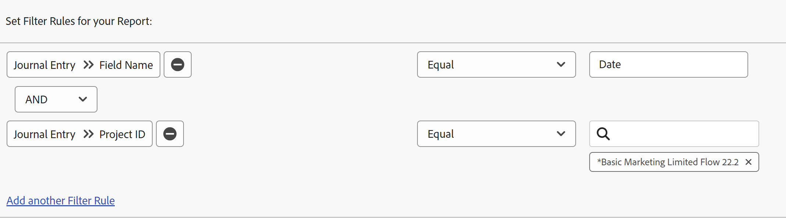

# Report on the Updates area

The Journal Entry report surfaces system updates from the Updates area of projects, tasks, issues, and other objects that were previously only available through the Adobe Workfront API. While this is an advanced report intended for specific use cases, the more digestible format makes it easier for you to report on project activity and system updates within Workfront.

>[!TIP]
>
>The Journal Entry report contains only system updates from the Updates area of objects. To report on comments left in the Updates area, you must use the Note report.  
>For more information on the Note report, see [View all updates in a Note report](../../../workfront-basics/updating-work-items-and-viewing-updates/view-all-updates-in-a-report.md).‍

The Journal Entry report can show:

* How many status changes occurred
* When a task or issue was deleted
* How values in important custom fields changed over the course of a project's life cycle
* What important dates changed over the course of a project's life cycle
* If the owner of a project changed

## Access requirements

+++ Expand to view access requirements for the functionality in this article.

You must have the following access to perform the steps in this article:

<table style="table-layout:auto"> 
 <col> 
 <col> 
 <tbody> 
  <tr> 
   <td role="rowheader">Adobe Workfront plan</td> 
   <td> 
Any
 </td> 
  </tr> 
  <tr> 
   <td role="rowheader">Adobe Workfront license</td> 
   <td> 
New: Standard 

Or 

Current: Plan 
 </td> 
  </tr> 
  <tr> 
   <td role="rowheader">Access level configurations</td> 
   <td> 
Edit access to&nbsp;Reports,&nbsp;Dashboards,&nbsp;Calendars
 
Edit access to Filters,&nbsp;Views, Groupings
 </td> 
  </tr> 
  <tr> 
   <td role="rowheader">Object permissions</td> 
   <td> 
View permissions to the objects that contain the journal entries you display in the report
 
You will obtain Manage permissions to the report after you create it
 </td> 
  </tr> 
 </tbody> 
</table>

For more detail about the information in this table, see [Access requirements in Workfront documentation](/help/quicksilver/administration-and-setup/add-users/access-levels-and-object-permissions/access-level-requirements-in-documentation.md).

+++

## Prerequisites

Before you can perform the actions described in this article, you must make sure of the following:

* Any fields (including custom fields) that you want to report on are tracked in Workfront. You can only report on data from the Updates area that is tracked.

  To learn how to add fields that you want Workfront to track, see [Configure system updates](../../../administration-and-setup/set-up-workfront/system-tracked-update-feeds/configure-system-updates.md).

## Journal Entry report overview

Because the Journal Entry report queries system updates, it can return a significant number of results. For this reason, we recommend that you filter to specific objects—such as projects, programs, portfolios, groups, and so forth—when creating the report.

To learn more about the different object types in Workfront, see [Understand objects in Adobe Workfront](../../../workfront-basics/navigate-workfront/workfront-navigation/understand-objects.md).

>[!NOTE]
>
>Because the Journal Entry report returns so much data, exporting and scheduled report delivery are not supported.

The default view for this report contains the following columns:

<table style="table-layout:auto"> 
 <col> 
 <col> 
 <thead> 
  <tr> 
   <th>Field</th> 
   <th>Explanation</th> 
  </tr> 
 </thead> 
 <tbody> 
  <tr> 
   <td><strong>Field Name</strong> </td> 
   <td> 
The name of the affected field. Depending on how you set up the report, this column could contain Status, Owner ID, Task Name, Planned Completion Date, or other fields. 
 
When <strong>DE</strong>: displays in this column, it indicates that the field listed is a custom field.
 </td> 
  </tr> 
  <tr> 
   <td><strong>Change Type</strong> </td> 
   <td> 
The type of change made to the affected field. Depending on the filter rules that you set up and the actions taken by users, the following might appear in this field:
 
    <ul> 
     <li> 
Add
 </li> 
     <li> 
Audit
 </li> 
     <li> 
Delete
 </li> 
     <li> 
Digest
 </li> 
     <li> 
Edit
 </li> 
     <li> 
Restore
 </li> 
    </ul> </td> 
  </tr> 
  <tr> 
   <td><strong>Top ObjCode</strong> </td> 
   <td> 
The highest parent object in the hierarchy.
 </td> 
  </tr> 
  <tr> 
   <td><strong>Scope</strong> </td> 
   <td> 
The type of object that was changed.
 </td> 
  </tr> 
  <tr> 
   <td><strong>Entry Date</strong> </td> 
   <td> 
The date that the field was changed.
 </td> 
  </tr> 
  <tr> 
   <td><strong>Edited by Name</strong> </td> 
   <td> 
The user that changed the field.
 </td> 
  </tr> 
 </tbody> 
</table>

To organize the information in this report, you can use the built-in grouping called Project. The Project grouping gives you a primary grouping of Project Name and a secondary grouping of Entry Date. You can apply this existing grouping during report creation, or you can apply it when viewing the report.

To learn how to set up the views, filters, and groupings you want for your report, see the relevant section:

<!--

(NOTE: from&nbsp;Luke: Take this for what it's worth, but part of me wonders if all of these subsections should be separate articles.

The biggest reason for breaking these up would be searchability, in my mind. For example, as a user, I might want to know how to see if the owner of a project changed. If I search the help site for that, I would be a lot more likely to find a separate article called "See if the owner of a project changed" vs an article titled "Create a Journal Entry report" because "Journal Entry" might mean nothing to me.) 

-->

* [See what status changes occurred](#see-what-status-changes-occurred) 
* [See when a task or issue was deleted](#see-when-a-task-or-issue-was-deleted) 
* [See how custom fields changed over the course of a project's life cycle](#see-how-custom-fields-changed-over-the-course-of-a-project-s-life-cycle) 
* [See how the Planned Completion Date changed over the course of a project's life cycle](#see-how-the-planned-completion-date-changed-over-the-course-of-a-project-s-life-cycle) 
* [See if the owner of a project changed](#see-if-the-owner-of-a-project-changed)

## See what status changes occurred {#see-what-status-changes-occurred}

You can set up the Journal Entry report to show:

* How many status changes were made on a project, task, or issue

* What the previous status was before the change
* Who changed the status
* When the status change took place

If you want to see the health of a project, you could also set up the report to show this same information using the project **Condition** field.

This information can be used to help with auditing and to illustrate how well you and your organization are planning.

<!--

(NOTE:&nbsp;for tip below: When analytics adds the status option, update this note to say "these entries (status or condition changes)")

-->

>[!TIP]
>
>If you want to compare the difference in days between condition changes, you can use Enhanced analytics.  
>To learn more about Enhanced analytics, see [Enhanced analytics overview](../../../enhanced-analytics/enhanced-analytics-overview.md).

1. Click the **[!UICONTROL Main Menu]** icon  in the upper-right corner of Adobe Workfront, or (if available), click the **[!UICONTROL Main Menu]** icon  in the upper-left corner, then click **Reports**.
1. Click **New Report**, then select **Journal Entry**.

   

   The report builder loads.

1. In the **Columns (View)** tab, add the following columns:

   <table style="table-layout:auto"> 
    <col> 
    <col> 
    <thead> 
     <tr> 
      <th>Column</th> 
      <th>Explanation</th> 
     </tr> 
    </thead> 
    <tbody> 
     <tr> 
      <td> 
Field Name
 </td> 
      <td> 
The name of the affected field. In this case, <strong>status</strong> should display in this column.
 </td> 
     </tr> 
     <tr> 
      <td> 
Change Type
 </td> 
      <td> 
The type of change made to the affected field, such as <strong>Add</strong>, <strong>Delete</strong>, or <strong>Edit</strong>.
 </td> 
     </tr> 
     <tr> 
      <td> 
Edited by Name
 </td> 
      <td> 
The name of the user that updated the status.
 </td> 
     </tr> 
     <tr> 
      <td> 
Entry Date
 </td> 
      <td> 
The date that the status was changed.
 </td> 
     </tr> 
     <tr> 
      <td> 
Old Text Value
 </td> 
      <td> 
The key for the previous status. The following are the status keys for the default project statuses:
 
       <ul> 
        <li> 
 <strong>CUR</strong>: Current
 </li> 
        <li> 
<strong>DED</strong>: Dead
 </li> 
        <li> 
<strong>ONH</strong>: On Hold
 </li> 
        <li> 
<strong>PLN</strong>: Planning
 </li> 
        <li> 
<strong>CPL</strong>: Complete
 </li> 
        <li> 
<strong>REQ</strong>: Requested
 </li> 
        <li> 
<strong>APR</strong>: Approved
 </li> 
        <li> 
<strong>REJ</strong>: Rejected
 </li> 
        <li> 
<strong>IDA</strong>: Idea
 </li> 
       </ul> 
If your organization has set up custom statuses, other status keys might appear in this column. To learn what custom status is related to a status key, contact your Workfront administrator or group administrator.
 </td> 
     </tr> 
     <tr> 
      <td> 
New Text Value
 </td> 
      <td> 
The key for the updated status.
 </td> 
     </tr> 
     <tr> 
      <td> 
Top ObjCode
 </td> 
      <td> 
The highest parent object for the field that had the status change.
 </td> 
     </tr> 
     <tr> 
      <td> 
Scope
 </td> 
      <td> 
The type of object that had the status change.
 </td> 
     </tr> 
     <tr> 
      <td> 
Issue Name (Optional)
 </td> 
      <td> 
The name of the issue that had a status change.
 </td> 
     </tr> 
     <tr> 
      <td> 
Task Name (Optional)
 </td> 
      <td> 
The name of the task that had a status change.
 </td> 
     </tr> 
    </tbody> 
   </table>

   For more information on adding columns, see [Views overview in Adobe Workfront](../../../reports-and-dashboards/reports/reporting-elements/views-overview.md).

1. In the **Filters** tab, click **Add filter rule**, then add the filter rule **Field Name** > **Equal** > **status**.

   

   >[!TIP]
   >
   >To report on condition changes, you can instead add the filter rule **Field Name** > **Equal** > **Condition**.

   For more information on adding filters, see [Filters overview](../../../reports-and-dashboards/reports/reporting-elements/filters-overview.md).

1. (Optional) To narrow the focus of the report and reduce load times, add a prompt.

   Or

   Create additional filter rules to include specific projects, tasks, or issues.

   >[!IMPORTANT]
   >
   >Creating a filter rule that uses the modifier **Contains** can actually increase load times. For this reason, we recommend using a different modifier like **Equal** when possible to filter for a specific project or higher-level object ID.

   To learn how to add a prompt, see [Add a prompt to a report](../../../reports-and-dashboards/reports/creating-and-managing-reports/add-prompt-report.md).

1. In the **Groupings** tab, click **Apply an Existing Grouping**, then select **Project**.

   For more information on adding groupings, see [Groupings overview in Adobe Workfront](../../../reports-and-dashboards/reports/reporting-elements/groupings-overview.md).

1. Click **Save + Close**.

   Your new report loads.

## See when a task or issue was deleted {#see-when-a-task-or-issue-was-deleted}

You can set up the Journal Entry report to show:

* What tasks or issues have been deleted
* Who deleted a task or issue

To see when a task or issue was deleted:

1. Click the **[!UICONTROL Main Menu]** icon  in the upper-right corner of Adobe Workfront, or (if available), click the **[!UICONTROL Main Menu]** icon  in the upper-left corner, then click **Reports**.
1. Click **New Report**, then select **Journal Entry**.

   

   The report builder loads.

1. In the **Columns (View)** tab, add the following columns:

   <table style="table-layout:auto"> 
    <col> 
    <col> 
    <thead> 
     <tr> 
      <th>Column</th> 
      <th>Explanation</th> 
     </tr> 
    </thead> 
    <tbody> 
     <tr> 
      <td> 
Scope
 </td> 
      <td> 
The type of object that was deleted.
 </td> 
     </tr> 
     <tr> 
      <td> 
Change Type
 </td> 
      <td> 
The type of change that happened. The <strong>Delete</strong> change displays in this column.
 </td> 
     </tr> 
     <tr> 
      <td> 
Entry Date
 </td> 
      <td> 
The date that the task or issue was deleted.
 </td> 
     </tr> 
     <tr> 
      <td> 
Edited by Name
 </td> 
      <td> 
The name of the user that deleted the task or issue.
 </td> 
     </tr> 
     <tr> 
      <td> 
Project Name
 </td> 
      <td> 
The name of the project that had tasks or issues deleted.
 </td> 
     </tr> 
    </tbody> 
   </table>

   For more information on adding columns, see [Views overview in Adobe Workfront](../../../reports-and-dashboards/reports/reporting-elements/views-overview.md).

1. In the **Filters** tab, click **Add filter rule**, then add the following filters:

   * **Change Type** > **Equal** > **Delete**
   * **Project ID** > **Equal** > **`<project>`**

     <!--WRITER check link; this png file has spaces
     -->

   For more information on adding filters, see [Filters overview](../../../reports-and-dashboards/reports/reporting-elements/filters-overview.md).

1. (Optional) To narrow the focus of the report and reduce load times, add a prompt.

   Or

   Create additional filter rules to include specific projects, tasks, or issues.

   >[!IMPORTANT]
   >
   >Creating a filter rule that uses the modifier **Contains** can actually increase load times. For this reason, we recommend using a different modifier like **Equal** when possible to filter for a specific project or higher-level object ID.

   To learn how to add a prompt, see [Add a prompt to a report](../../../reports-and-dashboards/reports/creating-and-managing-reports/add-prompt-report.md).

1. (Optional) In the **Groupings** tab, click **Apply an Existing Grouping**, then select **Project**.

   For more information on adding groupings, see [Groupings overview in Adobe Workfront](../../../reports-and-dashboards/reports/reporting-elements/groupings-overview.md).

1. Click **Save + Close**.

   Your new report loads.

## See how custom fields changed over the course of a project's life cycle {#see-how-custom-fields-changed-over-the-course-of-a-project-s-life-cycle}

You can track important field changes over the course of the project. To do this, you can set up the Journal Entry to track:

* If certain custom fields were added, updated, or edited
* When these changes happened
* Who made the changes

To see how custom fields changed over the course of a project's life cycle:

1. Click the **[!UICONTROL Main Menu]** icon  in the upper-right corner of Adobe Workfront, or (if available), click the **[!UICONTROL Main Menu]** icon  in the upper-left corner, then click **Reports**.
1. Click **New Report**, then select **Journal Entry**.

   

   The report builder loads.

1. In the **Columns (View)** tab, add the following columns:

   <table style="table-layout:auto"> 
    <col> 
    <col> 
    <thead> 
     <tr> 
      <th>Column</th> 
      <th>Explanation</th> 
     </tr> 
    </thead> 
    <tbody> 
     <tr> 
      <td> 
Field Name
 </td> 
      <td> 
The name of the custom field affected.
 
When <strong>DE</strong>: displays in this column, it indicates that the field listed is a custom field.
 </td> 
     </tr> 
     <tr> 
      <td> 
Change Type
 </td> 
      <td> 
The type of change made to the affected field, such as <strong>Add</strong>, <strong>Delete</strong>, or <strong>Edit</strong>.
 </td> 
     </tr> 
     <tr> 
      <td> 
Edited by Name
 </td> 
      <td> 
The name of the user that updated the custom field.
 </td> 
     </tr> 
     <tr> 
      <td> 
Entry Date
 </td> 
      <td> 
The date that the value in the custom field changed.
 
You should sort by this field in descending order.
 </td> 
     </tr> 
     <tr> 
      <td> 
Old Number Value
 </td> 
      <td> 
The previous number value in the custom field.
 </td> 
     </tr> 
     <tr> 
      <td> 
New Number Value
 </td> 
      <td> 
The current number value in the custom field.
 </td> 
     </tr> 
     <tr> 
      <td> 
Old Date Value
 </td> 
      <td> 
The previous date value in the custom field.
 </td> 
     </tr> 
     <tr> 
      <td> 
New Date Value
 </td> 
      <td> 
The current date value in the custom field.
 </td> 
     </tr> 
     <tr> 
      <td> 
Old Text Value
 </td> 
      <td> 
The previous text value in the custom field.
 </td> 
     </tr> 
     <tr> 
      <td> 
New Text Value
 </td> 
      <td> 
The current text value in the custom field.
 
If the custom field is a typeahead field, the <strong>New Text Value</strong> column displays the object ID.
 </td> 
     </tr> 
    </tbody> 
   </table>

   For more information on adding columns, see [Views overview in Adobe Workfront](../../../reports-and-dashboards/reports/reporting-elements/views-overview.md).

1. In the **Filters** tab, click **Add filter rule**, then add the following filters:

   * **Journal Entry Field Name** > **Contains** > **DE**

     >[!TIP]
     >
     >To limit this report to specific custom fields, add the filter rule **Journal Entry Field Name** > **Equal** > **`<custom field>`**.

   * **Project ID** > **Equal** > **`<project>`**

     

   For more information on adding filters, see [Filters overview](../../../reports-and-dashboards/reports/reporting-elements/filters-overview.md).

1. (Optional) To narrow the focus of the report and reduce load times, add a prompt.

   Or

   Create additional filter rules to include specific projects, tasks, or issues.

   >[!IMPORTANT]
   >
   >Creating a filter rule that uses the modifier **Contains** can actually increase load times. For this reason, we recommend using a different modifier like **Equal** when possible to filter for a specific project or higher-level object ID.

   To learn how to add a prompt, see [Add a prompt to a report](../../../reports-and-dashboards/reports/creating-and-managing-reports/add-prompt-report.md).

1. In the **Groupings** tab, click **Apply an Existing Grouping**, then select **Project**.

   For more information on adding groupings, see [Groupings overview in Adobe Workfront](../../../reports-and-dashboards/reports/reporting-elements/groupings-overview.md).

1. Click **Save + Close**.

   Your new report loads.

## See how the Planned Completion Date changed over the course of a project's life cycle {#see-how-the-planned-completion-date-changed-over-the-course-of-a-project-s-life-cycle}

You can set up the Journal Entry report to show how often the Planned Completion Date changes over the course of a project's life.

1. Click the **[!UICONTROL Main Menu]** icon  in the upper-right corner of Adobe Workfront, or (if available), click the **[!UICONTROL Main Menu]** icon  in the upper-left corner, then click **Reports**.
1. Click **New Report**, then select **Journal Entry**.

   

   The report builder loads.

1. In the **Columns (View)** tab, add the following columns:

   <table style="table-layout:auto"> 
    <col> 
    <col> 
    <thead> 
     <tr> 
      <th>Column</th> 
      <th>Explanation</th> 
     </tr> 
    </thead> 
    <tbody> 
     <tr> 
      <td> 
Field Name
 </td> 
      <td> 
The name of the affected field.
 
When <strong>DE</strong>: displays in this column, it indicates that the field listed is a custom field.
 </td> 
     </tr> 
     <tr> 
      <td> 
Change Type
 </td> 
      <td>The type of change that happened, such as <strong>Add</strong>, <strong>Delete</strong>, or <strong>Edit</strong>.</td> 
     </tr> 
     <tr> 
      <td> 
Edited by Name
 </td> 
      <td> 
The name of the user that updated the project's Planned Completion Date.
 </td> 
     </tr> 
     <tr> 
      <td> 
Entry Date
 </td> 
      <td> 
The date that the project's Planned Completion Date was changed.
 
You should sort by this field in descending order.
 </td> 
     </tr> 
     <tr> 
      <td> 
Top ObjCode
 </td> 
      <td> 
The highest parent object for the field that had the Planned Completion Date change.
 </td> 
     </tr> 
     <tr> 
      <td> 
Scope
 </td> 
      <td> 
The object that had the Planned Completion Date change.
 </td> 
     </tr> 
     <tr> 
      <td> 
Old Date Value
 </td> 
      <td> 
The previous value for the Planned Completion Date.
 </td> 
     </tr> 
     <tr> 
      <td> 
New Date Value
 </td> 
      <td> 
The current value for the Planned Completion Date.
 </td> 
     </tr> 
     <tr> 
      <td> 
Project Name
 
(Optional)
 </td> 
      <td> 
Thhe name of the project that had the Planned Completion Date change.
 </td> 
     </tr> 
     <tr> 
      <td> 
Task Name
 
(Optional)
 </td> 
      <td> 
The name of the tasks in the project that had the Planned Completion Date change.
 </td> 
     </tr> 
     <tr> 
      <td> 
Issue Name
 
(Optional)
 </td> 
      <td>The name of the issues in the project that have the Planned Completion Date change.</td> 
     </tr> 
    </tbody> 
   </table>

   For more information on adding columns, see [Views overview in Adobe Workfront](../../../reports-and-dashboards/reports/reporting-elements/views-overview.md).

1. In the **Filters** tab, click **Add filter rule**, then add the following:

   * **Field Name** > **Equal** > **Date**
   * **Project ID** > **Equal** > **`<project>`**

   

   For more information on adding filters, see [Filters overview](../../../reports-and-dashboards/reports/reporting-elements/filters-overview.md).

1. (Optional) To narrow the focus of the report and reduce load times, add a prompt.

   Or

   Create additional filter rules to include specific projects, tasks, or issues.

   >[!IMPORTANT]
   >
   >Creating a filter rule that uses the modifier **Contains** can actually increase load times. For this reason, we recommend using a different modifier like **Equal** when possible to filter for a specific project or higher-level object ID.

   To learn how to add a prompt, see [Add a prompt to a report](../../../reports-and-dashboards/reports/creating-and-managing-reports/add-prompt-report.md).

1. In the **Groupings** tab, click **Apply an Existing Grouping**, then select **Project**.

   For more information on adding groupings, see [Groupings overview in Adobe Workfront](../../../reports-and-dashboards/reports/reporting-elements/groupings-overview.md).

1. Click **Save + Close**.

   Your new report loads.

## See if the owner of a project changed {#see-if-the-owner-of-a-project-changed}

You can set up the Journal Entry report to show how many times the project owner—or project manager—changes over the course of a project's life.

1. Click the **[!UICONTROL Main Menu]** icon  in the upper-right corner of Adobe Workfront, or (if available), click the **[!UICONTROL Main Menu]** icon  in the upper-left corner, then click **Reports**.
1. Click **New Report**, then select **Journal Entry**.

   

   The report builder loads.

1. In the **Columns (View)** tab, add the following columns:

   <table style="table-layout:auto"> 
    <col> 
    <col> 
    <thead> 
     <tr> 
      <th>Column</th> 
      <th>Explanation</th> 
     </tr> 
    </thead> 
    <tbody> 
     <tr> 
      <td> 
Field Name
 </td> 
      <td>The name of the affected field. The <strong>ownerID</strong> displays in this column.</td> 
     </tr> 
     <tr> 
      <td> 
Change Type
 </td> 
      <td> 
The type of change that happened, such as <strong>Add</strong>, <strong>Delete</strong>, or <strong>Edit</strong>.
 </td> 
     </tr> 
     <tr> 
      <td> 
Top ObjCode
 </td> 
      <td> 
The highest parent object for the project that had the project owner updated.
 </td> 
     </tr> 
     <tr> 
      <td> 
Entry Date
 </td> 
      <td>The date that the project owner was changed. You should sort by this field in descending order.</td> 
     </tr> 
     <tr> 
      <td> 
Edited by Name
 </td> 
      <td> 
The name of the user that updated the project owner.
 </td> 
     </tr> 
     <tr> 
      <td> 
Additional Info 1
 </td> 
      <td> 
The current project owner on the project.
 </td> 
     </tr> 
     <tr> 
      <td> 
Additional Info 2
 </td> 
      <td> 
The previous project owner on the project.
 </td> 
     </tr> 
     <tr> 
      <td> 
Project Name
 </td> 
      <td> 
The project that had the Project Owner field updated.
 </td> 
     </tr> 
    </tbody> 
   </table>

   For more information on adding columns, see [Views overview in Adobe Workfront](../../../reports-and-dashboards/reports/reporting-elements/views-overview.md).

1. In the **Filters** tab, click **Add filter rule**, then add the following:

   * **Field Name** > **Equal** > **ownerID**
   * **Project ID** > **Equal** > **`<project name>`**

     

   For more information on adding filters, see [Filters overview](../../../reports-and-dashboards/reports/reporting-elements/filters-overview.md).

1. (Optional) To narrow the focus of the report and reduce load times, add a prompt.

   Or

   Create additional filter rules to include specific projects, tasks, or issues.

   >[!IMPORTANT]
   >
   >Creating a filter rule that uses the modifier **Contains** can actually increase load times. For this reason, we recommend using a different modifier like **Equal** when possible to filter for a specific project or higher-level object ID.

   To learn how to add a prompt, see [Add a prompt to a report](../../../reports-and-dashboards/reports/creating-and-managing-reports/add-prompt-report.md).

1. (Optional) In the **Groupings** tab, click **Apply an Existing Grouping**, then select **Project**.

   For more information on adding groupings, see [Groupings overview in Adobe Workfront](../../../reports-and-dashboards/reports/reporting-elements/groupings-overview.md).

1. Click **Save + Close**.

   Your new report loads.
