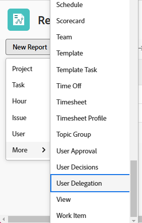

# Create a User Delegation report

<!--Audited: 10/2024-->

<!--

(NOTE: consider moving this to the Custom&nbsp;View, Filter, Grouping Samples section as an example of a report)

-->

In Adobe Workfront, users can delegate project, task, and issue approvals to other users to make sure that their approvals are managed when they are out of office. Users with a Plan license can create a User Delegation report to see:

* Who has delegated their task, issue, and project approvals to another user
* Which users have delegated task, issue, and project approvals assigned to them  

* The dates that the delegations start and end

To learn more about delegating approvals, see [Delegate approval request](../../../review-and-approve-work/manage-approvals/delegate-approval-requests.md).

<!--

DRAFTED: To learn more about delegating work, see <a href="../../../workfront-basics/manage-your-account-and-profile/manage-time-off/personal-time-off.md" class="MCXref xref">Log personal time off and delegate your work</a>.

-->

<!--

DRAFTED: To learn how to manage delegated work in Home, see [future link here].

-->

## Access requirements

+++ Expand to view access requirements for the functionality in this article. 

You must have the following access to perform the steps in this article:

<table style="table-layout:auto"> 
 <col> 
 <col> 
 <tbody> 
  <tr> 
   <td role="rowheader">Adobe Workfront plan</td> 
   <td> 
Any
 </td> 
  </tr> 
  <tr> 
   <td role="rowheader">Adobe Workfront license*</td> 
   <td> 
New: Standard 

   
Current: Plan 
 </td> 
  </tr> 
  <tr> 
   <td role="rowheader">Access level configurations*</td> 
   <td> 
Edit access to&nbsp;Reports,&nbsp;Dashboards,&nbsp;Calendars
 
Edit access to Filters,&nbsp;Views, Groupings
 
Note: If you still don't have access, ask your Workfront administrator if they set additional restrictions in your access level. For information on how a Workfront administrator can modify your access level, see <a href="../../../administration-and-setup/add-users/configure-and-grant-access/create-modify-access-levels.md" class="MCXref xref">Create or modify custom access levels</a>.
 </td> 
  </tr> 
  <tr> 
   <td role="rowheader">Object permissions</td> 
   <td> 
View permissions to the items whose approvals are delegated and to the users involved in the delegation
 
For information on requesting additional access, see <a href="../../../workfront-basics/grant-and-request-access-to-objects/request-access.md" class="MCXref xref">Request access to objects </a>.
 </td> 
  </tr> 
 </tbody> 
</table>

*To find out what plan, license type, or access you have, contact your Workfront administrator.
+++

## Create a user delegation report

1. Click the **Main Menu** icon  in the upper-right corner of Adobe Workfront, then click **Reports**.

1. Click **New Report**, then select **User Delegation**.  
   

   The following fields display in this report by default:

   | Field |Description |
   |---|---|
   | **From User** |This is the user that is delegating their task, issue, and project approvals to another user. |
   | **To User** |This is the user that has task, issue, and project approvals delegated to them. |
   | **Start Date** |This is the beginning of the out of office time for the user that has made the delegations. |
   | **End Date** |This is the end of the out of office time for the user that has made the delegations. |

   {style="table-layout:auto"}

1. (Optional) In the report builder, modify the following:

   * Columns (View)
   * Groupings
   * Filters
   * Chart

   To learn more about these features, see [Create a custom report](../../../reports-and-dashboards/reports/creating-and-managing-reports/create-custom-report.md).

1. After you finish building your report, click **Save + Close**.  
   
   The report displays.
