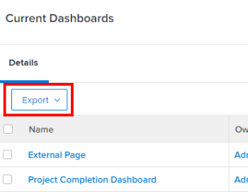

# Export data

<!-- Audited: 12/2023 -->

You can export Adobe Workfront data from various lists, reports, dashboards, and searches.

Some of the reasons to export data are:

* You want to provide a hard copy of your data to someone outside of Workfront.
* You want to send the results of a report as an attachment to an external user.
* You want to create an external back-up of your Workfront data.
* There is a limit to display only 2,000 results on one page inside the Workfront web application. If your report produces more than 2,000, you can export the report to any of the available formats and view all the results in the report in one list.

You can either export a report manually, from the Workfront interface, or you can schedule a delivery for a report and that report will be sent to you at a later time. For more information on scheduling delivered reports, see [Report delivery overview](../../../reports-and-dashboards/reports/creating-and-managing-reports/set-up-report-deliveries.md).

The information in this article does not apply to the following exports:

* Exporting information from chart reports.

  For more information about exporting a chart report, see [Add a chart to a report](../../../reports-and-dashboards/reports/creating-and-managing-reports/add-chart-report.md).

* Exporting information from the Gantt chart.

  For more information about exporting the Gantt chart, see [Export the Gantt Chart to PDF](../../../manage-work/gantt-chart/use-the-gantt-chart/export-gantt-chart-to-pdf.md).

* Exporting information from the Resource Planner.

  For more information about exporting the information from the Resource Planner, see "Export Option" in [Resource Planner navigation overview](../../../resource-mgmt/resource-planning/resource-planner-navigation.md).

## Access requirements

+++ Expand to view access requirements for the functionality in this article.

You must have the following access to perform the steps in this article:

<table style="table-layout:auto"> 
 <col> 
 </col> 
 <col> 
 </col> 
 <tbody> 
  <tr> 
   <td role="rowheader">Adobe Workfront plan</td> 
   <td> 
Any
 </td> 
  </tr> 
  <tr> 
   <td role="rowheader">Adobe Workfront license</td> 
   <td>
    
New: Light or higher

    
or

    
Current: Review or higher
 </td> 
  </tr> 
  <tr> 
   <td role="rowheader">Access level configurations</td> 
   <td> 
View or higher access to Reports, Dashboards, and Calendars to export reports
 
View or higher access to the objects you view in a list to export the list
 </td> 
  </tr> 
  <tr> 
   <td role="rowheader">Object permissions</td> 
   <td> 
View or higher permissions to a report or dashboard to export the report or the dashboard
 
View or higher permissions to the objects you view in a list to export the list
 </td> 
  </tr> 
 </tbody> 
</table>

For more detail about the information in this table, see [Access requirements in Workfront documentation](/help/quicksilver/administration-and-setup/add-users/access-levels-and-object-permissions/access-level-requirements-in-documentation.md).

+++

## Prerequisites

The report must be created before you can export its data.

For more information on creating reports, see [Create a custom report](/help/quicksilver/reports-and-dashboards/reports/creating-and-managing-reports/create-custom-report.md) or [Create a copy of a report](/help/quicksilver/reports-and-dashboards/reports/creating-and-managing-reports/create-copy-report.md).

## Export formats and limits

### Export formats {#export-formats}

Information can be exported in the following formats:

* PDF (Letter Landscape or Portrait, Legal, Ledger, and A4)
* Excel (.xls)
* Excel (.xlsx)
* Tab Delimited

>[!NOTE]
>
>Dashboards can either be printed or exported only to a .pdf file.

### Export limits {#export-limits}

<!--
NOTE: Alina: [! This information is shared between "Exporting Data" and "Setting Up Report Deliveries."]
-->

There are several limitations around the way reports display in Workfront as well as the way they export through a manual export, a delivered report, or through the API.

* **50,000 cells:** The maximum number of cells allowed in a report export for Excel files. 
* **50,000 rows:** The number of rows of data allowed in a report export for .pdf and Tab Delimited files.

  * For Excel .xls files, this limit is **65,000 rows**.  
  * For Excel .xlsx files, this limit is **100,000 rows**.  
  * These limits exclude the column headings, as well as rows for groupings in the report. For instance, if you have 6 groupings in a report, and 50,000 rows of data, the exported file will have 50,000 rows.

  >[!IMPORTANT]
  >
  >Exporting a report that includes a collection reference within a column may result in an error, even if the report is otherwise within the listed export limits. If the referenced collection is too large, the export process times out and subsequently results in an error.
  >
  >To avoid this error, either exclude columns that reference large collections or reduce the size of the referenced collections before exporting.
  >
  
  If your report has more items than these limits, you receive an error that the export is not successful. Reduce the number of items you see on the screen to a number less than or equal to these limits to be able to export the results.

  If your report has more than 50,000/ 65,000/ 100,000 rows and you want to export all the data, we suggest that you use filters or prompts to obtain smaller loads of data, and perform multiple exports.

  For information on using filters, see [Filters overview](../../../reports-and-dashboards/reports/reporting-elements/filters-overview.md).  
  
  For information about using prompts, see [Add a prompt to a report](../../../reports-and-dashboards/reports/creating-and-managing-reports/add-prompt-report.md).

* These limits apply to:

  * A manual export of a report.
  * A scheduled report.
  * An export through an API integration.
  * Data exported through a kick-start.  

    For more information about exporting data via kick-starts, see [Export data from Adobe Workfront via Kick-Starts](../../../administration-and-setup/manage-workfront/using-kick-starts/export-data-from-wf-via-kick-starts.md).
   
    >[!NOTE]
    >
    >You can export 50,000 rows in a kick-start file, although you can export the data only to an Excel format file.

  * Exporting utilization information for a project.

    For more information about exporting utilization information for a project, see [Overview of the Resource Utilization report](../../../reports-and-dashboards/reports/using-built-in-reports/resource-utilization-report.md#exporting-utilization-information-for-a-project).

* **10MB file size:** File size limit for any exported report scheduled for delivery. If an exported file attached to an email is larger than 5MB, a link where the file can be downloaded is emailed instead of the attached exported report.
* **65,530 hyperlinks:** This is a limit imposed by Excel on documents that contain more than 65,530 hyperlinks. These documents cannot be opened when they are exported manually, or sent in a delivered report. Note that an Excel document may have just 200 rows of data, but if there are more than 65,530 links inside the document, the document does not open. This limit exists on Excel files only, not on the other supported formats.&nbsp;
* **256 columns**: This is a limit imposed by Excel on documents that contain more than 256 columns. These documents cannot be exported manually, or sent in a delivered report. This limit exists on Excel files only, not on the other supported formats.

If you attempt to export data beyond the limit, you might not receive all of the expected data in the export. Rather, a modified report is produced within the limit.

Additionally, reports that take longer than 60 minutes to run will be halted.

If you have concerns or issues regarding your limit, please contact Workfront Technical Support.

## Export data

### Export data from a report or list {#export-data-from-a-report-or-list}

1. Go to the report or list you want to export.
1. Select the items you want to export. (Selecting individual items exports only the items you select.)

   For example, in a project, select the tasks you want to export.

   Or

   Leave all items deselected to export the entire list.

1. Click **Export**, then select a format.

   <!--
   This note doesn't seem to be true (I tested with e reviewer and they could export the dashboard and its reports), and there's another article all about exporting dashboards. Lisa 12/23
   >[!NOTE]
   >
   >To export a Dashboard report, you must have a Plan license.  
   >
   -->

   Or

   Click the **Export** icon , then select a format.

   The options available to you for PDF export depend on the locale settings in your Workfront user settings:

   * North America - letter (default), legal, ledger, A4

     <!--   
        
     -->

   * All locations outside of North America - A3, A4 (default), letter, legal, ledger

     <!--   
        
     -->

1. (Conditional) Depending on the operating system you use, you might have the option of opening or saving the file. Either open the file with the associated application or save it to your hard drive.
1. Continue with [Use the exported document](#use-the-exported-document).

### Export data from a dashboard {#export-data-from-a-dashboard}

You can print the information from a dashboard, or you can export it as a .pdf file.

For more information about exporting data from a dashboard, see [Export a dashboard](../../../reports-and-dashboards/dashboards/creating-and-managing-dashboards/export-dashboard.md).

## Use the exported document {#use-the-exported-document}

* [File names](#file-names) 
* [Titles](#titles) 
* [Timestamps](#timestamps) 
* [Formatting](#formatting) 
* [Links](#links) 
* [Branding](#branding)

### File names {#file-names}

Whether you export a list of objects or a report, your exported file will have a file name and a title. You can find the exported file on your computer by referring to the file name. The title of the report will give users an indication of what the exported file represents when you share it with them.

#### File names for exported lists {#file-names-for-exported-lists}

When you export a list of objects, the type of the object is displayed on the exported file in the file name and in the title of the list.

When you export a list of task or issues, the **File Name** can be one of the following:

* When you export task and issue lists in a project:

  * *The_project_name_Exported_Tasks*(*in PDF, Excel, Excel (.xlsx), or Tab delimited formats)*
  * *The_project_name_Exported_Issues*(*in PDF, Excel, Excel (.xlsx), or Tab delimited formats)*

* When you export task and issue lists in a task (subtasks):

  * **The_project_name_the_task_name_Exported_Tasks**(*in PDF, Excel, Excel (.xlsx), or Tab delimited formats)*
  * **The_project_name_the_task_name_Exported_Issues**(*in PDF, Excel, Excel (.xlsx), or Tab delimited formats)*

When you export a list of any other objects from a project to a PDF file, the file name of the exported document indicates the type of objects you exported.  
For example, the file name may be:

* *Exported_Users*, when exporting the People tab on the project(*in PDF, Excel, Excel (.xlsx), or Tab delimited formats)*
* *Exported_Risks*, when exporting a list of Risks on the project(*in PDF, Excel, Excel (.xlsx), or Tab delimited formats)*

#### File names for exported reports {#file-names-for-exported-reports}

When you export a report, the file name of the exported report is:

*The_report_name*(*in PDF, Excel, Excel (.xlsx), or Tab delimited formats)*

### Titles {#titles}

When you export a list of objects, only the file in the PDF format will have a title. If you export a list or a report to Excel, Excel (.xlsx), or Tab Delimited formats, the file does not have a title.

#### Titles for exported lists {#titles-for-exported-lists}

When you export task and issue lists in a project to a PDF file, the title of the exported document is one of the following:

* *Project name - Exported Tasks* 
* *Project name - Exported Issues*

When you export task and issue lists in a task to a PDF file, the tile of the exported document is one of the following:

* *Project name - Task Name - Exported Tasks* 
* *Project name - Task Name - Exported Issues*

When you export a list of any other objects from a project to a PDF file, the title of the exported document indicates the type of objects you exported.  
For example, the title may be:

* *Exported Users*, when exporting the People tab on the project.
* *Exported Risks*, when exporting a list of Risks on the project.

#### Titles for exported reports {#titles-for-exported-reports}

A report that is exported to a PDF file will have a title.

If the report is exported to Excel, Excel (.xlsx) or Tab Delimited formats, the exported report will not have a title. The title of the exported file is the name of the report as it appears in the Workfront web application.

If the report has a description, it is included in the exported file.

### Timestamps {#timestamps}

A timestamp is displayed on the exported document from the context of the user who exported the item.

The timestamp includes:

* Date
* Time
* Time zone when the item was exported

Depending on the type of document you export, timestamps are displayed in various locations:

* **PDF:** Timestamps are displayed on the footer of each page and in the file name.
* **Excel:** Timestamps are displayed in the file name.

### Formatting {#formatting}

When you export a project to .pdf, any subtasks are displayed as indented to their parent tasks. Exported lists do not collapse any parent tasks.

You always receive the default tab of a report when a report is sent or scheduled for a delivery, unless the report has a special view.

If your report has special formatting in the web application, the report should be delivered with the special formatting when the Details and the Matrix tabs are delivered, for .pdf and Excel files only.

>[!NOTE]
>
>If the data you are exporting contains shared columns and you export to an Excel or Tab Delimited format, these columns are separated out in the exported file.

For more information on how to customize formatting in a report, see [Use conditional formatting in views](../../../reports-and-dashboards/reports/reporting-elements/use-conditional-formatting-views.md).

### Links {#links}

Links can point to any object in Workfront that supports linking. When you export a list in Workfront to .pdf, any supported links that exist in the original document remain live in the exported document.

>[!TIP]
>
>If the line `valueformat=HTML` appears in text mode for a custom field column and the link values do not display in an exported .pdf file, you need to enter additional lines of code to your column in text mode.
>
>For example, if you have a custom field called Open Q1 Projects that contains links, you would add the following code: 
>
>`link.url=customDataLabelsAsString(Open Q1 Projects)`
>`linkedname=direct`

When you export to an Excel format, only links to objects within Workfront are included in the exported file and they are only supported in places where you can select to allow links in exported Excel documents, such as report deliveries.

## Branding {#branding}

>[!IMPORTANT]
>
>Branding applies only to organizations that are not yet onboarded to Adobe Experience Cloud.
>
>If your organization has been onboarded to Adobe Experience Cloud, branding is not available.

If your Workfront administrator has added customized branding to your Workfront instance for the Global Navigation Bar, the exported .pdf files also include your personalized logo.

Data that is exported in any other formats cannot be personalized with your logo.

For more information about branding your Workfront instance and the Global Navigation Bar, see [Brand your Adobe Workfront instance](../../../administration-and-setup/customize-workfront/brand-workfront/brand-your-workfront-instance.md).
