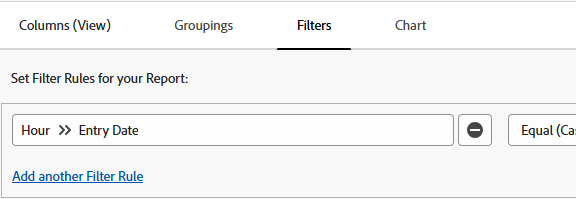

# Filter reports by timeframes

<!-- Audited: 4/2025 -->

You can filter a report by the timeframe of a date that exists on an object. For example, you can filter an hour report for a particular timeframe of when the hours were entered.

## Access requirements

+++ Expand to view access requirements for the functionality in this article. 

You must have the following access to perform the steps in this article:

<table style="table-layout:auto"> 
 <col> 
 <col> 
 <tbody> 
  <tr> 
   <td role="rowheader">Adobe Workfront plan</td> 
   <td> 
Any
 </td> 
  </tr> 
  <tr> 
   <td role="rowheader">Adobe Workfront license</td> 
      <td> 
      
New: Standard

       
 Or

      
Current: Plan

   </td>
 
  </tr> 
  <tr> 
   <td role="rowheader">Access level configurations</td> 
   <td> 
Edit access to Reports, Dashboards, Calendars
 
Edit access to Filters,&nbsp;Views, Groupings
</td> 
  </tr> 
  <tr> 
   <td role="rowheader">Object permissions</td> 
   <td> 
Manage permissions to a report
</td> 
  </tr> 
 </tbody> 
</table>

For more details about the information in this table, see [Access requirements in Workfront documentation](/help/quicksilver/administration-and-setup/add-users/access-levels-and-object-permissions/access-level-requirements-in-documentation.md). 

+++

## Prerequisites

The report must be created before you can filter its results.

For more information on creating reports, see [Create a report](../../../reports-and-dashboards/reports/creating-and-managing-reports/create-report.md).

## Filter a report by the timeframe of a date {#filter-a-report-by-the-timeframe-of-a-date}

{{step1-to-reports}}

1. In the top-left corner, click **New Report**, then select the type of report you want to create. 

1. On the **New Report** page, select the **Filters** tab.

1. Click **Add a Filter Rule**, then **Select a field**.

1. In the **Select a field** dialog box, select **Hour**, then **Entry Date**. 
   

1. In the drop-down that appears, select one of the following options:

   <table style="table-layout:auto"> 
    <col> 
    <col> 
    <tbody> 
     <tr> 
      <td role="rowheader">Equal (Case Sensitive)</td> 
      <td>After selecting this modifier, specify the date when the hours were entered.</td> 
     </tr>

     <tr> 
      <td role="rowheader">Not Equal (Case Sensitive)</td> 
      <td>After selecting this modifier, specify the date when the hours were entered to exclude this date from your report. The report shows hours logged in all dates, expect for the date you specified.</td> 
     </tr> 

     <tr> 
      <td role="rowheader">Less Than</td> 
      <td>After selecting this modifier, specify a&nbsp;date before which the hours were entered. The report shows hours entered before the specified date, not including the specified date.</td> 
     </tr> 

     <tr> 
      <td role="rowheader">Less Than Equal</td> 
      <td>After selecting this modifier, specify a&nbsp;date before which the hours were entered. The report shows hours entered before the specified date, including the specified date.</td> 
     </tr> 

     <tr> 
      <td role="rowheader">Greater Than</td> 
      <td>After selecting this modifier, specify a&nbsp;date after&nbsp;which the hours were entered. The report shows hours entered after&nbsp;the specified date, not including the specified date.</td> 
     </tr> 

      <tr> 
      <td role="rowheader">Greater Than Equal</td> 
      <td> After selecting this modifier, specify a&nbsp;date after&nbsp;which the hours were entered. The report shows hours entered after&nbsp;the specified date, including the specified date. </td> 
     </tr> 

     <tr> 
      <td role="rowheader">Between</td> 
      <td>After selecting this modifier, specify a date range when the hours were entered. The report shows hours entered between the specified dates.</td> 
     </tr> 

     <tr> 
      <td role="rowheader">Null</td> 
      <td>Select this modifier&nbsp;to display only hours where the Entry Date is missing.</td> 
     </tr> 

     <tr> 
      <td role="rowheader">Not Null</td> 
      <td>Select this modifier&nbsp;to display only hours where the Entry Date has a value.</td> 
     </tr>  

    </tbody> 
   </table>

1. Click **Save + Close**.

## Built-in timeframe modifiers {#built-in-timeframe-modifiers}

Adobe Workfront has built-in timeframe modifiers that you can use without defining a specific date. These modifiers are available for any date field in a filter or a prompt in any report.

For example, if you are building an hour report and would like to display hours entered in a specific timeframe, you can choose from the following built-in timeframe filter options:

<table style="table-layout:auto"> 
 <col> 
 <col> 
 <tbody> 
  <tr> 
   <td role="rowheader">Today</td> 
   <td>Displays hours where the Entry Date is today.</td> 
  </tr> 
  <tr> 
   <td role="rowheader">This Week</td> 
   <td>Displays hours where the Entry Date is a date in the current week, where the week starts on a Sunday&nbsp;and ends on a Saturday.</td> 
  </tr> 
  <tr> 
   <td role="rowheader">Next Week</td> 
   <td>Displays hours where the Entry Date is a date in the&nbsp;week following the current week, where the week starts on a Sunday&nbsp;and ends on a Saturday.&nbsp;</td> 
  </tr> 
  <tr> 
   <td role="rowheader">Last Week</td> 
   <td>Displays hours where the Entry Date is a date in the&nbsp;week prior to the current week, where the week starts on a Sunday&nbsp;and ends on a Saturday.&nbsp;</td> 
  </tr> 
  <tr> 
   <td role="rowheader">This Month</td> 
   <td>Displays hours where the Entry Date is a date in the current month.</td> 
  </tr> 
  <tr> 
   <td role="rowheader">Next Month</td> 
   <td>Displays hours where the Entry Date is a date in the month following the current month.</td> 
  </tr> 
  <tr> 
   <td role="rowheader">Last Month</td> 
   <td>Displays hours where the Entry Date is a date in the month preceding&nbsp;the current month</td> 
  </tr> 
  <tr> 
   <td role="rowheader">This Quarter</td> 
   <td> 
Displays hours where the Entry Date is a date in the current quarter, where quarters are defined as:
 
    <ul> 
     <li>First Quarter: January 1 - March 30</li> 
     <li>Second Quarter: April 1 - June 30</li> 
     <li>Third Quarter: July 1 - September 30</li> 
     <li>Fourth Quarter: October 1 - December 31</li> 
    </ul> </td> 
  </tr> 
  <tr> 
   <td role="rowheader">Next Quarter</td> 
   <td>Displays hours where the Entry Date is a date in the quarter following the current quarter, where quarters are defined above.</td> 
  </tr> 
  <tr> 
   <td role="rowheader">Last Quarter</td> 
   <td> 
Displays hours where the Entry Date is a date in the quarter preceding&nbsp;the current quarter, where quarters are defined above.
 
Note:  If your Workfront administrator has enabled and defined custom quarters for your system, the built-in filters for quarters are replaced with your custom quarter information. For more information about enabling custom quarters, see <a href="../../../administration-and-setup/set-up-workfront/configure-system-defaults/enable-custom-quarters-projects.md" class="MCXref xref">Enable custom quarters</a>.
 </td> 
  </tr> 
  <tr> 
   <td role="rowheader">This Year</td> 
   <td>Displays hours where the Entry Date is a date in&nbsp;the current year, where the current year starts on January 1 and ends on December 31.</td> 
  </tr> 
  <tr> 
   <td role="rowheader">Past Year</td> 
   <td>Displays hours where the Entry Date is a date in&nbsp;the past year, where the past&nbsp;year starts&nbsp;12 months prior to the current date.</td> 
  </tr> 
  <tr> 
   <td role="rowheader">Last Year</td> 
   <td> 
Displays hours where the Entry Date is a date in&nbsp;the last&nbsp;year, where the last&nbsp;year starts&nbsp;on January 1 and ends on December 31 of the year preceding the current year.
 
Note:  There is no built-in time period for fiscal year. You&nbsp;can create a&nbsp;report and filter the information by date using a custom modifier for the date range of the fiscal year, as it is defined in your organization. If you&nbsp;want to choose a timeframe for a fiscal year on the spot, then you should use a prompt instead of a filter.&nbsp;
 </td> 
  </tr> 
 </tbody> 
</table>
