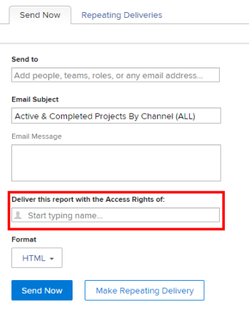

# Run and deliver a report with the access rights of another user

By default, users can only see the objects in a report that they have permissions to View.

You can allow all users to see the same results in a report as another user, regardless of their access level or permission level on the objects inside the report.

If you run a report with the access rights of another user who has higher access (for example, the access rights of an Adobe Workfront administrator), all the users who have permissions to View the report can see the information in the report as the user specified in the report builder. You can set this up for both reports that users find in the Workfront interface, or for reports that are delivered to users as an attachment to an email.

>[!TIP]
>
>You should replace the **Run this report with the Access Rights of:** field with an active user only when you want the report to display with the access rights of that user.&nbsp;For example, a Work-license user might not have permissions to see all the items in a report built by a Plan-license user or a System Administrator, unless the report displays with the access rights of a Planner or a System Administrator.  
>If the report is shared with users with similar access as the user specified in the **Run this report with the Access Rights of:** field, you can leave this field blank.

## Access requirements

You must have the following access to perform the steps in this article:

<table style="table-layout:auto"> 
 <col> 
 <col> 
 <tbody> 
  <tr> 
   <td role="rowheader">Adobe Workfront plan*</td> 
   <td> 
Any
 </td> 
  </tr> 
  <tr> 
   <td role="rowheader">Adobe Workfront license*</td> 
   <td> 
Plan 
 </td> 
  </tr> 
  <tr> 
   <td role="rowheader">Access level configurations*</td> 
   <td> 
Edit access to&nbsp;Reports,&nbsp;Dashboards,&nbsp;Calendars
 
Edit access to Filters,&nbsp;Views, Groupings
 
Note: If you still don't have access, ask your Workfront administrator if they set additional restrictions in your access level. For information on how a Workfront administrator can modify your access level, see <a href="../../../administration-and-setup/add-users/configure-and-grant-access/create-modify-access-levels.md" class="MCXref xref">Create or modify custom access levels</a>.
 </td> 
  </tr> 
  <tr> 
   <td role="rowheader">Object permissions</td> 
   <td> 
View permissions to a report (to view the delivered report)
 
Manage permissions to a report (to run the report)
 
For information on requesting additional access, see <a href="../../../workfront-basics/grant-and-request-access-to-objects/request-access.md" class="MCXref xref">Request access to objects </a>.
 </td> 
  </tr> 
 </tbody> 
</table>

&#42;To find out what plan, license type, or access you have, contact your Workfront administrator.

## Display a report with the access rights of another user

Populating the **Run this Report with the Access Rights of:** field ensures a report contains the same data, regardless of which user is accessing the report. The report displays as it would for the specified user.

The users accessing the report must have at least View permissions on the report to be able to see it. If the user listed in the **Run this Report with the Access Rights of:** field is deactivated, the report no longer displays for any other users who the report is shared with.

To run a report with the access rights of another user:

1. Click the **Main Menu** icon  in the upper-right corner of Workfront, then click **Reports**. 

1. Select the report you want to display with the access rights of another user.
1. Click **Report Actions**, then click **Edit**.

1. Click **Report Settings**.  

1. In the **Run this report with the Access Rights of:** field, start typing the name of the user that you want the report to display as, then select it when you see it in the list.  
   

   >[!NOTE]
   >
   >Users with a lower access level that are allowed to build reports do not have the ability to select a user other than themselves for the **Run this Report with the Access Rights of:** field.

1. Click **Done**.
1. Click **Save + Close**.  
   The report now displays for all users who the report is shared with as if it was viewed by the user specified in the **Run this report with the Access Rights of:** field.

>[!IMPORTANT]
>
>Entering a user other than the logged-in user for the **Run this report with the Access Rights of:** field impacts the information displayed in the report if the report contains a filter that uses a wildcard referring to the logged-in user. The report displays according to the value specified in the **Run this report with the Access Rights of:** field rather than what is defined in the wildcard filter.  
>
>For more information about wildcards for user fields, see the "User-based variables" section in [Wildcard filter variables](../../../reports-and-dashboards/reports/reporting-elements/understand-wildcard-filter-variables.md).

## Deliver a report with the access rights of another user

You can set up reports to be delivered as attachment to an email. You can set up these delivered reports to display as they display for users of a higher access level, so all users can see the same information in the delivered reports. The users who are going to see the report delivered in the email must be added to the Send to list of recipients inside the report delivery. For more information on setting up a report for delivery, see the article [Report delivery overview](../../../reports-and-dashboards/reports/creating-and-managing-reports/set-up-report-deliveries.md).

To deliver a report with the access rights of another user:

1. Click the **Main Menu** icon  in the upper-right corner of Workfront, then click **Reports**. 

1. Select the report you want to deliver with the access rights of another user.
1. Click the name of the report to select it.
1. Click **Report Actions**.
1. Click **Send Report**.  

1. In the **Deliver this report with the Access Rights of:** field, start typing the name of the user that you want the report to display as when it is delivered in an email, then select it when you see it in the list. The default is the name of the user who is building the report.  
   

   >[!NOTE]
   >
   >Users with a lower access level that are allowed to build reports do not have the ability to select a user other than themselves for the **Deliver this Report with the Access Rights of:** field.

1. Select the **Format** you want the report to display in the email:

   * HTML
   * PDF
   * MS Excel
   * MS Excel (.xlsx)
   * TSV

1. Click **Send Now** to send it immediately.  
   Or  
   Click **Make Repeating Delivery** to schedule a recurring delivery for the report.  
   For more information about report deliveries, see the article [Report delivery overview](../../../reports-and-dashboards/reports/creating-and-managing-reports/set-up-report-deliveries.md).

## Limitations for reports with a Source column

The following reports display a Source column where you can view information about the parent object:

* Issue reports
* Hour reports
* Document reports 

If users don't have permissions to the parent object of an issue, hour, or document, the Source column of the report displays empty, even when the report is configured to display, or to be delivered with the access rights of another user. 

In order to show information about the parent object in the report, we recommend adding a column for the parent object where you can display the name of the parent. 

For example, you can add any of the following to a report with a Source column: 

* The Project Name, Task Name, or Issue Name columns to a document or hour report.
* The Project Name or Task Name columns to an issue report. 
* A column using text-mode expressions that references all three objects. The following is an example for an hour report: 

   `displayname=Custom Source`

   `linkedname=opTask`
   
   `namekey=view.relatedcolumn`
   
   `namekeyargkey.0=opTask`
   
   `namekeyargkey.1=name`
   
   `textmode=true`
   
   `valueexpression=IF(!ISBLANK({opTaskID}),{opTask}.{name},IF(!ISBLANK({taskID}),{task}.{name},IF(!ISBLANK({projectID}),{project}.{name},IF(!ISBLANK({timesheetID}),CONCAT({owner}.{name}," ",{timesheet}.{startDate}," - ",{timesheet}.{endDate}),""))))`
  
   `valueformat=HTML`

   For information about text mode views, see [Edit a view using text mode](../text-mode/edit-text-mode-in-view.md).