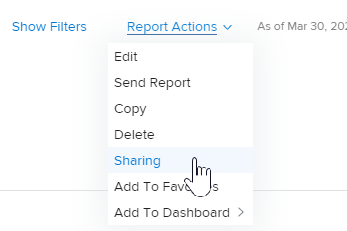

# Share a report in Adobe Workfront

Your Adobe Workfront administrator grants users access to view or edit reports when they assign access levels. For more information about granting access to issues, see [Grant access to reports, dashboards, and calendars](../../../administration-and-setup/add-users/configure-and-grant-access/grant-access-reports-dashboards-calendars.md).

Along with the access level that users are granted, you can also grant them permissions to View or Manage specific reports that you have access to share. For more information about access levels and permissions, see [How access levels and permissions work together](../../../administration-and-setup/add-users/access-levels-and-object-permissions/how-access-levels-permissions-work-together.md).

Permissions are specific to one item in Workfront and define what actions one can take on that item.

>[!NOTE]
>
>A Workfront administrator can add or remove permissions to any items in the system, for all users, without being the owner of those items.

## Access requirements

You must have the following to share objects:

<table style="table-layout:auto"> 
 <col> 
 <col> 
 <tbody> 
  <tr> 
   <td role="rowheader">Adobe Workfront plan*</td> 
   <td> 
Any 
 </td> 
  </tr> 
  <tr> 
   <td role="rowheader">Adobe Workfront license*</td> 
   <td> 
Review or higher
 </td> 
  </tr> 
  <tr> 
   <td role="rowheader">Access level configurations*</td> 
   <td> 
View access or higher to&nbsp;Reports,&nbsp;Dashboards, Calendars
 
Note: If you still don't have access, ask your Workfront administrator if they set additional restrictions in your access level. For information on how a Workfront administrator can modify your access level, see <a href="../../../administration-and-setup/add-users/configure-and-grant-access/create-modify-access-levels.md" class="MCXref xref">Create or modify custom access levels</a>.
 </td> 
  </tr> 
  <tr> 
   <td role="rowheader">Object permissions</td> 
   <td> 
View permissions or higher the report
 
For information on requesting additional access, see <a href="../../../workfront-basics/grant-and-request-access-to-objects/request-access.md" class="MCXref xref">Request access to objects </a>.
 </td> 
  </tr> 
 </tbody> 
</table>

&#42;To find out what plan, license type, or access you have, contact your Workfront administrator.

## Considerations about sharing reports

In addition to the considerations below, also see [Share reports, dashboards, and calendars](../../../workfront-basics/grant-and-request-access-to-objects/permissions-reports-dashboards-calendars.md).

* You can share reports that you create with other individuals, teams, groups, job roles, or companies. You can also share reports others created and which were shared with you. 
* You can also share them with your entire organization or make them public. Making a report public generates a URL that can be shared with others.
* You can share an individual report, or you can share multiple reports from a list of reports.

## Ways to share reports

You can share reports in&nbsp;Workfront in the following way:

* Manually, as described in the [Share a report](#share-a-report) section below. 
* Automatically, by inheriting View permissions from a dashboard that contains the report which has been shared. For information about viewing inherited permissions on objects, see [View inherited permissions on objects](../../../workfront-basics/grant-and-request-access-to-objects/view-inherited-permissions-on-objects.md).

## Share a report {#share-a-report}

Sharing one report or several reports from a list is identical.

1. Go to a list of reports and select one or multiple reports, then click **Share**.

   Or

   Click the name of one report, then click **Report Actions >****Sharing**.

   

1. In the box that displays, in the **Add people, teams, roles, groups, or companies ...** field start typing the name of the user, team, job role, group, or company whom you want to share the report with, then press **Enter** when the name displays.

1. To adjust the level of access for a name you added, click the drop-down menu to the right of the name, then choose one of the options below.

   <table style="table-layout:auto"> 
    <col> 
    <col> 
    <tbody> 
     <tr> 
      <td role="rowheader">View it</td> 
      <td> 
Allows your recipient access to see the report in the <strong>Reports</strong>  area and run it.
 
You can click <strong>Advanced Settings</strong> to specify whether you want the user or users to be able to <strong>Share</strong> it with anyone in the system.
 </td> 
     </tr> 
     <tr> 
      <td role="rowheader">Manage it</td> 
      <td> 
Allows your recipient full edit access to the report.
 
You can click <strong>Advanced Settings</strong> to specify whether you want the user or users to be able to <strong>Delete</strong> the report from the system and <strong>Share</strong> it with anyone in the system.
 </td> 
     </tr> 
    </tbody> 
   </table>

1. (Optional) Repeat the 2 previous steps to add other names to the list and configure their options.
1. (Optional) Click the **Gear** icon  in the upper-right corner of the sharing box, then select one of the following options:

   * **Make this public to external users:** Select this option to generate a URL that can be shared with others. Anyone with the URL can access the report, without having an Adobe Workfront license.

     >[!CAUTION]
     >
     >We recommend that you use caution when sharing an object containing confidential information with external users. This allows them to view information without being a Workfront user or part of your organization.

     >[!NOTE]
     >
     >If the report has a prompt and you share it publicly, users running the report through the public share link will not be able to run the report using the prompt. They will see the report without the prompt applied to it unless they log in to Workfront and access the report without using the public share link. For more information about the limitations of sharing reports with prompts, see the section [Limitations of sharing prompted reports](../../../reports-and-dashboards/reports/creating-and-managing-reports/add-prompt-report.md#limitations-of-running-public-prompted-reports) in the article [Add a prompt to a report](../../../reports-and-dashboards/reports/creating-and-managing-reports/add-prompt-report.md).

   * **Make this visible system-wide:** Select this option so that everyone in Workfront with access to reports can see the report.

1. Click **Save**.
