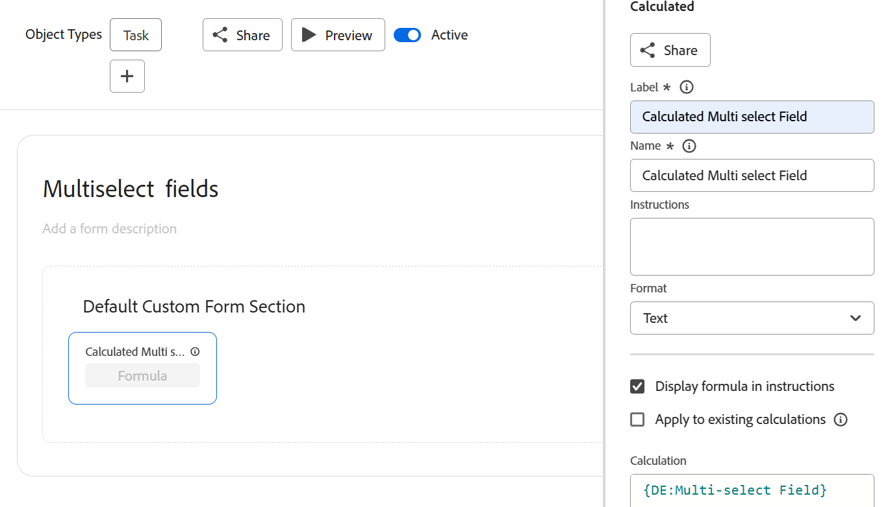
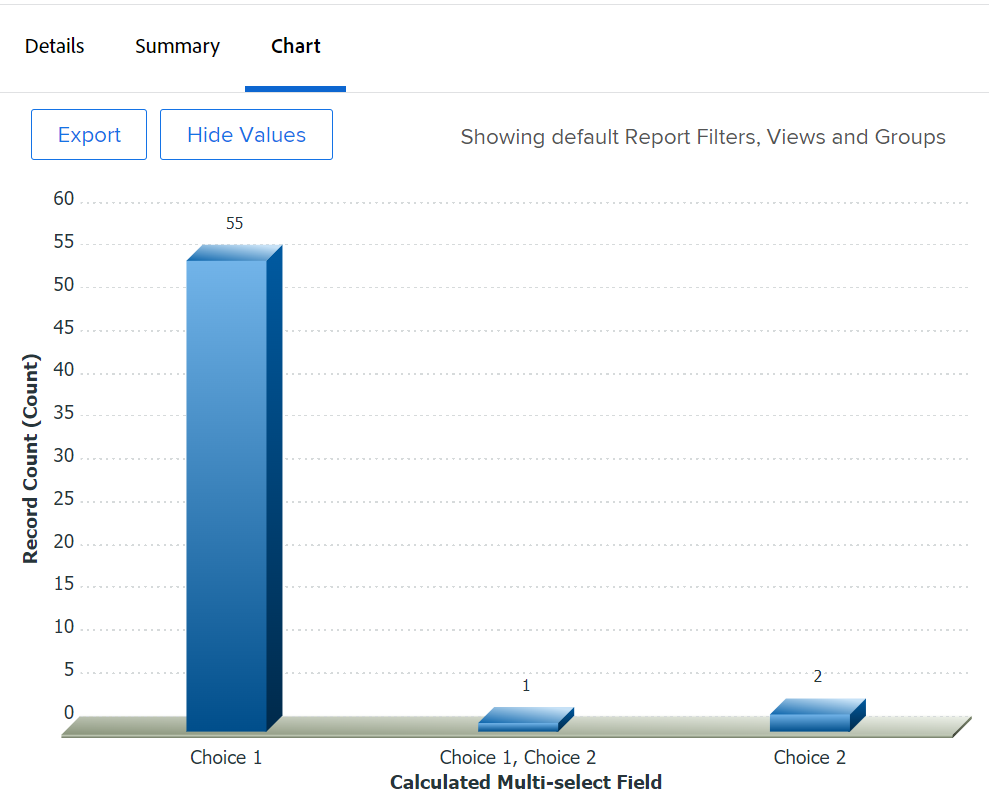

# Chart a report by a multi-select custom field

<!--The highlighted information on this page refers to functionality not yet generally available. It is available for all customers in the Preview environment and for a select group of customers in the Production environment.-->

Rather than building a chart using a multi-select custom field, we recommend that you create separate fields for each option of a multi-select custom field.

Examples of multi-select custom fields are:

* Checkboxes
* Multi-select dropdown menus

For information about using text mode, see the article [Text Mode overview](../../../reports-and-dashboards/reports/text-mode/understand-text-mode.md).

However, if it's not possible to have separate fields for each option of a multi-select field, you can chart a report by a multi-select custom field by using calculated custom fields to group the choices from the multi-select field first. After that, you can chart the report by the calculated fields.

>[!NOTE]
>
>Items that have any of the choices selected are counted only one time. 
>
>For example, if you have a Checkbox custom field with Choice 1 and Choice 2 as options, and you attach the form to tasks, the tasks that have both Choice 1 and Choice 2 display in a separate chart element than the tasks that have only Choice 1 or Choice 2 selected. 
>
>Tasks that have Choice 1 selected do not display in the same chart element as the tasks which have the Choice 1 and Choice 2 selected. 

## Access requirements

You must have the following access to perform the steps in this article:

<table style="table-layout:auto"> 
 <col> 
 <col> 
 <tbody> 
  <tr> 
   <td role="rowheader">Adobe Workfront plan*</td> 
   <td> 
Any
 </td> 
  </tr> 
  <tr> 
   <td role="rowheader">Adobe Workfront license*</td> 
   <td> 
Plan 
 </td> 
  </tr> 
  <tr> 
   <td role="rowheader">Access level configurations*</td> 
   <td> 
Edit access to&nbsp;Reports,&nbsp;Dashboards,&nbsp;Calendars
 
Edit access to Filters, Views, Groupings
 
Note: If you still don't have access, ask your Workfront administrator if they set additional restrictions in your access level. For information on how a Workfront administrator can modify your access level, see <a href="../../../administration-and-setup/add-users/configure-and-grant-access/create-modify-access-levels.md" class="MCXref xref">Create or modify custom access levels</a>.
 </td> 
  </tr> 
  <tr> 
   <td role="rowheader">Object permissions</td> 
   <td> 
Manage permissions to a report
 
For information on requesting additional access, see <a href="../../../workfront-basics/grant-and-request-access-to-objects/request-access.md" class="MCXref xref">Request access to objects </a>.
 </td> 
  </tr> 
 </tbody> 
</table>

&#42;To find out what plan, license type, or access you have, contact your Workfront administrator.

## Prerequisites

Before you begin, you must create a calculated custom field that shows the values selected from the multi-select custom field.&nbsp;For information, see the [Build a calculated custom field that references a multi-select custom field](#build-a-calculated-custom-field-that-references-a-multi-select-custom-field) section in this article.

## Chart a report by multi-select Custom Fields

<!--

(NOTE: this moved to its own article, linked in the Note above!)

-->

You cannot build a chart in a report by referencing a multi-select custom field. Instead, you can create a calculated field that records the values of the multi-select custom field on a given object and group by the calculated field.&nbsp;

* [Build a calculated custom field that references a multi-select custom field](#build-a-calculated-custom-field-that-references-a-multi-select-custom-field) 
* [Build a chart that references a calculated custom field](#build-a-chart-that-references-a-calculated-custom-field)

### Build a calculated custom field that references a multi-select custom field {#build-a-calculated-custom-field-that-references-a-multi-select-custom-field}

To build a calculated field that references a multi-select custom field, you must have the following prerequisites:

* A multi-select custom field in a custom form.  
  For information about building custom forms and adding custom fields to them, see the article [Design a form with the form designer](/help/quicksilver/administration-and-setup/customize-workfront/create-manage-custom-forms/form-designer/design-a-form/design-a-form.md).

* A custom form with the multi-select custom field attached to objects.
* Values for the multi-select custom field for each object.

To build the calculated custom field that references the multi-select custom field:

1. Create a custom form, or edit an existing one.  

   For information about creating custom forms, see [Design a form with the form designer](/help/quicksilver/administration-and-setup/customize-workfront/create-manage-custom-forms/form-designer/design-a-form/design-a-form.md).

1. Select the object or objects that you plan to use with the custom form. 
1. Click **Add a Field**, then **Calculated** to add the multi-select custom field to the form.

1. In the **Label** box, name the new calculated field to indicate that it references the multi-select custom field.  

   For example: "Calculated Multi-select Field."

1. In the **Calculation** box, enter the following code:

   `{DE:Multi-select Custom Field}`

   This adds the choices selected in the multi-select custom field to the calculated custom field. For example, if the form is attached to tasks and Choice 1 is selected from the multi-select custom field, the calculated custom field displays the value "Choice 1." If Choice 1 and Choice 2 are selected for a different task, the calculated custom field displays the value "Choice 1, Choice 2". 
   
1. Replace "Multi-select Custom Field" with the actual name of your multi-select custom field, as it appears in Workfront.

   

1. (Optional) If the multi-select custom field is already on this form and if this form is already attached to objects, enable the **Update previous calculations (in the background)** option. 

   This ensures that the new calculated field is automatically populated with the value from the multi-select custom field as it is added to the forms already attached to the objects.

1. Click **Done**.
1. Click **Save + Close**.

   The calculated custom field is added to the custom form and if the form is currently attached to objects, the field is populated with information from the multi-select custom field. 

### Build a chart that references a calculated custom field {#build-a-chart-that-references-a-calculated-custom-field}

1. (Optional) To ensure that all the calculated fields that you want to chart by are populated with values, from the Details tab of the report select all the objects that contain the custom form with both the multi-select custom field and the calculated custom field, then click **Edit**. 
1. (Optional and conditional) Select the **Recalculate Custom Expressions** field, then click **Save Changes**.  
    

   >[!NOTE]
   >
   >This option has been eliminated from editing projects in bulk.  You can still recalculate expressions for projects in bulk by clicking the **More** icon  at the top of a project list, then **Recalculate Expressions**. 

1. Go to the report where you want to add the chart for the calculated field that references the multi-select custom field. 
1. Click **Report Actions**, then **Edit**. 

1. Select the <strong>Groupings</strong> tab, then click <strong>Add Grouping</strong>. 
1. Add the <strong>Calculated Multi-select Field</strong> you created as your grouping. 
1. Select the <strong>Chart</strong> tab, and add a chart to your report.

   For example, choose a **Column** chart. 
    For information about adding a chart to a report, see the section <a href="../../../reports-and-dashboards/reports/creating-and-managing-reports/create-custom-report.md#add-a-chart" class="MCXref xref">Add a chart to a report</a> in the article <a href="../../../reports-and-dashboards/reports/creating-and-managing-reports/create-custom-report.md" class="MCXref xref">Create a custom report</a>. 
1. In the **Bottom (X) Axis** field, select the <strong>Calculated Multi-select Field</strong> to display in the chart. 
1. Click <strong>Save + Close</strong>.

   The report displays the results grouped by the Calculated Multi-select Field in a chart.

   