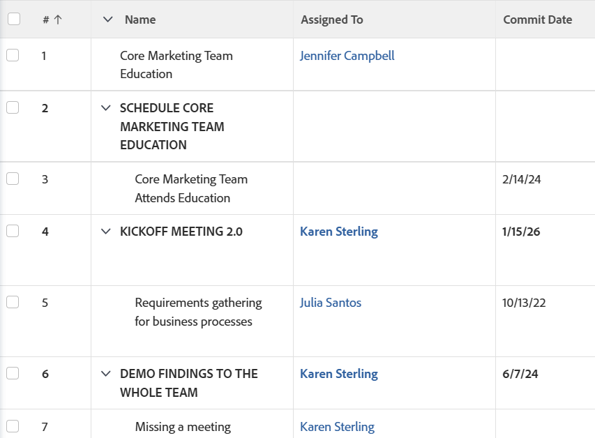

# View: show name of parent tasks as all caps

You can add this column to a task view to display the name of the parent tasks in all capital letters.

## Access requirements

You must have the following access to perform the steps in this article:

<table style="table-layout:auto"> 
 <col> 
 <col> 
 <tbody> 
  <tr> 
   <td role="rowheader">Adobe Workfront plan*</td> 
   <td> 
Any
 </td> 
  </tr> 
  <tr> 
   <td role="rowheader">Adobe Workfront license*</td> 
   <td> 
Request to modify filters, views, and groupings 

   
Plan to modify reports

    </td> 
  </tr> 
  <tr> 
   <td role="rowheader">Access level configurations*</td> 
   <td> 
Edit access to Reports, Dashboards, Calendars to modify a report
 
Edit access to Filters, Views, Groupings to modify individual a view
 
<b>NOTE</b>
   
   If you still don't have access, ask your Workfront administrator if they set additional restrictions in your access level. For information on how a Workfront administrator can modify your access level, see <a href="../../../administration-and-setup/add-users/configure-and-grant-access/create-modify-access-levels.md" class="MCXref xref">Create or modify custom access levels</a>.
 </td> 
  </tr> 
  <tr> 
   <td role="rowheader">Object permissions</td> 
   <td> 
Manage permissions to a report
 
For information on requesting additional access, see <a href="../../../workfront-basics/grant-and-request-access-to-objects/request-access.md" class="MCXref xref">Request access to objects </a>.
 </td> 
  </tr> 
 </tbody> 
</table>

&#42;To find out what plan, license type, or access you have, contact your Workfront administrator.

## Show name of parent tasks as all caps

To build this column in a task view:

1. Go to a list of tasks.
1. From the **View** drop-down menu, select **Customize View**.  
   Or  
   From the **View** drop-down menu, select **New View**.

1. In the**Column Preview** area, click the header of the column that shows the task name in the list.
1. Click**Switch to Text Mode**.
1. Mouse over the text mode area, and click **Click to edit text**.
1. Remove the text you find in the **Text Mode** box, and replace it with the following code: <pre>descriptionkey=name displayname=Task Name textmode=true valueexpression=IF({numberOfChildren}>"0",UPPER({name}),{name}) valueformat=HTML width=150 </pre>

1. Click **Save View**.
