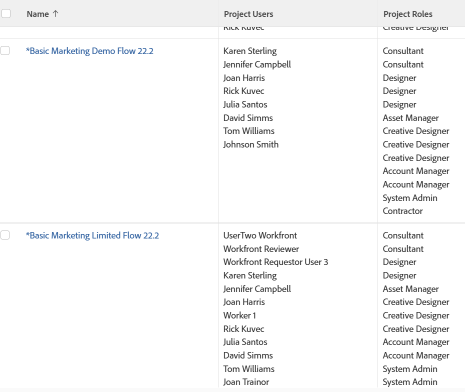
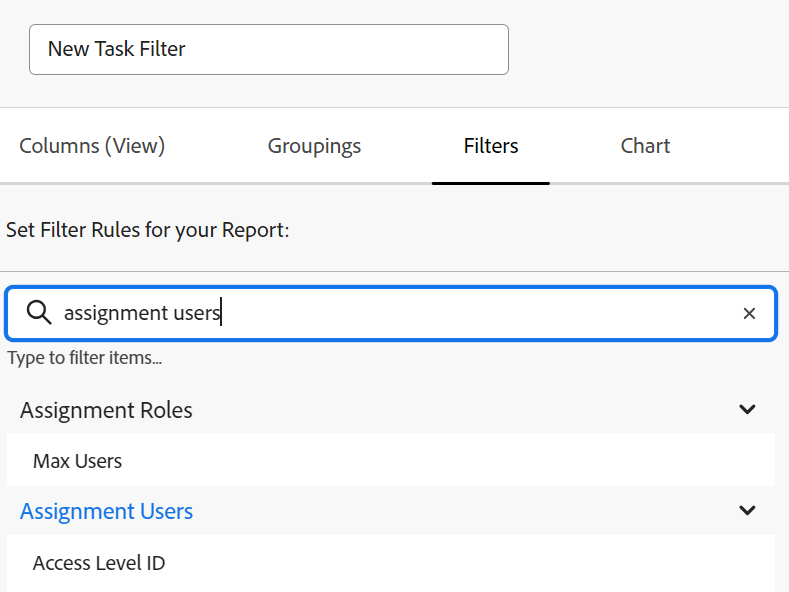

# Reports or lists: display users associated with an object

You can display users, job roles, and teams associated with objects in reports or lists as well as reference them in filters. You cannot group by users, job roles, or teams associated with objects.

You can display or filter by users, job roles, or teams associated with the following objects:

<table style="table-layout:auto"> 
 <col> 
 <col> 
 <tbody> 
  <tr> 
   <td role="rowheader">Object</td> 
   <td>Associated users or job roles</td> 
  </tr> 
  <tr> 
   <td role="rowheader">Project</td> 
   <td> 
You can display all users and the job roles they fulfill on the project in a project report. You cannot filter by the users or their associated job roles in a project report. 
 </td> 
  </tr> 
  <tr> 
   <td role="rowheader">Tasks</td> 
   <td>You can display and filter by all users, job roles, and teams assigned to a task in a task report.</td> 
  </tr> 
  <tr> 
   <td role="rowheader">Issues</td> 
   <td>You can display and filter by all users, job roles, and teams assigned to an issue in an issue report.</td> 
  </tr> 
  <tr> 
   <td role="rowheader">Portfolios</td> 
   <td>You can display all users and the job roles they fulfill on the project in a project report and group the report by Portfolio. You cannot filter by the users or their associated job roles in a project report.</td> 
  </tr> 
  <tr> 
   <td role="rowheader">Programs</td> 
   <td>You can display all users and the job roles they fulfill on the project in a project report and group the report by Program. You cannot filter by the users or their associated job roles in a project report.</td> 
  </tr> 
 </tbody> 
</table>

## Display all users and job roles associated with a project

You can display all users associated with in the project in the view of a project list or report. This includes all users listed in the People section of the project. You can also view the roles they are associated with when assigned to tasks or issues on the project in a project report.

For information about building a project report to display all users and their roles on the project, see [View: list of project users with job roles](../../../reports-and-dashboards/reports/custom-view-filter-grouping-samples/view-project-user-list.md).

You cannot filter for users or job roles associated with projects in a project filter.

## Display all users, job roles, or teams assigned to a task

You can display all users, roles, or teams assigned to a task in the view of a task list or report by adding the Assignments field to the view.

You can filter by the users, job roles, or teams assigned to tasks by referencing the following fields in a task filter:

* Assignment Users 
* Assignment Roles
* Team

## Display all users, job roles, or teams assigned to an issue

You can display all users, roles, or teams assigned to an issue in the view of an issue list or report by adding the Assignments field to the view.

You can filter by the users, job roles, or teams assigned to issues by referencing the following fields in an issue filter:

* Assignment Users 
* Assignment Roles
* Team

## Display all users and job roles associated with a portfolio

You can display all users and roles associated with a portfolio by displaying them in a project report and then grouping the report by Portfolio.

For information about building a project report to display all users and their roles on the project, see [View: list of project users with job roles](../../../reports-and-dashboards/reports/custom-view-filter-grouping-samples/view-project-user-list.md).

You cannot filter for users or job roles associated with projects in a portfolio or project filter.

## Display all users and job roles associated with a program

You can display all users and roles associated with a program by displaying them in a project report and then grouping the report by Program.

For information about building a project report to display all users and their roles on the project, see [View: list of project users with job roles](../../../reports-and-dashboards/reports/custom-view-filter-grouping-samples/view-project-user-list.md).

You cannot filter for users or job roles associated with projects in a program or project filter.
