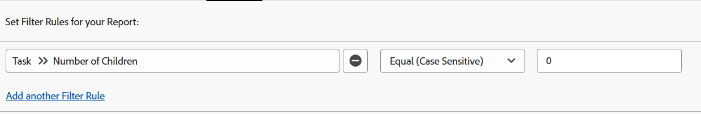
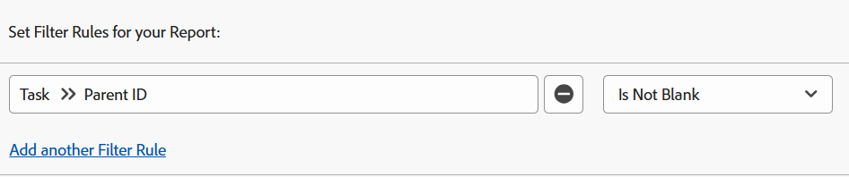
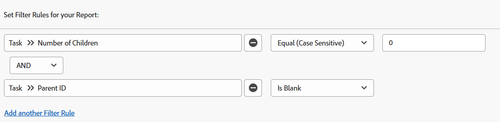

# Filter: display parent tasks

You can apply the task filters below to display working tasks. Working tasks are tasks that can be worked independently and are not parent tasks to other tasks. In one example, a filter identifies children tasks that could be parents themselves. In this case, they are not working tasks.

>[!TIP]
>
>* If you consider adding more than one filter to a report, we recommend that you add all your filters using the report builder interface, and clicking Switch to Text Mode after all the other filter rules have been added. Then, you can add the code for the parent task filter as noted above.&nbsp;
>* We also recommend that you add a grouping for Project Name to make the report easier to read. For more information about adding groupings to your reports, see the article [Groupings overview in Adobe Workfront](../../../reports-and-dashboards/reports/reporting-elements/groupings-overview.md). 
>

## Access requirements

You must have the following access to perform the steps in this article:

<table style="table-layout:auto"> 
 <col> 
 <col> 
 <tbody> 
  <tr> 
   <td role="rowheader">Adobe Workfront plan*</td> 
   <td> <p>Any</p> </td> 
  </tr> 
  <tr> 
   <td role="rowheader">Adobe Workfront license*</td> 
   <td> <p>Request to modify a filter </p>
   <p>Plan to modify a report</p> </td> 
  </tr> 
  <tr> 
   <td role="rowheader">Access level configurations*</td> 
   <td> <p>Edit access to Reports, Dashboards, Calendars to modify a report</p> <p>Edit access to Filters, Views, Groupings to modify a filter</p> <p><b>NOTE</b>
   
   If you still don't have access, ask your Workfront administrator if they set additional restrictions in your access level. For information on how a Workfront administrator can modify your access level, see <a href="../../../administration-and-setup/add-users/configure-and-grant-access/create-modify-access-levels.md" class="MCXref xref">Create or modify custom access levels</a>.</p> </td> 
  </tr>
  <tr> 
   <td role="rowheader">Object permissions</td> 
   <td> <p>Manage permissions to a report</p> <p>For information on requesting additional access, see <a href="../../../workfront-basics/grant-and-request-access-to-objects/request-access.md" class="MCXref xref">Request access to objects </a>.</p> </td> 
  </tr> 
 </tbody> 
</table>

&#42;To find out what plan, license type, or access you have, contact your Workfront administrator.

## Display tasks with no children (they could have a parent)

You can apply the following filter to a task report to display tasks with no children.&nbsp;They could have parents of their own and be children of other tasks.

1. From the **Main Menu** , click **Reports.** 

1. Click **New Report**.
1. Select a **Task Report**.
1. Click **Filters**.
1. Click **Add a Filter Rule**.
1. In the **Start typing field name ...** line, start typing **Number of Children**.

1. Select **Equal (Case Sensitive)** for your modifier, then enter **0** for the number of children.  
   

   Or

   Click&nbsp;**Switch to Text Mode**, and in the&nbsp;text editing window, copy and paste the following text:&nbsp;

   ```
   numberOfChildren=0
   numberOfChildren_Mod=eq
   ```
   

1. Click **Save + Close**.

   This pulls a report for all tasks which are working tasks in your system. Some of these tasks could have a parent, but they are not parent tasks themselves.

## Display tasks with parents (they could have children)

You can apply the following filter to a task report to display tasks with parents, meaning they are children tasks. However, these tasks could also have children of their own because the filter does not exclude their children. Children tasks that are also parents for other tasks are not considered working tasks.

1. From the **Main Menu** , click **Reports.
1. Click **New Report**.
1. Select a **Task Report**.
1. Click **Filters**.
1. Click **Add a Filter Rule**.
1. In the **Start typing field name ...** line, start typing **Parent ID**.
1. Select **Is Not Blank** for your modifier.
    
      
    
    Or
    
    Click **Switch to Text Mode**, and in the text editing window, copy and paste the following text: 
    
    `parentID_Mod=notblank`
    
1. Click **Save + Close**.
    
    This pulls a report for all tasks in your system that have parents and are children tasks of those parents. Some of these tasks could be a parent themselves.

## Display tasks with no children and no parents (standalone tasks)

You can apply the following filter to a task report to display standalone working tasks.&nbsp;These tasks don't have a parent and they have no children of their own.

1. From the **Main Menu** , click **Reports.** 
1. Click **New Report**.
1. Select a **Task Report**.
1. Click **Filters**.
1. Click **Add a Filter Rule** and in the **Start typing field name ...** line start typing **Number of Children** select **Equal (Case Sensitive)** for your modifier, then enter **0** for the number of children.
1. Click **Add another Filter Rule** and in the **Start typing field name ...** line start typing **Parent ID**, then select **Is Blank**.

   

   Or

   Instead of steps 6-7, click&nbsp;**Switch to Text Mode** and in the&nbsp;text editing window, copy and paste the following text:&nbsp;

   <!--
   <p data-mc-conditions="QuicksilverOrClassic.Draft mode">(NOTE: ensure steps above stay accurate)</p>
   -->

   ```
   numberOfChildren=0
   numberOfChildren_Mod=eq
   parentID_Mod=isblank
   ```

1. Click **Save + Close**.

   This pulls a report for all tasks in your system that have no parents nor children. These are standalone working tasks.
