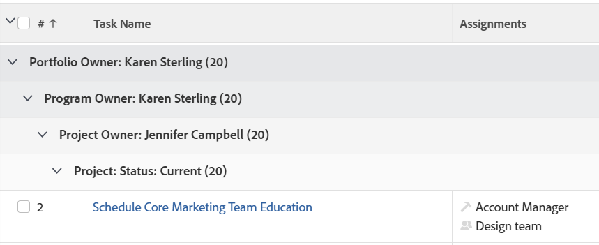

# Grouping: 4-level task grouping for Portfolio Owner, Program Owner, Project Owner, and Project Status

This task Grouping provides 4 levels of Grouping. In this case, tasks are grouped by Portfolio Owner, Program Owner, Project Owner, and Project Status.&nbsp;You can only have up to 3 levels of Grouping using the standard interface. To add a fourth level, you must use Text Mode. You cannot group reports by more than 4 criteria at the same time.

## Access requirements

You must have the following access to perform the steps in this article:

<table style="table-layout:auto"> 
 <col> 
 <col> 
 <tbody> 
  <tr> 
   <td role="rowheader">Adobe Workfront plan*</td> 
   <td> 
Any
 </td> 
  </tr> 
  <tr> 
   <td role="rowheader">Adobe Workfront license*</td> 
   <td> 
Request to modify a grouping 

   
Plan to modify a report
 </td> 
  </tr> 
  <tr> 
   <td role="rowheader">Access level configurations*</td> 
   <td> 
Edit access to Reports, Dashboards, Calendars to modify a report
 
Edit access to Filters, Views, Groupings to modify a grouping
 
<b>NOTE</b>
   
   If you still don't have access, ask your Workfront administrator if they set additional restrictions in your access level. For information on how a Workfront administrator can modify your access level, see <a href="../../../administration-and-setup/add-users/configure-and-grant-access/create-modify-access-levels.md" class="MCXref xref">Create or modify custom access levels</a>.
 </td> 
  </tr>  
  <tr> 
   <td role="rowheader">Object permissions</td> 
   <td> 
Manage permissions to a report
 
For information on requesting additional access, see <a href="../../../workfront-basics/grant-and-request-access-to-objects/request-access.md" class="MCXref xref">Request access to objects </a>.
 </td> 
  </tr> 
 </tbody> 
</table>

&#42;To find out what plan, license type, or access you have, contact your Workfront administrator.

## Create a 4-level task Grouping for Portfolio Owner, Program Owner, Project Owner, and Project Status

To apply this grouping:

1. Go to a list of tasks.
1. From the **Grouping**&nbsp;drop-down menu, select **New Grouping**.

1. Click**Switch to Text Mode**.
1. Remove the text&nbsp;in the **Group your Report** area.
1. Replace&nbsp;the text with the following code:  
   <pre>group.0.linkedname=project group.0.name=Portfolio Owner group.0.notime=false group.0.valuefield=project:portfolio:owner:name group.0.valueformat=string group.1.linkedname=project group.1.name=Program Owner group.1.notime=false group.1.valuefield=project:program:owner:name group.1.valueformat=string group.2.linkedname=projectOwnerMM group.2.listgrouingparsedmethod=nested(project).nested(owner).string(name) group.2.namekey=projectownermm group.2.notime=false group.2.valuefield=projectOwnerMM:name group.2.valueformat=string group.3.enumclass=com.attask.common.constants.ProjectStatusEnum group.3.linkedname=project group.3.namekey=view.relatedcolumn group.3.namekeyargkey.0=project group.3.namekeyargkey.1=status group.3.notime=false group.3.valuefield=project:status group.3.valueformat=val</pre>

1. Click **Save Grouping**.
