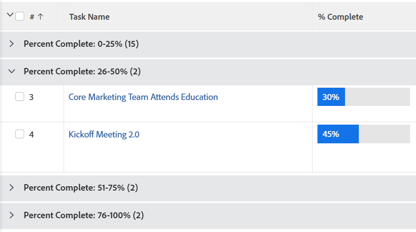

# Grouping: organize list results by a calculated value common to all objects in the grouping

<!--Audited: 10/2024-->

You might want to view your tasks grouped by Percent Complete in ranges of 0-25, 26-50, 51-75, 75-99, and 100. You can create a grouping using text mode to do this.



## Access requirements

+++ Expand to view access requirements for the functionality in this article. 

<table style="table-layout:auto"> 
 <col> 
 <col> 
 <tbody> 
  <tr> 
   <td role="rowheader">Adobe Workfront package</td> 
   <td> <p>Any</p> </td> 
  </tr> 
  <tr> 
   <td role="rowheader">Adobe Workfront license</td> 
   <td> 
   <p>Contributor or Request to modify a filter </p>
   <p>Standard or Plan to modify a report</p>
  </tr> 
  <tr> 
   <td role="rowheader">Access level configurations</td> 
   <td> <p>Edit access to Reports, Dashboards, Calendars to modify a report</p> <p>Edit access to Filters, Views, Groupings to modify a filter</p> </td> 
  </tr> 
  <tr> 
   <td role="rowheader">Object permissions</td> 
   <td> <p>Manage permissions to a report</p>  </td> 
  </tr> 
 </tbody> 
</table>

For more detail about the information in this table, see [Access requirements in Workfront documentation](/help/quicksilver/administration-and-setup/add-users/access-levels-and-object-permissions/access-level-requirements-in-documentation.md).

+++

## Organize list results by a calculated value common to all objects in the grouping

To apply this grouping to a list of tasks:

1. Go to a list of tasks. 
1. From the **Grouping**drop-down menu, select **New Grouping**.

1. Click **Switch to Text Mode**.
1. In the available space, add the following code:

   ```
   textmode=true
   group.0.valueexpression=IF({percentComplete}>=0&&{percentComplete}<=25,'0-25%',IF({percentComplete}>25&&{percentComplete}<=50,'26-50%',IF({percentComplete}>50&&{percentComplete}<=75,'51-75%',IF({percentComplete}>75&&{percentComplete}<=100,'76-100%',''))))
   group.0.linkedname=direct
   group.0.valueformat=doubleAsString
   group.0.namekey=percentComplete
   ```

1. Click **Done**, then **Save Grouping**.
1. (Optional) Update the grouping name, then click **Save Grouping**.
