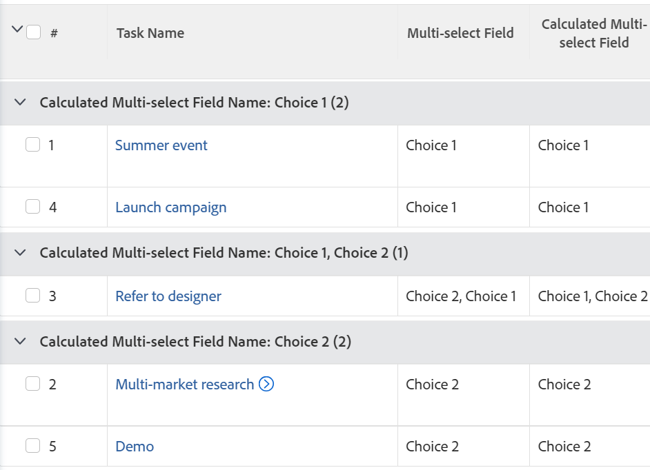
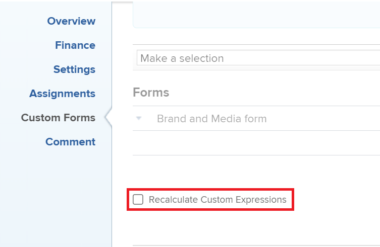

# Group a report by a multi-select custom field

You can group by the value in a multi-select custom field in a Adobe Workfront report only by using text mode. 

Examples of multi-select custom fields are:

* Checkboxes
* Multi-select dropdown menus

For information about using text mode, see the article [Text Mode overview](../../../reports-and-dashboards/reports/text-mode/understand-text-mode.md).

## Considerations when when grouping by a multi-select custom field

* You cannot chart a report that uses a text-mode grouping. You need to create an additional calculated field that refers to the multi-select custom field to also chart the report by the value of the multi-select custom field. 

   For more information, see [Chart a report by a multi-select custom field](../../../reports-and-dashboards/reports/custom-view-filter-grouping-samples/chart-report-by-multi-select-custom-field.md).
* Items that have any of the choices selected are counted only one time. 
   
   For example, if you have a Checkbox custom field with Choice 1 and Choice 2 as options, and you attach the form to tasks, the tasks that have both Choice 1 and Choice 2 selected are grouped separately from the tasks that have only Choice 1 or Choice 2 selected. 

## Access requirements

You must have the following access to perform the steps in this article:

<table style="table-layout:auto"> 
 <col> 
 <col> 
 <tbody> 
  <tr> 
   <td role="rowheader">Adobe Workfront plan*</td> 
   <td> 
Any
 </td> 
  </tr> 
  <tr> 
   <td role="rowheader">Adobe Workfront license*</td> 
   <td> 
Request to modify a grouping 

   
Plan to modify a report
 </td> 
  </tr> 
  <tr> 
   <td role="rowheader">Access level configurations*</td> 
   <td> 
Edit access to Reports, Dashboards, Calendars to modify a report
 
Edit access to Filters, Views, Groupings to modify a grouping
 
<b>NOTE</b>
   
   If you still don't have access, ask your Workfront administrator if they set additional restrictions in your access level. For information on how a Workfront administrator can modify your access level, see <a href="../../../administration-and-setup/add-users/configure-and-grant-access/create-modify-access-levels.md" class="MCXref xref">Create or modify custom access levels</a>.
 </td> 
  </tr>  
  <tr> 
   <td role="rowheader">Object permissions</td> 
   <td> 
Manage permissions to a report
 
For information on requesting additional access, see <a href="../../../workfront-basics/grant-and-request-access-to-objects/request-access.md" class="MCXref xref">Request access to objects </a>.
 </td> 
  </tr> 
 </tbody> 
</table>

*To find out what plan, license type, or access you have, contact your Workfront administrator.

## Group a report by multi-select custom fields

To be able to group by a multi-select custom field, you must have the following prerequisites:

* Build the multi-select custom field in a custom form.  
  For information about building custom forms and adding custom fields to them, see the article [Create or edit a custom form](../../../administration-and-setup/customize-workfront/create-manage-custom-forms/create-or-edit-a-custom-form.md).

* Attach the custom form to objects.
* Populate the multi-select custom field with a value on each object.&nbsp;

To group by a multi-select custom field in a report:

1. Create a report or edit an existing one where you want to add a grouping for a multi-select custom field.  
   For information about creating reports, see the article [Create a custom report](../../../reports-and-dashboards/reports/creating-and-managing-reports/create-custom-report.md).

1. Select the **Groupings** tab.
1. Click **Switch to Text Mode**.

1. Select the text in the **Group your Report** box and replace it with the following code:  
   
   <pre>
   group.0.displayname=Multi-select Custom Field Name
   group.0.valueexpression={DE:Multi-select Custom Field Name}
   group.0.valueformat=HTML
   group.0.textmode=true
   </pre>

1. Replace "Multi-select Custom Field Name" with the actual name of your multi-select custom field, as it appears in Workfront.
1. Click **Save and Close**.  
   
   The objects in the report are grouped by the values of the multi-select custom field.  

      

   The name of the groupings of the report are the names of the multi-select custom field followed by the values selected in the field.

<!--

<h2>Chart a report by multi-select Custom Fields</h2>

(NOTE: this moved to its own article, linked in the Note above!)

You cannot build a chart in a report by referencing a multi-select custom field. Instead, you can create a calculated field that records the values of the multi-select custom field on a given object and group by the calculated field.&nbsp;

<ul>
<li><a href="#build-a-calculated-custom-field-that-references-a-multi-select-custom-field" class="MCXref xref">Build a calculated custom field that references a multi-select custom field</a> </li>
<li><a href="#build-a-chart-that-references-a-calculated-custom-field" class="MCXref xref">Build a chart that references a calculated custom field</a> </li>
</ul>

<strong>Build a calculated custom field that references a multi-select custom field</strong>

To be able to build a calculated field that references a multi-select custom field, you must have the following prerequisites:

<ul>
<li>Build the multi-select custom field in a custom form. For information about building custom forms and adding custom fields to them, see the article <a href="../../../administration-and-setup/customize-workfront/create-manage-custom-forms/create-or-edit-a-custom-form.md" class="MCXref xref">Create or edit a custom form</a>.</li>
<li>Attach the custom form to objects.</li>
<li>Populate the multi-select custom field with a value on each object.</li>
</ul>

To build the calculated custom field that references the multi-select custom field:

<ol>
<li value="1">Create a custom form, or edit an existing one. For information about creating custom forms, see the article <a href="../../../administration-and-setup/customize-workfront/create-manage-custom-forms/create-or-edit-a-custom-form.md" class="MCXref xref">Create or edit a custom form</a>.</li>
<li value="2">Click<strong>Add a Field</strong>, then <strong>Calculated</strong> to add the multi-select custom field to the form.</li>
<li value="3">In the <strong>Label</strong> box, name the new calculated field to indicate that it references the multi-select custom field. For example: "Calculated Multi-select Field."</li>
<li value="4"> 
In the <strong>Calculation</strong> box, enter the following code:
<pre>{DE:Multi-select Custom Field}</pre> 
    
 </li>
<li value="5">Replace "Multi-select Custom Field" with the actual name of your multi-select custom field, as it appears in Workfront.</li>
<li value="6"> 
(Optional) If the multi-select custom field is already on this form and if this form is already attached to objects, enable the <strong>Update previous calculations</strong>&nbsp;option.
 
This ensures that the new field is automatically populated with the value from the multi-select custom field as it is added to the forms attached to the objects already.
 </li>
<li value="7">Click <strong>Done</strong>.</li>
<li value="8">Click <strong>Save +Close</strong>.</li>
</ol>

<strong>Build a chart that references a calculated custom field</strong>

<ol>
<li value="1"> Go to the report where you want to add the chart for the calculated field that references the multi-select custom field. </li>
<li value="2"> (Optional) To ensure that all the calculated fields that you want to chart by are populated with values, select all the objects in your report, then click <strong>Edit</strong>. </li>
<li value="3"> 
 (Optional and conditional) Enable the <strong>Recalculate Custom Expressions</strong> field, then click <strong>Save Changes</strong>.
 
    
 </li>
<li value="4"> Click <strong>Report Actions</strong>, then <strong>Edit</strong>. </li>
<li value="5">Select the <strong>Groupings</strong> tab, then click <strong>Add Grouping</strong>. </li>
<li value="6">Add the<strong>Calculated Multi-select Field</strong> you created as your grouping. </li>
<li value="7"> 
Select the <strong>Chart</strong> tab, and add a chart to your report.
 
For information about adding a chart to a report, see the section <a href="../../../reports-and-dashboards/reports/creating-and-managing-reports/create-custom-report.md#add-a-chart" class="MCXref xref">Add a chart to a report</a> in the article <a href="../../../reports-and-dashboards/reports/creating-and-managing-reports/create-custom-report.md" class="MCXref xref">Create a custom report</a>. 
 </li>
<li value="8">Select the <strong>Calculated Multi-select Field</strong> as one of the fields to display in the chart. </li>
<li value="9"> 
Click <strong>Save + Close</strong>.
 
The report displays the results grouped by the Calculated Multi-select Field in a chart. 
 </li>
</ol>

-->
