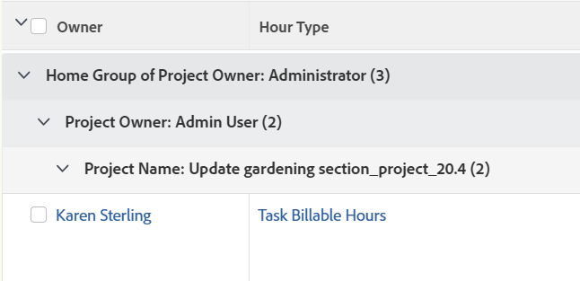

# Grouping: Home Group of Project Owner in a list of hours

You can display the name of the Home Group of the Project Owner in an Hour list or report.

The grouping also groups the results by the name of the Project Owner and the Project Name.



## Access requirements

You must have the following access to perform the steps in this article:

<table style="table-layout:auto"> 
 <col> 
 <col> 
 <tbody> 
  <tr> 
   <td role="rowheader">Adobe Workfront plan*</td> 
   <td> <p>Any</p> </td> 
  </tr> 
  <tr> 
   <td role="rowheader">Adobe Workfront license*</td> 
   <td> <p>Request to modify a grouping </p>
   <p>Plan to modify a report</p> </td> 
  </tr> 
  <tr> 
   <td role="rowheader">Access level configurations*</td> 
   <td> <p>Edit access to Reports, Dashboards, Calendars to modify a report</p> <p>Edit access to Filters, Views, Groupings to modify a grouping</p> <p><b>NOTE</b>
   
   If you still don't have access, ask your Workfront administrator if they set additional restrictions in your access level. For information on how a Workfront administrator can modify your access level, see <a href="../../../administration-and-setup/add-users/configure-and-grant-access/create-modify-access-levels.md" class="MCXref xref">Create or modify custom access levels</a>.</p> </td> 
  </tr>  
  <tr> 
   <td role="rowheader">Object permissions</td> 
   <td> <p>Manage permissions to a report</p> <p>For information on requesting additional access, see <a href="../../../workfront-basics/grant-and-request-access-to-objects/request-access.md" class="MCXref xref">Request access to objects </a>.</p> </td> 
  </tr> 
 </tbody> 
</table>

&#42;To find out what plan, license type, or access you have, contact your Workfront administrator.

## Group by Home Group of Project Owner in a list of hours

To apply this grouping:

1. Go to a list of hours.
1. From the&nbsp;**Grouping**&nbsp;drop-down menu, select&nbsp;**New Grouping**.

1. Click**Switch to Text Mode**.
1. Remove the text&nbsp;in the&nbsp;**Group your Report**&nbsp;area.
1. Replace&nbsp;the text with the following code:

   ```
   group.0.displayname=Home Group of Project Owner<br>group.0.valuefield=project:owner:homeGroup:name<br>group.0.valueformat=HTML<br>group.1.displayname=Project Owner<br>group.1.linkedname=projectOwnerMM<br>group.1.namekey=view.relatedcolumn<br>group.1.namekeyargkey.0=projectOwnerMM<br>group.1.namekeyargkey.1=name<br>group.1.valuefield=projectOwnerMM:name<br>group.1.valueformat=string<br>group.2.displayname=Project Name<br>group.2.linkedname=project<br>group.2.namekey=view.relatedcolumn<br>group.2.namekeyargkey.0=project<br>group.2.namekeyargkey.1=name<br>group.2.valuefield=project:name<br>group.2.valueformat=string<br>textmode=true
   ```

1. Click **Save Grouping**.
