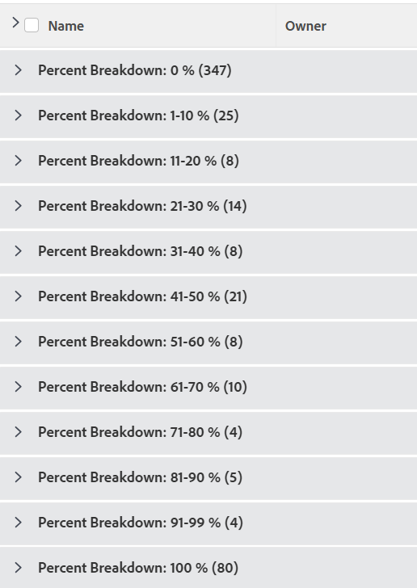

# Grouping: project percent breakdown 2

In this custom project grouping, you can display projects grouped by a range of their percent complete values. The breakdowns show percent complete value of 10&nbsp;percent point increments: 0-10%, 11-20%, 21-30% etc.

The following grouping organizes projects by the percent complete value into one of these groupings:

* 0%
* 1-10%
* 11-20%
* 21-30%
* 31-40%
* 41-50%
* 51-60%
* 61-70%
* 71-80%
* 81-90%
* 91-99%
* 100%

## Access requirements

You must have the following access to perform the steps in this article:

<table style="table-layout:auto"> 
 <col> 
 <col> 
 <tbody> 
  <tr> 
   <td role="rowheader">Adobe Workfront plan*</td> 
   <td> 
Any
 </td> 
  </tr> 
  <tr> 
   <td role="rowheader">Adobe Workfront license*</td> 
   <td> 
Request to modify a grouping 

   
Plan to modify a report
 </td> 
  </tr> 
  <tr> 
   <td role="rowheader">Access level configurations*</td> 
   <td> 
Edit access to Reports, Dashboards, Calendars to modify a report
 
Edit access to Filters, Views, Groupings to modify a grouping
 
<b>NOTE</b>
   
   If you still don't have access, ask your Workfront administrator if they set additional restrictions in your access level. For information on how a Workfront administrator can modify your access level, see <a href="../../../administration-and-setup/add-users/configure-and-grant-access/create-modify-access-levels.md" class="MCXref xref">Create or modify custom access levels</a>.
 </td> 
  </tr>  
  <tr> 
   <td role="rowheader">Object permissions</td> 
   <td> 
Manage permissions to a report
 
For information on requesting additional access, see <a href="../../../workfront-basics/grant-and-request-access-to-objects/request-access.md" class="MCXref xref">Request access to objects </a>.
 </td> 
  </tr> 
 </tbody> 
</table>

&#42;To find out what plan, license type, or access you have, contact your Workfront administrator.

## Group by project percent breakdown

To apply this grouping:

1. Go to a list of projects.
1. From the **Grouping**&nbsp;drop-down menu, select **New Grouping**.

1. Click **Switch to Text Mode**.
1. Remove the text in the box, and paste the following code in the available space:  
   <pre>group.0.linkedname=direct group.0.name=Percent Breakdown group.0.notime=false group.0.valueexpression=IF({percentComplete}=0,"0 %",IF({percentComplete}<=11,"1-10 %",IF({percentComplete}<=21,"11-20 %",IF({percentComplete}<=31,"21-30 %",IF({percentComplete}<41,"31-40 %",IF({percentComplete}<51,"41-50 %",IF({percentComplete}<61,"51-60 %",IF({percentComplete}<71,"61-70 %",IF({percentComplete}<81,"71-80 %",IF({percentComplete}<91,"81-90 %",IF({percentComplete}<100,"91-99 %","100 %"))))))))))) textmode=true</pre>

1. Click **Save Grouping**.
