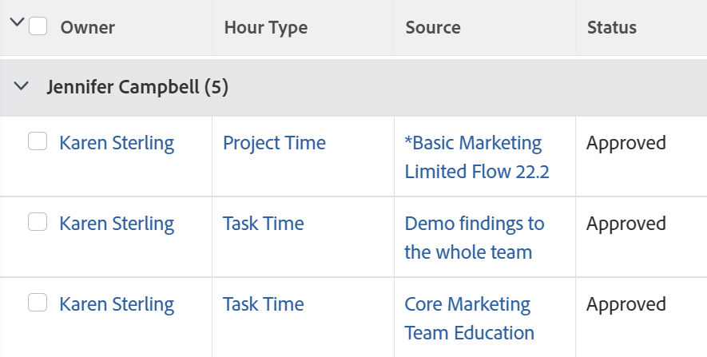

# Grouping: Project Sponsor for hours

<!--Audited: 10/2024-->

This hour grouping organizes hours by the sponsor of the project where the hours are logged. The standard report builder interface for hour groupings does not provide a mapping to the Project Sponsor field. You must use the Text Mode interface to access this field.



## Access requirements

+++ Expand to view access requirements for the functionality in this article. 

You must have the following access to perform the steps in this article:

<table style="table-layout:auto"> 
 <col> 
 <col> 
 <tbody> 
  <tr> 
   <td role="rowheader">Adobe Workfront plan</td> 
   <td> <p>Any</p> </td> 
  </tr> 
  <tr> 
   <td role="rowheader">Adobe Workfront license*</td> 
   <td> 
    <p>New:</p>
   <ul><li><p>Contributor to modify a filter </p></li>
   <li><p>Standard to modify a report</p></li> </ul>

   <p>Current:</p>
   <ul><li><p>Request to modify a filter </p></li>
   <li><p>Plan to modify a report</p></li> </ul></td> 
  </tr> 
  <tr> 
   <td role="rowheader">Access level configurations</td> 
   <td> <p>Edit access to Reports, Dashboards, Calendars to modify a report</p> <p>Edit access to Filters, Views, Groupings to modify a filter</p> </td> 
  </tr> 
  <tr> 
   <td role="rowheader">Object permissions</td> 
   <td> <p>Manage permissions to a report</p>  </td> 
  </tr> 
 </tbody> 
</table>

*For information, see [Access requirements in Workfront documentation](/help/quicksilver/administration-and-setup/add-users/access-levels-and-object-permissions/access-level-requirements-in-documentation.md). 

+++

## Group by Project Sponsor for hours

To apply this grouping:

1. Go to a list of hours.
1. From the **Grouping** drop-down menu, select **New Grouping**.

1. Click **Switch to Text Mode**.
1. Remove the text in the area that displays and replace it with the following code:  

```
   group.0.linkedname=project:sponsor:name
   group.0.name=
   group.0.valuefield=project:sponsor:name
   group.0.valueformat=HTML
   textmode=true
```

1. Click **Done**. 
1. Update the grouping name, then click **Save Grouping**.
