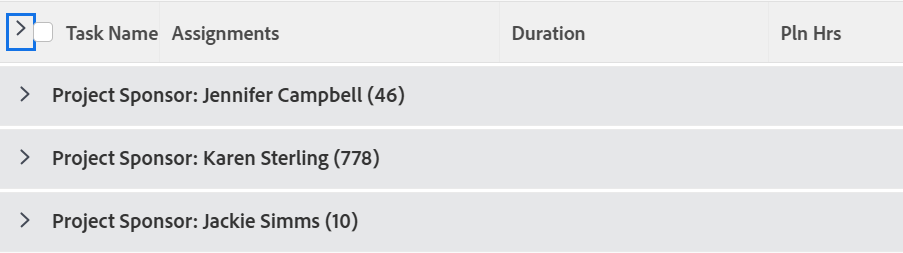

# Grouping: Project Sponsor for a task list

This task grouping allows you to group tasks by the Project Sponsor.



## Access requirements

You must have the following access to perform the steps in this article:

<table style="table-layout:auto"> 
 <col> 
 <col> 
 <tbody> 
  <tr> 
   <td role="rowheader">Adobe Workfront plan*</td> 
   <td> <p>Any</p> </td> 
  </tr> 
  <tr> 
   <td role="rowheader">Adobe Workfront license*</td> 
   <td> <p>Request to modify a grouping </p>
   <p>Plan to modify a report</p> </td> 
  </tr> 
  <tr> 
   <td role="rowheader">Access level configurations*</td> 
   <td> <p>Edit access to Reports, Dashboards, Calendars to modify a report</p> <p>Edit access to Filters, Views, Groupings to modify a grouping</p> <p><b>NOTE</b>
   
   If you still don't have access, ask your Workfront administrator if they set additional restrictions in your access level. For information on how a Workfront administrator can modify your access level, see <a href="../../../administration-and-setup/add-users/configure-and-grant-access/create-modify-access-levels.md" class="MCXref xref">Create or modify custom access levels</a>.</p> </td> 
  </tr>  
  <tr> 
   <td role="rowheader">Object permissions</td> 
   <td> <p>Manage permissions to a report</p> <p>For information on requesting additional access, see <a href="../../../workfront-basics/grant-and-request-access-to-objects/request-access.md" class="MCXref xref">Request access to objects </a>.</p> </td> 
  </tr> 
 </tbody> 
</table>

&#42;To find out what plan, license type, or access you have, contact your Workfront administrator.

## Group by Project Sponsor for a task list

To apply this grouping:

1. Go to list of tasks.
1. In the **Grouping** drop-down menu, select **New Grouping**.

1. Click **Switch to Text Mode**.
1. Remove the text you see in the text editing window.
1. Copy and paste the following code in the text editing window:

   ```
   group.0.name=Project Sponsor<br>group.0.valuefield=project:sponsor:name<br>group.0.valueformat=string
   ```

1. Click **Save Grouping**.
