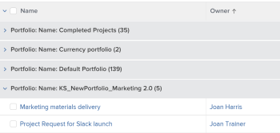
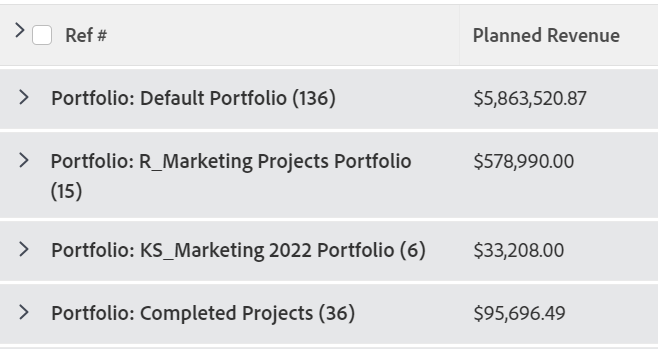
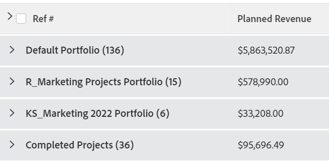

# Grouping: edit the display name in a grouping

<!--Audited: 01/2024-->

You can rename groupings to something more familiar to your users.

For example, when you apply the standard Portfolio Name grouping to a list of projects, the name of the grouping appears as *Portfolio: Name: `<name of portfolio>`*.

You can modify this grouping using text mode to display a name that is easier to read.

## Access requirements

You must have the following access to perform the steps in this article:

<table style="table-layout:auto"> 
 <col> 
 <col> 
 <tbody> 
  <tr> 
   <td role="rowheader">Adobe Workfront plan*</td> 
   <td> 
Any
 </td> 
  </tr> 
  <tr> 
   <td role="rowheader">Adobe Workfront license*</td> 
   <td> 

   
New: 

   <ul>
   <li> 
Contributor to modify a grouping 
</li>
   <li>
Standard to modify a report
</li></ul>

   
 Current:

   <ul>  
   <li>
Request to modify a grouping 
</li>
   <li>
Plan to modify a report
</li> </td> 
  </tr> 
  <tr> 
   <td role="rowheader">Access level configurations*</td> 
   <td> 
Edit access to Reports, Dashboards, Calendars to modify a report
 
Edit access to Filters, Views, Groupings to modify a grouping
 
<b>NOTE</b>
   
   If you still don't have access, ask your Workfront administrator if they set additional restrictions in your access level. For information on how a Workfront administrator can modify your access level, see <a href="../../../administration-and-setup/add-users/configure-and-grant-access/create-modify-access-levels.md" class="MCXref xref">Create or modify custom access levels</a>.
 </td> 
  </tr>  
  <tr> 
   <td role="rowheader">Object permissions</td> 
   <td> 
Manage permissions to a report
 
For information on requesting additional access, see <a href="../../../workfront-basics/grant-and-request-access-to-objects/request-access.md" class="MCXref xref">Request access to objects </a>.
 </td> 
  </tr> 
 </tbody> 
</table>

&#42;To find out what plan, license type, or access you have, contact your Workfront administrator.

## Edit the display name in a grouping

To change the display name in a project grouping:

1. Go to a list of projects.
1. From the **Grouping** drop-down menu, select **New Grouping**.

1. Click **Add Grouping**, and start typing "Portfolio Name" in the **First by:** field, then select it when it displays in the list.

1. Click **Switch to Text Mode**.
1. Do one of following:

   * Add the following code to the existing text available in the **Group your Report** box:

     `   
     group.0.displayname=Your Value
     `

      Or, in this case:

      `
      group.0.displayname=Portfolio
      `

   * Remove all the lines in the text mode interface of the grouping that have the word "name" in them, then add the line:

     `   
     group.0.name=Your Value
     `

      Or, in this case:

      `   
      group.0.name=Portfolio
      `

      >[!TIP]
      >
      >You can also leave the `group.0.name=` and the `group.0.displayname=` lines blank, in which case the grouping shows the value you are grouping by.

     

1. Click **Done**, then **Save Grouping**.

    The default name for the grouping is modified according to your text mode information. 
