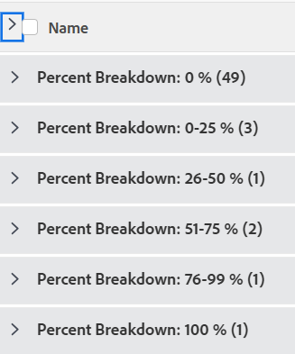

# Grouping: task percent breakdown 1

<!--Audited: 10/2024-->

In this custom project grouping, you can display projects grouped by a range of their percent complete values. The breakdowns show percent complete value of 25 percent point increments: 0-25%, 25-50%, etc. 

The following grouping organizes tasks by the percent complete value into 6 different groupings:

* 0%
* 1-25%
* 26-50%
* 51-75%
* 76-99%
* 100%



## Access requirements

+++ Expand to view access requirements for the functionality in this article. 

<table style="table-layout:auto"> 
 <col> 
 <col> 
 <tbody> 
  <tr> 
   <td role="rowheader">Adobe Workfront package</td> 
   <td> <p>Any</p> </td> 
  </tr> 
  <tr> 
   <td role="rowheader">Adobe Workfront license</td> 
   <td> 
   <p>Contributor or Request to modify a filter </p>
   <p>Standard or Plan to modify a report</p>
  </tr> 
  <tr> 
   <td role="rowheader">Access level configurations</td> 
   <td> <p>Edit access to Reports, Dashboards, Calendars to modify a report</p> <p>Edit access to Filters, Views, Groupings to modify a filter</p> </td> 
  </tr> 
  <tr> 
   <td role="rowheader">Object permissions</td> 
   <td> <p>Manage permissions to a report</p>  </td> 
  </tr> 
 </tbody> 
</table>

For more detail about the information in this table, see [Access requirements in Workfront documentation](/help/quicksilver/administration-and-setup/add-users/access-levels-and-object-permissions/access-level-requirements-in-documentation.md). 

+++

## Group by task percent breakdown

To apply this grouping:

1. Go to a list of tasks.
1. From the **Grouping** drop-down menu, select **New Grouping**.
1. Click **Add grouping**. 

1. Click**Switch to Text Mode**.
1. Remove the text in the **Group by** area.
1. Replace the text with the following code:

   ```
   group.0.linkedname=direct
   group.0.name=Percent Breakdown
   group.0.notime=false
   group.0.valueexpression=IF({percentComplete}=0,"0 %",IF({percentComplete}<=26,"0-25 %",IF({percentComplete}<=51,"26-50 %",IF({percentComplete}<=76,"51-75 %",IF({percentComplete}<100,"76-99 %","100 %")))))
   group.0.valueformat=string

   ```

1. Click **Done** > **Save Grouping**.
1. (Optional) Update the grouping name, then click **Save Grouping**. 
