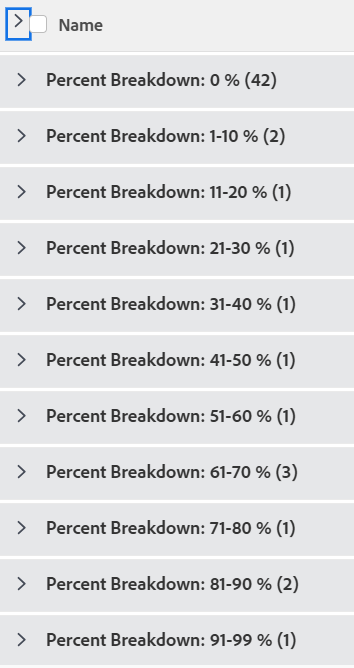

# Grouping: task percent breakdown 2

<!--Audited: 10/2024-->

In this custom task grouping, you can display tasks grouped by a range of their percent complete values. The breakdowns show percent complete value of 10 percent point increments: 1-10%, 11-20%, etc.

The following grouping organizes projects by the percent complete value into one of these groupings:

* 0%
* 1-10%
* 11-20%
* 21-30%
* 31-40%
* 41-50%
* 51-60%
* 61-70%
* 71-80%
* 81-90%
* 91-99%
* 100%



## Access requirements

+++ Expand to view access requirements for the functionality in this article. 

You must have the following access to perform the steps in this article:

<table style="table-layout:auto"> 
 <col> 
 <col> 
 <tbody> 
  <tr> 
   <td role="rowheader">Adobe Workfront plan</td> 
   <td> <p>Any</p> </td> 
  </tr> 
  <tr> 
   <td role="rowheader">Adobe Workfront license*</td> 
   <td> 
    <p>New:</p>
   <ul><li><p>Contributor to modify a filter </p></li>
   <li><p>Standard to modify a report</p></li> </ul>

   <p>Current:</p>
   <ul><li><p>Request to modify a filter </p></li>
   <li><p>Plan to modify a report</p></li> </ul></td> 
  </tr> 
  <tr> 
   <td role="rowheader">Access level configurations</td> 
   <td> <p>Edit access to Reports, Dashboards, Calendars to modify a report</p> <p>Edit access to Filters, Views, Groupings to modify a filter</p> </td> 
  </tr> 
  <tr> 
   <td role="rowheader">Object permissions</td> 
   <td> <p>Manage permissions to a report</p>  </td> 
  </tr> 
 </tbody> 
</table>

*For information, see [Access requirements in Workfront documentation](/help/quicksilver/administration-and-setup/add-users/access-levels-and-object-permissions/access-level-requirements-in-documentation.md). 

+++

## Group by task percent breakdown

To apply this grouping:

1. Go to a list of tasks.
1. From the **Grouping** drop-down menu, select **New Grouping**.
1. Click **Add grouping**. 

1. Click**Switch to Text Mode**.
1. Remove the text in the **Group by** area.
1. Replace the text with the following code:

   ```
   group.0.linkedname=direct
   group.0.name=Percent Breakdown
   group.0.notime=false
   group.0.valueexpression=IF({percentComplete}=0,"0 %",IF({percentComplete}<=11,"1-10 %",IF({percentComplete}<=21,"11-20 %",IF({percentComplete}<=31,"21-30 %",IF({percentComplete}<41,"31-40 %",IF({percentComplete}<51,"41-50 %",IF({percentComplete}<61,"51-60 %",IF({percentComplete}<71,"61-70 %",IF({percentComplete}<81,"71-80 %",IF({percentComplete}<91,"81-90 %",IF({percentComplete}<100,"91-99 %","100 %")))))))))))
   textmode=true

   ```

1. Click **Done** > **Save Grouping**.
1. (Optional) Update the grouping name, then click **Save Grouping**. 
