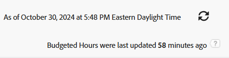

# Report: Budgeted Hour

<!--Audited: 10/2024-->

<!--

(NOTE: From&nbsp;Alina: This is my article, but since it's about building a report, it is in the Reporting section. Please don't remove it -it's linked to Resource Management and it is super important.) 

-->

When you want to share Budgeted Hour information with other users who do not have access to the Resource Planner, you can do so by building a Budgeted Hour report. You can then share the report with them.

>[!IMPORTANT]
>
>Budgeted Hours are normally updated every hour (infrequently, it may take a maximum of three hours) in the Adobe Workfront database. Refreshing the report does not necessarily refresh the hour information in it. You can view the time lapsed since the last update in the upper-right corner of every Budgeted Hour report. Refreshing the report refreshes the information in it only when there has been more than one hour since the last update.
>
>

## Access requirements

+++ Expand to view access requirements for the functionality in this article. 

You must have the following access to perform the steps in this article:

<table style="table-layout:auto"> 
 <col> 
 <col> 
 <tbody> 
  <tr> 
   <td role="rowheader">Adobe Workfront plan</td> 
   <td> 
Any
 </td> 
  </tr> 
  <tr> 
   <td role="rowheader">Adobe Workfront license*</td> 
   <td> 
    
New:

   <ul><li>
Contributor to modify a filter 
</li>
   <li>
Standard to modify a report
</li> </ul>

   
Current:

   <ul><li>
Request to modify a filter 
</li>
   <li>
Plan to modify a report
</li> </ul></td> 
  </tr> 
  <tr> 
   <td role="rowheader">Access level configurations</td> 
   <td> 
Edit access to Reports, Dashboards, Calendars to modify a report
 
Edit access to Filters, Views, Groupings to modify a filter
 </td> 
  </tr> 
  <tr> 
   <td role="rowheader">Object permissions</td> 
   <td> 
Manage permissions to a report
  </td> 
  </tr> 
 </tbody> 
</table>

*For information, see [Access requirements in Workfront documentation](/help/quicksilver/administration-and-setup/add-users/access-levels-and-object-permissions/access-level-requirements-in-documentation.md). 

+++

## Build a Budgeted Hour report

1. Click the **Main Menu** icon  in the upper-right corner, or the **Main Menu** icon  in the upper-left corner, if available, then click **Reports**. 

1. Click **New Report** > **More** > **Budgeted Hour**.

   The default view is applied to the report.

1. (Optional) To make the report easier to read, click the **Bud. Hours** column, then **Switch to Text Mode**, then click **Edit Text Mode**.
1. Change the `valuefield` line to `valueexpreesion` and enter the rounding expression.

   This rounds the number of Budgeted Hours to a number of decimals that you specify.

   For information about how to round a number in Workfront, see the article [Overview of calculated data expressions](../../../reports-and-dashboards/reports/calc-cstm-data-reports/calculated-data-expressions.md).

1. Click **Done**.
1. (Optional) Click **Add Column** to add additional columns.
1. (Optional) To make the report easier to read, we recommend that you add a grouping to it. We suggest the following grouping:

   Click the **Groupings** tab, then do one or several of the following:

   * Click **Add grouping** and start typing "Project Name", then select it when it appears in the list.
   * Click **Add grouping** and start typing "Job Role Name", then select it when it appears in the list.
   * Click **Add grouping** and start typing "Allocation Date", select it when it appears in the list, then select the timeframe you want to group by from the **Group Dates by** field.

1. (Optional) Click **Filters** to add filters to the report.
1. (Optional) Click **Chart** to add a chart to the report.
1. Click **Save + Close**.

## Review the Budgeted Hour report

The following information is available in the Budgeted Hour report by default:

<table style="table-layout:auto"> 
 <col> 
 <col> 
 <tbody> 
  <tr> 
   <td role="rowheader">Project </td> 
   <td>This is the name of the project associated with the Budgeted Hour.</td> 
  </tr> 
  <tr> 
   <td role="rowheader"> 
Job&nbsp;Role
 </td> 
   <td>This is the name of the job role associated with the Budgeted Hour. </td> 
  </tr> 
  <tr> 
   <td role="rowheader">User</td> 
   <td>This is the name of the user associated with the Budgeted Hour.</td> 
  </tr> 
  <tr> 
   <td role="rowheader">Alloc. Date</td> 
   <td> 
This is the Allocation Date. It is the first day (a Sunday) of the week for which you budgeted the hours.
 
Tip:  
If a week spans for two months, this generates two rows in the report: one corresponding to the first day of the week (the Sunday of the week which is during the first month), and a second one corresponding with the first day of the second month (and which could be any day of the week.)
 
For example, if you budget 8 hours for a user for the week of June 30 (Sunday) - July 6 (Saturday), the two rows show an Allocation Date of June 30, and July 1.
 
 </td> 
  </tr> 
  <tr> 
   <td role="rowheader">Bud. Hours</td> 
   <td>These are the Budgeted Hours allocated to the User in the Resource Planner.</td> 
  </tr> 
  <tr> 
   <td role="rowheader">Pln. Bud. Hours</td> 
   <td>These are the Budgeted Hours allocated to the Job&nbsp;Role or the Project in the Resource Planner.</td> 
  </tr> 
 </tbody> 
</table>
