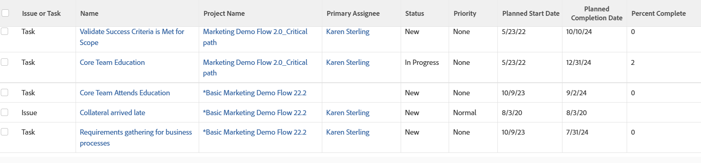

# Report: combined task and issue View and Grouping

This Work Item report&nbsp;shows both tasks and issues which users have accepted to work on in one report. It is best when combined with a custom grouping.

This report uses `sharecol=true` in the view to combine multiple fields under the same column header. For more information on the `sharecol` tag, see [View: merge information from multiple columns in one shared column](../../../reports-and-dashboards/reports/custom-view-filter-grouping-samples/view-merge-columns.md).

>[!TIP]
>
>&nbsp;The Work Item view&nbsp;displays only tasks and issues that have been accepted by the users assigned to them. This report does not&nbsp;display work items that have not been moved from the Work Requests or Team Requests lists into the user's Working On list.



## Access requirements

You must have the following access to perform the steps in this article:

<table style="table-layout:auto"> 
 <col> 
 <col> 
 <tbody> 
  <tr> 
   <td role="rowheader">Adobe Workfront plan*</td> 
   <td> <p>Any</p> </td> 
  </tr> 
  <tr> 
   <td role="rowheader">Adobe Workfront license*</td> 
   <td> <p>Plan </p> </td> 
  </tr> 
  <tr> 
   <td role="rowheader">Access level configurations*</td> 
   <td> <p>Edit access to Reports, Dashboards, Calendars</p> <p>Edit access to Filters, Views, Groupings</p> <p><b>NOTE</b>
   
   If you still don't have access, ask your Workfront administrator if they set additional restrictions in your access level. For information on how a Workfront administrator can modify your access level, see <a href="../../../administration-and-setup/add-users/configure-and-grant-access/create-modify-access-levels.md" class="MCXref xref">Create or modify custom access levels</a>.</p> </td> 
  </tr> 
  <tr> 
   <td role="rowheader">Object permissions</td> 
   <td> <p>Manage permissions to a report</p> <p>For information on requesting additional access, see <a href="../../../workfront-basics/grant-and-request-access-to-objects/request-access.md" class="MCXref xref">Request access to objects </a>.</p> </td> 
  </tr> 
 </tbody> 
</table>

&#42;To find out what plan, license type, or access you have, contact your Workfront administrator.

## Build a report with combined task and issue View and Grouping

To build a report with this view:

1. From the **Main Menu** , click&nbsp;**Reports**. 

1. Click **New Report** and select the object **Work Item** from the drop-down menu.

1. In the**Column Preview** area,&nbsp;click the header of the only column displayed.
1. Click**Switch to Text Mode**.
1. Mouse over the text mode area, and click **Click to edit text**.
1. Remove the text you find in the **Text Mode** box, and replace it with the following code: 

   ```
   column.0.description=Task or Issue 
   column.0.name=Issue or Task
   column.0.shortview=false
   column.0.stretch=0
   column.0.textmode=true
   column.0.type=image
   column.0.valueexpression=IF(ISBLANK({opTaskID}),'Task','Issue')
   column.0.valueformat=
   column.0.width=40
   column.1.description=Task or Issue Name
   column.1.isInlineEditable=false
   column.1.link.linkproperty.0.name=ID
   column.1.link.linkproperty.0.valuefield=task:ID
   column.1.link.linkproperty.0.valueformat=string
   column.1.link.lookup=link.view
   column.1.link.valuefield=task:objCode
   column.1.link.valueformat=val
   column.1.listsort=nested(task).string(name)
   column.1.name=Name
   column.1.sharecol=true
   column.1.shortview=false
   column.1.stretch=50
   column.1.textmode=true
   column.1.valuefield=task:name
   column.1.valueformat=HTML
   column.1.width=120
   column.2.isInlineEditable=false
   column.2.link.linkproperty.0.name=ID
   column.2.link.linkproperty.0.valuefield=opTask:ID
   column.2.link.linkproperty.0.valueformat=string
   column.2.link.lookup=link.view
   column.2.link.valuefield=opTask:objCode
   column.2.link.valueformat=val
   column.2.linkedname=opTask
   column.2.listsort=nested(opTask).string(name)
   column.2.shortview=false
   column.2.stretch=0
   column.2.textmode=true
   column.2.valuefield=opTask:name
   column.2.valueformat=HTML
   column.2.width=120
   column.3.description=Project Name
   column.3.isInlineEditable=false
   column.3.link.linkproperty.0.name=ID
   column.3.link.linkproperty.0.valuefield=task:projectID
   column.3.link.linkproperty.0.valueformat=string
   column.3.link.lookup=link.view
   column.3.link.valuefield=task:project:objCode
   column.3.link.valueformat=val
   column.3.listsort=nested(task).nested(project).string(name)
   column.3.name=Project Name
   column.3.sharecol=true
   column.3.shortview=false
   column.3.stretch=50
   column.3.textmode=true
   column.3.valuefield=task:project:name
   column.3.valueformat=HTML
   column.3.width=120
   column.4.isInlineEditable=false
   column.4.link.linkproperty.0.name=ID
   column.4.link.linkproperty.0.valuefield=opTask:projectID
   column.4.link.linkproperty.0.valueformat=string
   column.4.link.lookup=link.view
   column.4.link.valuefield=opTask:project:objCode
   column.4.link.valueformat=val
   column.4.linkedname=opTask
   column.4.listsort=nested(opTask).nested(project).string(name)
   column.4.shortview=false
   column.4.stretch=0
   column.4.textmode=true
   column.4.valuefield=opTask:project:name
   column.4.valueformat=HTML
   column.4.width=120
   column.5.displayname=Primary Assignee
   column.5.linkedname=assignment
   column.5.namekey=view.relatedcolumn
   column.5.namekeyargkey.0=assignment
   column.5.namekeyargkey.1=assignedToID
   column.5.querysort=assignment:assignedToID
   column.5.textmode=true
   column.5.valuefield=assignment:assignedTo:name
   column.5.valueformat=HTML
   column.6.displayname=Status
   column.6.enumclass=com.attask.common.constants.OpTaskStatusEnum
   column.6.enumtype=OPTASK
   column.6.linkedname=opTask
   column.6.namekey=view.relatedcolumn
   column.6.namekeyargkey.0=opTask
   column.6.namekeyargkey.1=status
   column.6.querysort=opTask:status
   column.6.sharecol=true
   column.6.textmode=true
   column.6.type=enum
   column.6.valuefield=opTask:status
   column.6.valueformat=val
   column.7.displayname=
   column.7.enumclass=com.attask.common.constants.TaskStatusEnum
   column.7.enumtype=TASK
   column.7.linkedname=task
   column.7.namekey=view.relatedcolumn
   column.7.namekeyargkey.0=task
   column.7.namekeyargkey.1=status
   column.7.querysort=task:status
   column.7.textmode=true
   column.7.type=enum
   column.7.valuefield=task:status
   column.7.valueformat=val
   column.8.displayname=Priority
   column.8.enumclass=com.attask.common.constants.TimelinePriorityEnum
   column.8.enumtype=OPTASK
   column.8.linkedname=opTask
   column.8.namekey=view.relatedcolumn
   column.8.namekeyargkey.0=opTask
   column.8.namekeyargkey.1=priority
   column.8.querysort=opTask:priority
   column.8.sharecol=true
   column.8.textmode=true
   column.8.type=enum
   column.8.valuefield=opTask:priority
   column.8.valueformat=val
   column.9.displayname=
   column.9.enumclass=com.attask.common.constants.TimelinePriorityEnum
   column.9.enumtype=TASK
   column.9.linkedname=task
   column.9.namekey=view.relatedcolumn
   column.9.namekeyargkey.0=task
   column.9.namekeyargkey.1=priority
   column.9.querysort=task:priority
   column.9.type=enum
   column.9.valuefield=task:priority
   column.9.valueformat=val
   column.10.isInlineEditable=false
   column.10.linkedname=task
   column.10.listsort=nested(task).atDateAsAtDate(plannedStartDate)
   column.10.name=Planned Start Date
   column.10.sharecol=true
   column.10.shortview=false
   column.10.stretch=0
   column.10.textmode=true
   column.10.valuefield=task:plannedStartDate
   column.10.valueformat=atDate
   column.10.width=100
   column.11.isInlineEditable=false
   column.11.linkedname=opTask
   column.11.listsort=nested(opTask).atDateAsAtDate(plannedStartDate)
   column.11.shortview=false
   column.11.stretch=0
   column.11.textmode=true
   column.11.valuefield=opTask:plannedStartDate
   column.11.valueformat=atDate
   column.11.width=1
   column.12.isInlineEditable=false
   column.12.linkedname=task
   column.12.listsort=nested(task).atDateAsAtDate(projectedCompletionDate)
   column.12.name=Planned Completion Date
   column.12.sharecol=true
   column.12.shortview=false
   column.12.stretch=0
   column.12.textmode=true
   column.12.valuefield=task:projectedCompletionDate
   column.12.valueformat=atDate
   column.12.width=100
   column.13.isInlineEditable=false
   column.13.linkedname=opTask
   column.13.listsort=nested(opTask).atDateAsAtDate(projectedCompletionDate)
   column.13.shortview=false
   column.13.stretch=0
   column.13.textmode=true
   column.13.valuefield=opTask:projectedCompletionDate
   column.13.valueformat=atDate
   column.13.width=1
   column.14.isInlineEditable=false
   column.14.linkedname=task
   column.14.listsort=nested(task).double(percentComplete)
   column.14.name=Percent Complete
   column.14.sharecol=true
   column.14.shortview=false
   column.14.stretch=0
   column.14.textmode=true
   column.14.valueexpression=IF(ISBLANK({taskID}),"",{task}.{percentComplete})
   column.14.valueformat=HTML
   column.14.width=100
   column.15.textmode=true
   column.15.value=
   column.15.valueformat=HTML
   column.15.width=1
   ```

1. (Optional) Click **Groupings** to add a grouping to the report. 
1. (Optional) If you are adding a grouping, click **Switch to Text Mode**. 
1. (Optional) Replace the text inside the grouping text mode area with the following code:

   ```
   group.0.name=
   group.0.valueexpression=IF(ISBLANK({opTaskID}),'Task','Issue')
   group.0.valueformat=string
   textmode=true
   ```

   This grouping groups all the Tasks together, and all the Issues together.

1. Click **Save + Close**.
