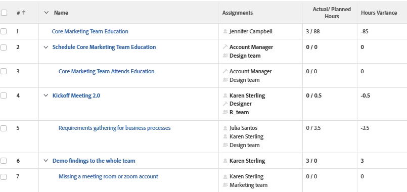

# View: Actual Hours over Planned Hours in the same column of a task View

In this task view,&nbsp;the actual amount of hours recorded on a task are displayed over the hours planned for each task.

## Access requirements

You must have the following access to perform the steps in this article:

<table style="table-layout:auto"> 
 <col> 
 <col> 
 <tbody> 
  <tr> 
   <td role="rowheader">Adobe Workfront plan*</td> 
   <td> 
Any
 </td> 
  </tr> 
  <tr> 
   <td role="rowheader">Adobe Workfront license*</td> 
   <td> 
Request to modify a view 

   
Plan to modify a report
 </td> 
  </tr> 
  <tr> 
   <td role="rowheader">Access level configurations*</td> 
   <td> 
Edit access to Reports, Dashboards, Calendars to modify a report
 
Edit access to Filters, Views, Groupings to modify a view
 
<b>NOTE</b>
   
   If you still don't have access, ask your Workfront administrator if they set additional restrictions in your access level. For information on how a Workfront administrator can modify your access level, see <a href="../../../administration-and-setup/add-users/configure-and-grant-access/create-modify-access-levels.md" class="MCXref xref">Create or modify custom access levels</a>.
 </td> 
  </tr>  
  <tr> 
   <td role="rowheader">Object permissions</td> 
   <td> 
Manage permissions to a report
 
For information on requesting additional access, see <a href="../../../workfront-basics/grant-and-request-access-to-objects/request-access.md" class="MCXref xref">Request access to objects </a>.
 </td> 
  </tr> 
 </tbody> 
</table>

&#42;To find out what plan, license type, or access you have, contact your Workfront administrator.

## View Actual Hours over Planned Hours in a task view

To apply this view:

1. Go to a list of tasks.
1. From the **View** drop-down menu, select **New View**.

1. In the**Column Preview** area, eliminate all columns except for one.
1. Click the header of the remaining column, then click **Switch to Text Mode**.
1. Mouse over the text mode area, and click **Click to edit text**.
1. Remove the text you find in the **Text Mode** box, and replace it with the following code:
   <pre>column.0.descriptionkey=name column.0.link.linkproperty.0.name=ID column.0.link.linkproperty.0.valuefield=ID column.0.link.linkproperty.0.valueformat=int column.0.link.lookup=link.view column.0.link.valuefield=objCode column.0.link.valueformat=val column.0.linkedname=direct column.0.listsort=string(name) column.0.namekey=name.abbr column.0.querysort=name column.0.shortview=false column.0.stretch=100 column.0.valuefield=name column.0.valueformat=HTML column.0.width=150 column.1.viewalias=assignments column.1.displayname= column.1.linkedname=direct column.1.namekey=assignments column.1.valuefield=assignmentsListString column.1.valueformat=HTML column.1.tile.name=component.assignmentslist column.2.displayname=Actual/ Planned Hours column.2.linkedname=direct column.2.namekey=actualworkrequired column.2.querysort=actualWork column.2.textmode=true column.2.valueexpression=CONCAT({actualWorkRequired}/60,' / ',{workRequired}/60) column.2.valuefield=actualWorkRequired column.2.valueformat=compound column.2.viewalias=actualworkrequired column.3.aggregator.function=SUM column.3.aggregator.valueexpression=SUB({actualWork}, {workRequired}) column.3.aggregator.valueformat=compound column.3.displayname=Hours Variance column.3.linkedname=direct column.3.textmode=true column.3.valueexpression=SUB({actualWork}, {workRequired})/60 column.3.valueformat=customNumberAsString</pre>

1. Click **Save View**.
