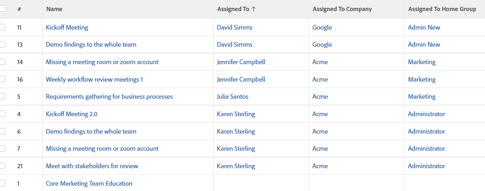

# View: assigned user's Company and Home Group

This task view displays the Company and Home Group of the Primary Owner of the task. These are values that are not available in the standard interface, but they are accessible through&nbsp;text mode.

## Access requirements

You must have the following access to perform the steps in this article:

<table style="table-layout:auto"> 
 <col> 
 <col> 
 <tbody> 
  <tr> 
   <td role="rowheader">Adobe Workfront plan*</td> 
   <td> 
Any
 </td> 
  </tr> 
  <tr> 
   <td role="rowheader">Adobe Workfront license*</td> 
   <td> 
Request to modify a view 

   
Plan to modify a report
 </td> 
  </tr> 
  <tr> 
   <td role="rowheader">Access level configurations*</td> 
   <td> 
Edit access to Reports, Dashboards, Calendars to modify a report
 
Edit access to Filters, Views, Groupings to modify a view
 
<b>NOTE</b>
   
   If you still don't have access, ask your Workfront administrator if they set additional restrictions in your access level. For information on how a Workfront administrator can modify your access level, see <a href="../../../administration-and-setup/add-users/configure-and-grant-access/create-modify-access-levels.md" class="MCXref xref">Create or modify custom access levels</a>.
 </td> 
  </tr> 
  <tr> 
   <td role="rowheader">Object permissions</td> 
   <td> 
Manage permissions to a report
 
For information on requesting additional access, see <a href="../../../workfront-basics/grant-and-request-access-to-objects/request-access.md" class="MCXref xref">Request access to objects </a>.
 </td> 
  </tr> 
 </tbody> 
</table>

&#42;To find out what plan, license type, or access you have, contact your Workfront administrator.

## View assigned user's Company and Home Group

1. Go to a list of tasks.
1. From the **View** drop-down menu, select **New View**.

1. In the**Column Preview** area, eliminate all columns except for one.
1. Click the header of the remaining column, then click **Switch to Text Mode**.
1. Mouse over the text mode area, and click **Click to edit text**.
1. Remove the text you find in the **Text Mode** box, and replace it with the following code:
   <pre>column.0.descriptionkey=name  column.0.link.linkproperty.0.name=ID  column.0.link.linkproperty.0.valuefield=ID  column.0.link.linkproperty.0.valueformat=int  column.0.link.lookup=link.view  column.0.link.valuefield=objCode  column.0.link.valueformat=val  column.0.linkedname=direct  column.0.listsort=string(name)  column.0.namekey=name.abbr  column.0.querysort=name  column.0.shortview=false  column.0.stretch=100  column.0.valuefield=name  column.0.valueformat=HTML  column.0.width=150  column.1.descriptionkey=assignedto  column.1.link.linkproperty.0.name=ID  column.1.link.linkproperty.0.valuefield=assignedTo:ID  column.1.link.linkproperty.0.valueformat=int  column.1.link.lookup=link.view  column.1.link.valuefield=assignedTo:objCode  column.1.link.valueformat=val  column.1.linkedname=assignedTo  column.1.listsort=nested(assignedTo).string(name)  column.1.namekey=assignedto  column.1.querysort=assignedTo:name  column.1.shortview=false  column.1.stretch=0  column.1.valuefield=assignedTo:name  column.1.valueformat=HTML  column.1.width=150  column.2.description=Assigned To Company  column.2.displayname=Assigned To Company  column.2.linkedname=assignedTo:company  column.2.listsort=nested(assignedTo:company).string(name)  column.2.namekey=assignedto  column.2.querysort=assignedTo:company:name  column.2.shortview=false  column.2.stretch=0  column.2.valuefield=assignedTo:company:name  column.2.valueformat=HTML  column.2.width=150  column.3.description=Assigned To Home Group  column.3.displayname=Assigned To Home Group  column.3.linkedname=assignedTo:homeGroup  column.3.listsort=nested(assignedTo:homeGroup).string(name)  column.3.namekey=assignedto  column.3.querysort=assignedTo:homeGroup:name  column.3.shortview=false  column.3.stretch=0  column.3.valuefield=assignedTo:homeGroup:name  column.3.valueformat=HTML  column.3.width=150</pre>

1. Click **Save Changes**.
