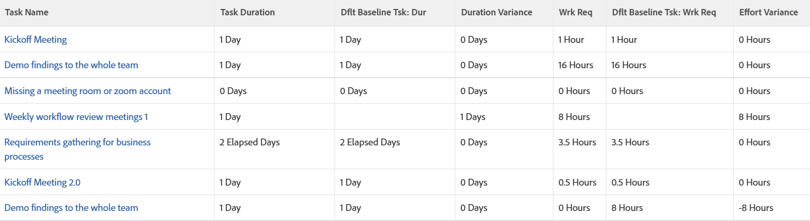

# View: baseline variance for Duration and Planned Work in a task View

This view displays the following in a task view:

* Task information with baseline task information.
* The difference between Duration and the Default Baseline Duration.
* The difference between the Planned Work and the Default Baseline Planned Work.

>[!NOTE]
>
>&nbsp;The data displayed in the following view&nbsp;compares actual task values to the values associated with the Default Baseline tasks.

&nbsp;

## Access requirements

You must have the following access to perform the steps in this article:

<table style="table-layout:auto"> 
 <col> 
 <col> 
 <tbody> 
  <tr> 
   <td role="rowheader">Adobe Workfront plan*</td> 
   <td> 
Any
 </td> 
  </tr> 
  <tr> 
   <td role="rowheader">Adobe Workfront license*</td> 
   <td> 
Request to modify a view 

   
Plan to modify a report
 </td> 
  </tr> 
  <tr> 
   <td role="rowheader">Access level configurations*</td> 
   <td> 
Edit access to Reports, Dashboards, Calendars to modify a report
 
Edit access to Filters, Views, Groupings to modify a view
 
<b>NOTE</b>
   
   If you still don't have access, ask your Workfront administrator if they set additional restrictions in your access level. For information on how a Workfront administrator can modify your access level, see <a href="../../../administration-and-setup/add-users/configure-and-grant-access/create-modify-access-levels.md" class="MCXref xref">Create or modify custom access levels</a>.
 </td> 
  </tr> 
  <tr> 
   <td role="rowheader">Object permissions</td> 
   <td> 
Manage permissions to a report
 
For information on requesting additional access, see <a href="../../../workfront-basics/grant-and-request-access-to-objects/request-access.md" class="MCXref xref">Request access to objects </a>.
 </td> 
  </tr> 
 </tbody> 
</table>

&#42;To find out what plan, license type, or access you have, contact your Workfront administrator.

## View baseline variance for Duration and Planned Work in a task view

1. Go to&nbsp;a list of tasks.
1. In the **View** drop-down menu, select **New View**.

1. Remove all the columns in the view, except the first one.
1. With the first column selected, click **Switch to Text Mode**.
1. Copy the text below and paste it in the first column of the view:  
   <pre>column.0.descriptionkey=name column.0.link.linkproperty.0.name=ID column.0.link.linkproperty.0.valuefield=ID column.0.link.linkproperty.0.valueformat=int column.0.link.lookup=link.view column.0.link.valuefield=objCode column.0.link.valueformat=val column.0.linkedname=direct column.0.listsort=string(name) column.0.namekey=name.abbr column.0.querysort=name column.0.shortview=false column.0.stretch=100 column.0.valuefield=name column.0.valueformat=HTML column.0.width=150 column.0.displayname=Task Name column.1.descriptionkey=duration column.1.linkedname=direct column.1.listsort=intAsInt(durationMinutes) column.1.namekey=duration.abbr column.1.querysort=durationMinutes column.1.shortview=false column.1.stretch=0 column.1.valuefield=durationFieldLong column.1.valueformat=compound column.1.viewalias=duration column.1.width=100 column.1.displayname=Task Duration column.2.descriptionkey=view.relatedcolumn column.2.descriptionkeyargkey.0=defaultbaselinetask column.2.descriptionkeyargkey.1=duration column.2.linkedname=defaultBaselineTask column.2.listsort=intAsInt(durationMinutes) column.2.namekey=duration column.2.namekeyargkey.0=defaultbaselinetask.abbr column.2.namekeyargkey.1=duration.abbr column.2.querysort=defaultBaselineTask:durationMinutes column.2.shortview=false column.2.stretch=0 column.2.valuefield=defaultBaselineTask:durationFieldLong column.2.valueformat=compound column.2.viewalias=defaultBaselineTask:duration column.2.width=100 column.2.displayname=Dflt Baseline Tsk: Dur column.2.durationunitfield=durationUnit.value column.3.description=Duration Variance"column.3.linkedname=direct column.3.listsort=intAsInt(durationMinutes) column.3.name=Duration Variance column.3.querysort=durationMinutes column.3.shortview=false column.3.stretch=0 column.3.valueexpression=CONCAT(SUB({duration},{defaultBaselineTask}.{duration})/480," Days") column.3.valueformat=HTML column.3.viewalias=duration column.3.width=100 column.3.displayname=Duration Variance column.4.descriptionkey=workrequired column.4.linkedname=direct column.4.listsort=doubleAsDouble(workRequired) column.4.namekey=workrequired.abbr column.4.querysort=workRequired column.4.shortview=false column.4.stretch=0 column.4.valuefield=workFieldLong column.4.valueformat=compound column.4.viewalias=workrequired column.4.width=100 column.4.displayname=Wrk Req column.5.descriptionkey=view.relatedcolumn column.5.descriptionkeyargkey.0=defaultbaselinetask column.5.descriptionkeyargkey.1=workrequired column.5.linkedname=defaultBaselineTask column.5.listsort=doubleAsDouble(workRequired) column.5.namekey=view.relatedcolumn column.5.namekeyargkey.0=defaultbaselinetask.abbr column.5.namekeyargkey.1=workrequired.abbr column.5.querysort=defaultBaselineTask:workRequired column.5.shortview=false column.5.stretch=0 column.5.valuefield=defaultBaselineTask:workFieldLong column.5.valueformat=compound column.5.viewalias=defaultBaselineTask:workrequired column.5.width=100 column.5.displayname=Dflt Baseline Tsk: Wrk Req column.6.descriptionkey=workrequired column.6.linkedname=direct column.6.listsort=doubleAsDouble(workRequired) column.6.name=Effort Variance column.6.querysort=workRequired column.6.shortview=false column.6.stretch=0 column.6.valueexpression=CONCAT(SUB({workRequired},{defaultBaselineTask}.{workRequired})/60," Hours") column.6.valueformat=HTML column.6.viewalias=workrequired column.6.width=100 column.6.displayname=Effort Variance</pre>

1. Click **Save View**.  