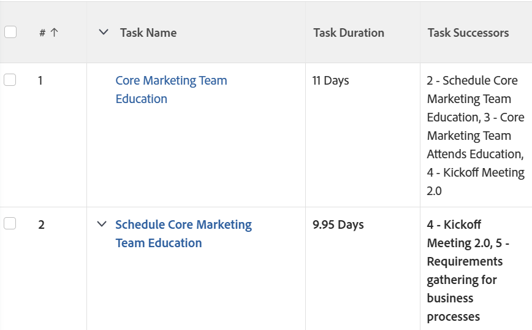

# View: add a list of task successors in a column

You can add a column to a task view to show a list of the successors of the tasks. The **Task Successors** column includes the number of the successor as well as the name.

## Access requirements

You must have the following access to perform the steps in this article:

<table style="table-layout:auto"> 
 <col> 
 <col> 
 <tbody> 
  <tr> 
   <td role="rowheader">Adobe Workfront plan*</td> 
   <td> 
Any
 </td> 
  </tr> 
  <tr> 
   <td role="rowheader">Adobe Workfront license*</td> 
   <td> 
Request to modify a view 

   
Plan to modify a report
 </td> 
  </tr> 
  <tr> 
   <td role="rowheader">Access level configurations*</td> 
   <td> 
Edit access to Reports, Dashboards, Calendars to modify a report
 
Edit access to Filters, Views, Groupings to modify a view
 
<b>NOTE</b>
   
   If you still don't have access, ask your Workfront administrator if they set additional restrictions in your access level. For information on how a Workfront administrator can modify your access level, see <a href="../../../administration-and-setup/add-users/configure-and-grant-access/create-modify-access-levels.md" class="MCXref xref">Create or modify custom access levels</a>.
 </td> 
  </tr> 
  <tr> 
   <td role="rowheader">Object permissions</td> 
   <td> 
Manage permissions to a report
 
For information on requesting additional access, see <a href="../../../workfront-basics/grant-and-request-access-to-objects/request-access.md" class="MCXref xref">Request access to objects </a>.
 </td> 
  </tr> 
 </tbody> 
</table>

&#42;To find out what plan, license type, or access you have, contact your Workfront administrator.

## Add a list of task successors in a column

To add this column to a task view:

1. Go to an existing task view.
1. Expand the View drop-down menu, and select **Customize View**.
1. Click **Add Column**.
1. Click **Switch to Text Mode**.
1. Mouse over the **Show in this column** area, and click **Click to edit text**.

1. Remove all text in the Text Mode box, and replace it with the following code:  
   <pre>displayname=Task Successors listdelimiter=  listmethod=nested(successors).lists textmode=true type=iterate valueexpression=CONCAT({successor}.{taskNumber},' - ',{successor}.{name}) valueformat=HTML</pre>

1. Click **Save View**.
