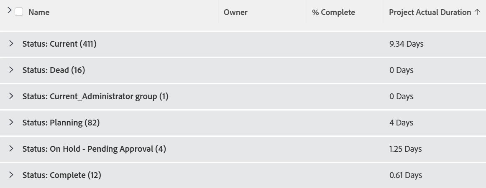

# View and grouping: display project Actual Duration aggregated by the average in a Grouping

You can add the following column in a project report to show the Actual Duration aggregated as an average in a grouping.

## Access requirements

You must have the following access to perform the steps in this article:

<table style="table-layout:auto"> 
 <col> 
 <col> 
 <tbody> 
  <tr> 
   <td role="rowheader">Adobe Workfront plan*</td> 
   <td> 
Any
 </td> 
  </tr> 
  <tr> 
   <td role="rowheader">Adobe Workfront license*</td> 
   <td> 
Request to modify a view 

   
Plan to modify a report
 </td> 
  </tr> 
  <tr> 
   <td role="rowheader">Access level configurations*</td> 
   <td> 
Edit access to Reports, Dashboards, Calendars to modify a report
 
Edit access to Filters, Views, Groupings to modify a view
 
<b>NOTE</b>
   
   If you still don't have access, ask your Workfront administrator if they set additional restrictions in your access level. For information on how a Workfront administrator can modify your access level, see <a href="../../../administration-and-setup/add-users/configure-and-grant-access/create-modify-access-levels.md" class="MCXref xref">Create or modify custom access levels</a>.
 </td> 
  </tr> 
  <tr> 
   <td role="rowheader">Object permissions</td> 
   <td> 
Manage permissions to a report
 
For information on requesting additional access, see <a href="../../../workfront-basics/grant-and-request-access-to-objects/request-access.md" class="MCXref xref">Request access to objects </a>.
 </td> 
  </tr> 
 </tbody> 
</table>

&#42;To find out what plan, license type, or access you have, contact your Workfront administrator.

## Display project Actual Duration aggregated by the average in a Grouping

To add this column to a project view:

1. (Recommended)&nbsp;For best results and to see the aggregated average value of the Actual Duration, you must have a Grouping added to your project list or report.  
   For more information about creating Groupings, see the article [Groupings overview in Adobe Workfront](../../../reports-and-dashboards/reports/reporting-elements/groupings-overview.md).

1. Go to an existing project view.
1. Expand the View drop-down menu, and select&nbsp;**Customize View**.
1. Click&nbsp;**Add Column**.
1. Click&nbsp;**Switch to Text Mode**.
1. Mouse over the&nbsp;**Show in this column**&nbsp;area, and click&nbsp;**Click to edit text**.

1. Remove all text in the Text Mode box, and replace it with the following code:  
   <pre>aggregator.displayformat=compound  aggregator.function=AVG  aggregator.namekey=view.relatedcolumn  aggregator.namekeyargkey=actualduration  aggregator.valuefield=actualDurationMinutes  aggregator.valueformat=val  displayname=Project Actual Duration  durationunitfield=durationUnit.value  linkedname=project  namekey=actualduration  namekeyargkey=actualduration  querysort=actualDurationMinutes  textmode=true  valuefield=actualDurationMinutes  valueformat=compound#M:D  viewalias=actualduration</pre>

1. Click **Save View**.
