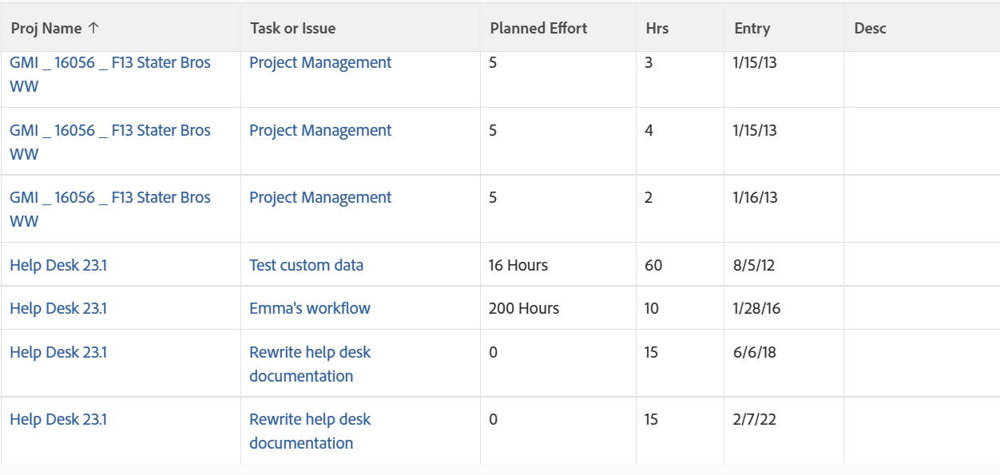

# View: combined task and issue details in an Hour list

This hour view combines the Task and Issue Name columns, as well as the Task and Issue Planned Hours&nbsp;using the 

```
sharecol
```

tag. Because an hour entry can only belong to either a task or issue, both objects cannot appear in the same column at the same time.&nbsp;Each line of the view populates with the information from either a Task or an Issue.

To learn more about the 

```
sharecol
```

tag, see [View: merge information from multiple columns in one shared column](../../../reports-and-dashboards/reports/custom-view-filter-grouping-samples/view-merge-columns.md).  


## Access requirements

You must have the following access to perform the steps in this article:

<table style="table-layout:auto"> 
 <col> 
 <col> 
 <tbody> 
  <tr> 
   <td role="rowheader">Adobe Workfront plan*</td> 
   <td> <p>Any</p> </td> 
  </tr> 
  <tr> 
   <td role="rowheader">Adobe Workfront license*</td> 
   <td> <p>Request to modify a view </p>
   <p>Plan to modify a report</p> </td> 
  </tr> 
  <tr> 
   <td role="rowheader">Access level configurations*</td> 
   <td> <p>Edit access to Reports, Dashboards, Calendars to modify a report</p> <p>Edit access to Filters, Views, Groupings to modify a view</p> <p><b>NOTE</b>
   
   If you still don't have access, ask your Workfront administrator if they set additional restrictions in your access level. For information on how a Workfront administrator can modify your access level, see <a href="../../../administration-and-setup/add-users/configure-and-grant-access/create-modify-access-levels.md" class="MCXref xref">Create or modify custom access levels</a>.</p> </td> 
  </tr>  
  <tr> 
   <td role="rowheader">Object permissions</td> 
   <td> <p>Manage permissions to a report</p> <p>For information on requesting additional access, see <a href="../../../workfront-basics/grant-and-request-access-to-objects/request-access.md" class="MCXref xref">Request access to objects </a>.</p> </td> 
  </tr> 
 </tbody> 
</table>

&#42;To find out what plan, license type, or access you have, contact your Workfront administrator.

## View combined task and issue details in an Hour list

To apply this view:

1. Go to a list of hours.
1. From the **View** drop-down menu, select **New View**.

1. In the**Column Preview** area, eliminate all columns except for one.
1. Click the header of the remaining column, then click **Switch to Text Mode**.
1. Mouse over the text mode area, and click **Click to edit text**.
1. Remove the text you find in the **Text Mode** box, and replace it with the following code:  
   <pre>column.1.querysort=project:name<br>column.1.shortview=false<br>column.1.stretch=0<br>column.1.valuefield=project:name<br>column.1.valueformat=HTML<br>column.1.width=100<br>column.2.description=Task or Issue<br>column.2.link.linkproperty.0.name=ID<br>column.2.link.linkproperty.0.valuefield=task:ID<br>column.2.link.linkproperty.0.valueformat=int<br>column.2.link.lookup=link.view<br>column.2.link.valuefield=task:objCode<br>column.2.link.valueformat=val<br>column.2.linkedname=task<br>column.2.listsort=nested(task).string(name)<br>column.2.name=Task or Issue<br>column.2.querysort=task:name<br>column.2.sharecol=true<br>column.2.shortview=false<br>column.2.stretch=0<br>column.2.valuefield=task:name<br>column.2.valueformat=HTML<br>column.2.width=100<br>column.3.descriptionkey=optask<br>column.3.link.linkproperty.0.name=ID<br>column.3.link.linkproperty.0.valuefield=opTask:ID<br>column.3.link.linkproperty.0.valueformat=int<br>column.3.link.lookup=link.view<br>column.3.link.valuefield=opTask:objCode<br>column.3.link.valueformat=val<br>column.3.linkedname=optask<br>column.3.listsort=nested(opTask).string(name)<br>column.3.namekey=opTask<br>column.3.querysort=opTask:name<br>column.3.shortview=false<br>column.3.stretch=0<br>column.3.valuefield=opTask:name<br>column.3.valueformat=HTML<br>column.3.width=1<br>column.4.valuefield=task:work<br>column.4.sharecol=true<br>column.4.linkedname=task<br>column.4.valueformat=doubleAsInt<br>column.4.namekey=view.relatedcolumn<br>column.4.querysort=task:work<br>column.4.textmode=true<br>column.4.namekeyargkey.0=task<br>column.4.namekeyargkey.1=work<br>column.4.displayname=Planned Effort<br>column.5.displayname=Planned Effort<br>column.5.viewalias=opTask:workrequired<br>column.5.linkedname=opTask<br>column.5.valuefield=opTask:workRequired<br>column.5.valueformat=compound<br>column.5.querysort=opTask:workRequired<br>column.5.namekeyargkey.0=opTask<br>column.5.namekeyargkey.1=workrequired<br>column.5.namekey=view.relatedcolumn<br>column.5.textmode=true<br>column.6.descriptionkey=hours<br>column.6.linkedname=direct<br>column.6.listsort=doubleAsDouble(hours)<br>column.6.namekey=hours.abbr<br>column.6.querysort=hours<br>column.6.shortview=false<br>column.6.stretch=0<br>column.6.valuefield=hours<br>column.6.valueformat=doubleAsString<br>column.6.width=75<br>column.7.descriptionkey=entrydate<br>column.7.linkedname=direct<br>column.7.listsort=atDateAsAtDate(entryDate)<br>column.7.namekey=entrydate.abbr<br>column.7.querysort=entryDate<br>column.7.shortview=false<br>column.7.stretch=0<br>column.7.valuefield=entryDate<br>column.7.valueformat=atDate<br>column.7.width=75<br>column.8.descriptionkey=description<br>column.8.linkedname=direct<br>column.8.listsort=string(description)<br>column.8.namekey=description.abbr<br>column.8.querysort=description<br>column.8.shortview=false<br>column.8.stretch=0<br>column.8.valuefield=description<br>column.8.valueformat=HTML<br>column.8.width=150</pre>

1. Click **Save View**.
