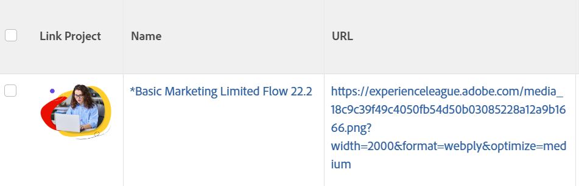

# View: display an image instead of a string in a column

<!--Audited: 11/2024-->

You can replace the name of an object in a view with an image using text mode. You can also add a link to the image that can open the object it replaces.

>[!NOTE]
>
>Images appear in their actual resolution so try to use small images.



## Access requirements

+++ Expand to view access requirements for the functionality in this article. 

You must have the following access to perform the steps in this article:

<table style="table-layout:auto"> 
 <col> 
 <col> 
 <tbody> 
  <tr> 
   <td role="rowheader">Adobe Workfront plan</td> 
   <td> <p>Any</p> </td> 
  </tr> 
  <tr> 
   <td role="rowheader">Adobe Workfront license*</td> 
   <td> 
    <p>New:</p>
   <ul><li><p>Contributor to modify a filter </p></li>
   <li><p>Standard to modify a report</p></li> </ul>

   <p>Current:</p>
   <ul><li><p>Request to modify a filter </p></li>
   <li><p>Plan to modify a report</p></li> </ul></td> 
  </tr> 
  <tr> 
   <td role="rowheader">Access level configurations</td> 
   <td> <p>Edit access to Reports, Dashboards, Calendars to modify a report</p> <p>Edit access to Filters, Views, Groupings to modify a filter</p> </td> 
  </tr> 
  <tr> 
   <td role="rowheader">Object permissions</td> 
   <td> <p>Manage permissions to a report</p>  </td> 
  </tr> 
 </tbody> 
</table>

*For information, see [Access requirements in Workfront documentation](/help/quicksilver/administration-and-setup/add-users/access-levels-and-object-permissions/access-level-requirements-in-documentation.md). 

+++

## Example: Replace the name of a project in a project view with an image:

1. Upload an image to a web site or server external of Adobe Workfront. You must be able to access the image using your web browser.

   >[!TIP]
   >
   >* Every browser type is different but all are capable of displaying URLs.
   >* Avoid using images that are uploaded to Workfront. Because images stored in Workfront are not publicly available and have an access key that expires after a period of time, these images stop displaying in the view over time.
   >* An image saved on your computer does not have an inherent URL. Find a site that provides image hosting and host your image there. Your organization might already have such a site.

1. Using your web browser, go to the image that you saved.
1. Obtain the image's URL by doing the following:

   <!--
   <p data-mc-conditions="QuicksilverOrClassic.Draft mode">(NOTE: I used this blog post to document what kind of image we need for this: https://www.canto.com/blog/image-url/ (consulting uses this)) </p>
   -->

   1. Right-click and select **Copy image location**, or **Get link**, depending on your browser. You now have the URL for that specific image and can paste it from your clipboard.
   1. Ensure that everyone with that link has permissions to view the image by just going to the link and they don't need a login to access it.

1. Go to a project, click the **More** menu  next to the name of the project, then click **Edit**. 

1. In the **URL** field, add the link to the image.
1. Go to a project view in a list of projects.
1. Click the **View** drop-down menu, then click **New View**.
1. Click the header of the column for the **Project Name**, then click **Switch to Text Mode**.

1. Add the following code to the column to the existing code:
   
   ```
   displayname=Link Project
   image.name=Link Project
   image.valuefield=URL
   link.linkproperty.0.name=projectID
   link.linkproperty.0.value=ID
   link.lookup=link.edit
   link.page=/view
   link.valuefield=objCode
   link.valueformat=val
   textmode=true
   type=image
   valueformat=
   ```

1. Click **Done** > **Save View**.
    The image you selected replaces the Project Name in the project view and the image is a link to the project.